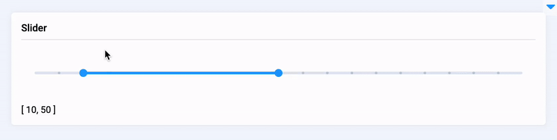

# 👨💻 Supervisely Developer Portal

## Introduction

Every company wants to be sure that its current and future AI tasks are solvable.&#x20;

The main issue with most solutions on the market is that they build as products. It's a black box developing by some company you don't really have an impact on. As soon as your requirements go beyond basic features offered and you want to customize your experience, add something that is not in line with the software owner development plans or won't benefit other customers, you're out of luck.

That is why **Supervisely is building a platform** instead of a product.&#x20;

### [Supervisely Platform 🔥](https://supervise.ly/)


You can think of [Supervisely](https://supervise.ly/) as an Operating System available via Web Browser to help you solve Computer Vision tasks. The idea is to unify all the relevant tools within a single [Ecosystem](https://ecosystem.supervise.ly/) of apps, tools, UI widgets and services that may be needed to make the AI development process as smooth and fast as possible.

More concretely, Supervisely includes the following functionality:

* Data labeling for images, videos, 3D point cloud and volumetric medical images (dicom)
* Data visualization and quality control
* State-Of-The-Art Deep Learning models for segmentation, detection, classification and other tasks
* Interactive tools for model performance analysis
* Specialized Deep Learning models to speed up data labeling (aka AI-assisted labeling)
* Synthetic data generation tools
* Instruments to make it easier to collaborate for data scientists, data labelers, domain experts and software engineers

### [Supervisely Ecosystem](https://supervise.ly/ecosystem) 🎉



Simplicity of creating Supervisely Apps has already led to the development of [hundreds of applications](https://ecosystem.supervise.ly/), ready to be run within a single click in web browser and get the job done.

Label your data, perform quality assurance, inspect every aspect of your data, collaborate easily, train and apply state-of-the-art neural networks, integrate custom models, automate routine tasks and more — like in a real AppStore, there should be an app for everything.

## Development 🧑‍💻&#x20;

Supervisely provides the foundation for integration, customization, development and running computer vision applications to address your custom tasks - just like in OS, like Windows or MacOS.&#x20;

### What you can do

There are different levels of integration, customization and automation:

1. [HTTP REST API](./#level-1.-http-rest-api)
2. [Python scripts for automation and integration](./#level-2.-python-scripts-for-automation-and-integration)
3. [Headless apps (without UI)](./#level-3.-headless-apps-without-ui)
4. [Apps with interactive UIs](./#level-4.-apps-with-interactive-uis)
5. [Apps with UIs integrated into labeling tools](./#level-5.-apps-with-ui-integrated-into-labeling-tools)

#### Level 1. HTTP REST API

Supervisely has a rich [HTTP REST API](https://api.docs.supervise.ly/) that covers basically every action, you can do manually. You can use **any programming language** and **any development environment** to extend and customize your Supervisely experience.&#x20;


For Python developers, we recommend using our [Python SDK](https://supervisely.readthedocs.io/en/latest/sdk\_packages.html) (🔴  link to tutorial) because it wraps up all API methods and can save you a lot of time with built-in error handling, network re-connection, response validation, request pagination, and so on.


<details>

<summary>cURL example</summary>

There's no easier way to kick the tires than through [cURL](http://curl.haxx.se/). If you are using an alternative client, note that you are required to send a valid header in your request.

Example:

```bash
curl -H "x-api-key: <your-token-here>" https://app.supervise.ly/public/api/v3/projects.list
```

As you can see, URL starts with `https://app.supervise.ly`. It is for Community Edition. For Enterprise Edition you have to use your custom server address.&#x20;

</details>

#### Level 2. Python scripts for automation and integration

[Supervisely SDK for Python](https://supervisely.readthedocs.io/en/latest/sdk\_packages.html) is specially designed to speed up development, reduce boilerplate, and lets you do anything in a few lines of Python code with Supervisely Annotatation JSON format, communicate with the platform, import and export data, manage members, upload predictions from your models, etc.

<details>

<summary>Python SDK example</summary>

Look how it is simple to communicate with the platform from your python script.

```python
import supervisely as sly

# authenticate with your personal API token
api = sly.Api.from_env()

# create project and dataset
project = api.project.create(workspace_id=123, name="demo project")
dataset = api.dataset.create(project.id, "dataset-01")

# upload data
image_info = api.image.upload_path(dataset.id, "img.png", "/Users/max/img.png")
api.annotation.upload_path(image_info.id, "/Users/max/ann.json")

# download data
img = api.image.download_np(image_info.id)
ann = api.annotation.download_json(image_info.id)
```

</details>

#### Level 3. Headless apps (without UI)

Create python apps to automate routine and repetitive tasks, share them within your organization,  and provide an easy way to use them for end-users without coding background.  Headless apps are just python scripts that can be run from a context menu.&#x20;


It is simple and suitable for the most basic tasks and use-cases, for example:

* import and export in custom format ([example1](https://ecosystem.supervise.ly/apps/import-images-groups), [example2](https://ecosystem.supervise.ly/apps/export-as-masks), [example3](https://ecosystem.supervise.ly/apps/export-to-pascal-voc), [example4](https://ecosystem.supervise.ly/apps/render-video-labels-to-mp4))
* assets transformation ([example1](https://ecosystem.supervise.ly/apps/rasterize-objects-on-images), [example2](https://ecosystem.supervise.ly/apps/resize-images), [example3](https://ecosystem.supervise.ly/apps/change-video-framerate), [example4](https://ecosystem.supervise.ly/apps/convert\_ptc\_to\_ptc\_episodes))
* users management ([example1](https://ecosystem.supervise.ly/apps/invite-users-to-team-from-csv), [example2](https://ecosystem.supervise.ly/apps/create-users-from-csv), [example3](https://ecosystem.supervise.ly/apps/export-activity-as-csv))&#x20;
* deploy special models for AI-assisted labeling ([example1](https://ecosystem.supervise.ly/apps/supervisely-ecosystem%2Fritm-interactive-segmentation%2Fsupervisely), [example2](https://ecosystem.supervise.ly/apps/supervisely-ecosystem%2Ftrans-t%2Fsupervisely%2Fserve), [example3](https://ecosystem.supervise.ly/apps/volume-interpolation))

#### Level 4. Apps with interactive UIs

Interactive interfaces and visualizations are the keys to building and improving AI solutions: from custom data labeling to model training. Such apps open up opportunities to customize Supervisely platform to any type of task in Computer Vision, implement data and models workflows that fit your organization's needs, and even build vertical solutions for specific industries on top of it.


Here are several examples:

* custom labeling interfaces with AI assistance for [images](https://ecosystem.supervise.ly/apps/dev-smart-tool-batched) and [videos](https://ecosystem.supervise.ly/apps/batched-smart-tool-for-videos)
* [interactive model performance analysis](https://ecosystem.supervise.ly/apps/semantic-segmentation-metrics-dashboard)
* [interactive NN training dashboard](https://ecosystem.supervise.ly/apps/supervisely-ecosystem%2Fmmsegmentation%2Ftrain)
* [data exploration](https://ecosystem.supervise.ly/apps/action-recognition-stats) and [visualization](https://ecosystem.supervise.ly/apps/objects-thumbnails-preview-by-class) apps
* [vertical solution](https://ecosystem.supervise.ly/collections/supervisely-ecosystem%2Fgl-metric-learning%2Fsupervisely%2Fretail-collection) for labeling products on shelves in retail
* inference interfaces [in labeling tools](https://ecosystem.supervise.ly/apps/supervisely-ecosystem%2Fnn-image-labeling%2Fannotation-tool); for [images](https://ecosystem.supervise.ly/apps/supervisely-ecosystem%2Fnn-image-labeling%2Fproject-dataset), [videos](https://ecosystem.supervise.ly/apps/apply-nn-to-videos-project) and [point clouds](https://ecosystem.supervise.ly/apps/apply-det3d-to-project-dataset); for [model ensembles](https://ecosystem.supervise.ly/apps/apply-det-and-cls-models-to-project)

#### Level 5. Apps with UI integrated into labeling tools

There is no single labeling tool that fits all tasks. Labeling tool has to be designed and customized for a specific task to make the job done in an efficient manner. Supervisely apps can be smoothly integrated into labeling tools to deliver amazing user experience (including multi tenancy) and annotation performance.


Here are several examples:

* apps designed for custom labeling workflows ([example1](https://ecosystem.supervise.ly/apps/visual-tagging), [example2](https://ecosystem.supervise.ly/apps/review-labels-side-by-side))&#x20;
* NN inference is integrated for labeling automation and model predictions analysis ([example](https://ecosystem.supervise.ly/apps/supervisely-ecosystem%2Fnn-image-labeling%2Fannotation-tool))
* industry-specific labeling tool: annotation of thousands of product types on shelves with AI assistance ([retail collection](https://ecosystem.supervise.ly/collections/supervisely-ecosystem%2Fgl-metric-learning%2Fsupervisely%2Fretail-collection), [labeling app](https://ecosystem.supervise.ly/apps/ai-assisted-classification))

### Principles 🧭

Development for Supervisely builds upon these five principles:

* All in **pure Python** and build on top of your favourites libraries (opencv, requests, fastapi, pytorch, imgaug, etc ...) - easy for python developers and data scientists to build and share apps with teammates and the ML community.
* No front‑end experience is required -  build **powerful** and **interactive** web-based GUI apps using the comprehensive library of ready-to-use UI widgets and components.
* **Easy to learn, fast to code,** and **ready for production**.  SDK provides a simple and intuitive API by having complexity "under the hood". Every action can be done just in a few lines of code. You focus on your task, Supervisely will handle everything else - interfaces, databases, permissions, security, cloud or self-hosted deployment, networking, data storage, and many more. Supervisely has solid testing, documentation, and support.
* Everything is **customizable** - from labeling interfaces to neural networks. The platform has to be customized and extended to perfectly fit your tasks and requirements, not vice versa. Hundreds of examples cover every scenario and can be found in our [ecosystem of apps](https://ecosystem.supervise.ly/).
* Apps can be both **open-sourced or private**. All apps made by Supervisely team are [open-sourced](https://github.com/supervisely-ecosystem). Use them as examples, just fork and modify the way you want. But customers and community users can still develop private apps to protect their intellectual property.

## Main features 💎

* [Start in a minute](./#start-in-a-minute)
* [Magically simple API](./#magically-simple-api)
* [Customization is everywhere](./#customization-is-everywhere)
* [Interactive UI is a game-changer](./#interactive-ui-is-a-key)
* Develop fast with ready UI widgets
* [Convenient debugging](./#convenient-debugging)
* Apps can be both private and public
* [Single-click deployment](./#single-click-deployment)
* [Reliable versioning - releases and branches](./#reliable-versioning-releases-and-branches)
* [Supports both Github and Gitlab](./#supports-both-github-and-gitlab)
* [Built-in cloud development environment](./#built-in-cloud-development-environment) (coming soon)
* [Trusted by Fortune 500, top researchers and developers](./#trusted-by-fortune500-top-researches-and-developers)

### Start in a minute

Supervisely's open-source SDK and app framework are straightforward to get started with. It’s just a matter of:

```
pip install supervisely
```

### Magically simple API

[Supervisely SDK for Python](https://supervisely.readthedocs.io/en/latest/sdk\_packages.html) is simple, intuitive, and can save you hours. Reduce boilerplate and build custom integrations in a few lines of code. It has never been so easy to communicate with the platform from python.

```python
# authenticate with your personal API token
api = sly.Api.from_env()

# create project and dataset
project = api.project.create(workspace_id=123, name="demo project")
dataset = api.dataset.create(project.id, "dataset-01")

# upload data
image_info = api.image.upload_path(dataset.id, "img.png", "/Users/max/img.png")
api.annotation.upload_path(image_info.id, "/Users/max/ann.json")

# download data
img = api.image.download_np(image_info.id)
ann = api.annotation.download_json(image_info.id)
```

### Customization is everywhere

Customization is the only way to cover all tasks in Computer Vision&#x20;

### Interactive GUI is a game-changer

The majority of Python programs are "command line" based. While highly experienced programmers don't have problems with it, most "normal people" and end-users do.  This creates a digital divide, a "GUI Gap".  App with graphic user interface (GUI) becomes more approachable and easy to use to a wider audience. And finally, some tasks are impossible to solve without a GUI at all.

Imagine, how it will be great if all ML tools and repositories have an interactive GUI with the RUN button ▶️. It will take minutes to start working with a top Deep Learning framework instead of spending weeks running it on your data.  &#x20;

🎯 Our ambitious goal is to make it possible.


### Convenient debugging

🔴 nn image labeling app with breakpoints and websockets  🔴&#x20;

### Develop fast with ready UI widgets

poster widgets

### Apps can be both private and public

bla bla

### Single-click deployment

bla bla text provide link to your github repo and click add, easy run ...

### Reliable versioning - releases and branches

bla bla image

### App is just a web server, use any technology you love &#x20;

jupyter notebook

### Supports both Github and Gitlab&#x20;

bla bla

### Built-in cloud development environment

vscode - переснять в браузере (youtube player)

### Trusted by Fortune500, top researches and developers

bla bla

Used in the world’s top data science groups

Compatible with basically everythiong

## Community

Join our constantly growing Supervisely community with more than 65k+ users. Supervisely platform and its Ecosystem of apps on a daily basis help thousands of companies and researchers all over the world to build computer vision solutions efficiently.&#x20;

#### Have an idea or ask for help?

If you have any questions, ideas or feedback please:

1. [Suggest a feature or idea](https://ideas.supervise.ly/), or [give a technical feedback ](https://github.com/supervisely/supervisely/issues)
2. [Join our slack](https://supervise.ly/slack)
3. [Contact us](https://supervise.ly/contact-us)

Your feedback 👍 helps us a lot and we appreciate it&#x20;

## Contribution 👏

Want to help us bring Computer Vision R\&D to the next level? We encourage you to participate and speed up R\&D for thousands of researchers by

* building and expanding Supervisely Ecosystem with us
* integrating to Supervisley and sharing your ML tools and research with the entire ML community

## Partnership 🤝

We are happy to expand and increase the value of Supervisely Ecosystem with additional technological partners, researchers, developers, and value-added resellers.

Feel free to [contact us](https://supervise.ly/contact-us) if you have&#x20;

* ML service or product
* unique domain expertise
* vertical solution
* valuable repositories and tools that solve the task
* custom NN models and data

Let's discuss the ways of working together, particularly if we have joint interests, technologies and  customers.
