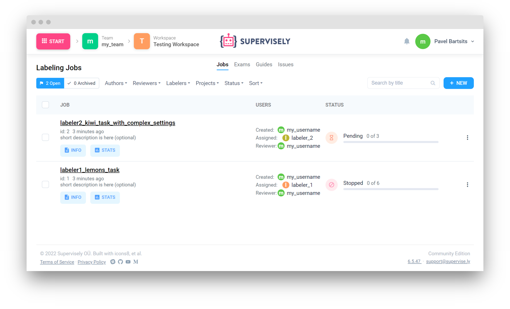
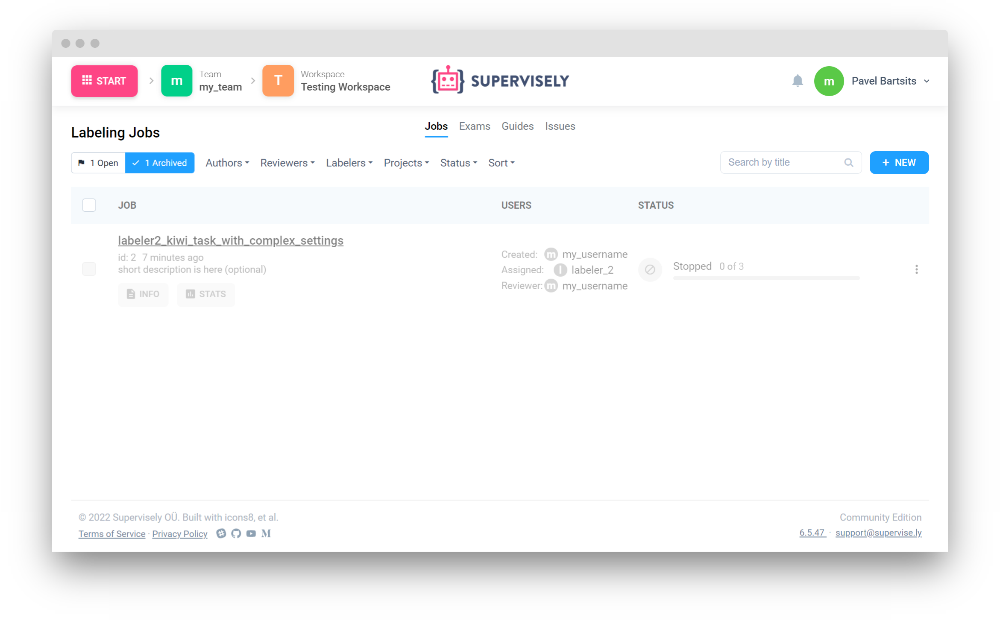

# Labeling Jobs

## Introduction

In this tutorial you will learn how to manage `Labeling Jobs` using Supervisely SDK and API.

📗 Everything you need to reproduce [this tutorial is on GitHub](https://github.com/supervisely-ecosystem/automation-with-python-sdk-and-api/tree/master/examples/labeling-jobs-automation): source code and demo data.

## How to debug this tutorial

**Step 1.** Prepare `~/supervisely.env` file with credentials. [Learn more here.](https://developer.supervise.ly/getting-started/basics-of-authentication#how-to-use-in-python)

**Step 2.** Clone [repository](https://github.com/supervisely-ecosystem/automation-with-python-sdk-and-api) with source code and demo data and create [Virtual Environment](https://docs.python.org/3/library/venv.html).

```bash
git clone https://github.com/supervisely-ecosystem/automation-with-python-sdk-and-api
cd automation-with-python-sdk-and-api
./create_venv.sh
```

**Step 3.** Open repository directory in Visual Studio Code.

```bash
code -r .
```

**Step 4.** change ✅ IDs ✅ in `local.env` file by copying the IDs from Supervisely instance.

*   Change Team ID in `local.env` file by copying the ID from the context menu of the team.


    ```python
    CONTEXT_TEAMID=8                 # ⬅️ change it
    ```

    <figure><figcaption></figcaption></figure>
* Get [**Lemons (Test)**](https://ecosystem.supervise.ly/projects/lemons-test) project from ecosystem. Lemons (Test) is an example project with 6 images of lemons and kiwi fruits.

<figure><figcaption></figcaption></figure>

Change project id in `local.env` file by copying the ID from the context menu of the project.

```python
CONTEXT_PROJECTID=5555                 # ⬅️ change it
```

<figure><figcaption></figcaption></figure>

*   Change User ID and user login in `local.env` to your own from Team members page.


    ```python
    CONTEXT_USERID=7                 # ⬅️ change it
    CONTEXT_USERLOGIN="my_username"  # ⬅️ change it
    ```

    <figure><figcaption></figcaption></figure>

**Step 5.** Start debugging `examples/labeling-jobs-automation/main.py`

## Labeling Jobs automation

### Import libraries

```python
import os
from dotenv import load_dotenv
import supervisely as sly
```

### Init API client

​Init API for communicating with Supervisely Instance. First, we load environment variables with credentials:

```python
load_dotenv("local.env")
load_dotenv(os.path.expanduser("~/supervisely.env"))
api = sly.Api()
```

### Get your IDs and username from environment

```python
TEAM_ID = int(os.environ["CONTEXT_TEAMID"])
PROJECT_ID = int(os.environ["CONTEXT_PROJECTID"])
USER_ID = int(os.environ["CONTEXT_USERID"])
USER_LOGIN = os.environ["CONTEXT_USERLOGIN"]
```

### Prepare project for Labeling Job

Function will populate project meta with classes: "kiwi", "lemon", and tags: "size", "origin".

```python
prepare_project(api=api, id=PROJECT_ID)
```

| [](https://user-images.githubusercontent.com/48913536/194885404-5215aef1-dccc-45ec-8226-f4fbf40b1eba.png) | [](https://user-images.githubusercontent.com/48913536/194885409-f60e7135-cce3-4413-b636-17689deb76ab.png) |
| :-----------------------------------------------------------------------------------------------------------------------------------------------------------------------------------------------------------------: | :-----------------------------------------------------------------------------------------------------------------------------------------------------------------------------------------------------------------: |

## Labeling jobs automation

### Step 1. Create and add annotators to the team, before creating Labeling Job

<figure><figcaption></figcaption></figure>

Create accounts for annotators with restrictions.

**Note:** Creating users requires admin permission.

```python
labeler_1 = api.user.get_info_by_login(login='labeler_1')
if labeler_1 is None:
    labeler_1 = api.user.create(login='labeler_1', password='11111abc', is_restricted=True)

labeler_2 = api.user.get_info_by_login(login='labeler_2')
if labeler_2 is None:
    labeler_2 = api.user.create(login='labeler_2', password='22222abc', is_restricted=True)
```

Labelers will be able to login only after being added to at least one team

**Note:** Adding users to the Team requires admin permission.

```python
if api.user.get_team_role(labeler_1.id, TEAM_ID) is None:
    api.user.add_to_team(labeler_1.id, TEAM_ID, api.role.DefaultRole.ANNOTATOR)
if api.user.get_team_role(labeler_2.id, TEAM_ID) is None:
    api.user.add_to_team(labeler_2.id, TEAM_ID, api.role.DefaultRole.ANNOTATOR)
```

<figure><figcaption></figcaption></figure>

### Step 2. Define project and datasets for labeling job

```python
project_meta_json = api.project.get_meta(PROJECT_ID)
project_meta = sly.ProjectMeta.from_json(project_meta_json)
print(project_meta)
```

Output:

```
ProjectMeta:
Object Classes
+-------+--------+----------------+--------+
|  Name | Shape  |     Color      | Hotkey |
+-------+--------+----------------+--------+
|  kiwi | Bitmap |  [208, 2, 27]  |        |
| lemon | Bitmap | [80, 227, 194] |        |
+-------+--------+----------------+--------+
Tags
+--------+--------------+------------------------------+--------+---------------+--------------------+
|  Name  |  Value type  |       Possible values        | Hotkey | Applicable to | Applicable classes |
+--------+--------------+------------------------------+--------+---------------+--------------------+
| origin |  any_string  |             None             |        |  objectsOnly  | ['kiwi', 'lemon']  |
|  size  | oneof_string | ['small', 'medium', 'large'] |        |  objectsOnly  | ['kiwi', 'lemon']  |
+--------+--------------+------------------------------+--------+---------------+--------------------+
```

```python
datasets = api.dataset.get_list(project.id)
print(datasets)
```

Output:

```
[
  DatasetInfo(
    id=10555, 
    name='ds1',
    description='', 
    size='1277440',
    project_id=5555,
    images_count=6, 
    created_at='2022-10-18T15:39:57.377Z',
    updated_at='2022-10-18T15:39:57.377Z'
  )
]
```

### Step 3. Create Labeling Jobs

<figure><figcaption></figcaption></figure>

Create labeling job for labeler 1, and assign class lemon to label.

```python
created_jobs = api.labeling_job.create(name='labeler1_lemons_task',
                                       dataset_id=datasets[0].id,
                                       user_ids=[labeler_1.id],
                                       readme='annotation manual for fruits in markdown format here (optional)',
                                       description='short description is here (optional)',
                                       classes_to_label=["lemon"])
print(created_jobs)
```

Output:

```
[
  LabelingJobInfo(
      id=1, 
      name='labeler1_lemons_task', 
      readme='annotation manual for fruits in markdown format here (optional)',
      description='short description is here (optional)', 
      team_id=8,
      workspace_id=349,
      workspace_name='Testing Workspace', 
      project_id=5555,
      project_name='Lemons (Test)', 
      dataset_id=10555,
      dataset_name='ds1', 
      created_by_id=7,
      created_by_login='my_username', 
      assigned_to_id=101, 
      assigned_to_login='labeler_1',
      created_at='2022-10-05T08:42:30.588Z', 
      started_at=None, 
      finished_at=None,
      status='pending',
      disabled=False, 
      images_count=6, 
      finished_images_count=0, 
      rejected_images_count=0,
      accepted_images_count=0,
      classes_to_label=[],
      tags_to_label=[], 
      images_range=(None, None), 
      objects_limit_per_image=None, 
      tags_limit_per_image=None,
      filter_images_by_tags=[], 
      include_images_with_tags=[],
      exclude_images_with_tags=[],
      entities=[
        {
          'reviewStatus': 'none', 
          'id': 3882702, 
          'name': 'IMG_8144.jpeg'
        }, 
        {
          'reviewStatus': 'none', 
          'id': 3882697, 
          'name': 'IMG_4451.jpeg'
        },
        {
          'reviewStatus': 'none',
          'id': 3882698,
          'name': 'IMG_3861.jpeg'
        }, 
        {
          'reviewStatus': 'none', 
          'id': 3882700, 
          'name': 'IMG_2084.jpeg'
        }, 
        {
          'reviewStatus': 'none',
          'id': 3882701, 
          'name': 'IMG_1836.jpeg'
        }, 
        {
          'reviewStatus': 'none',
          'id': 3882699,
          'name': 'IMG_0748.jpeg'
        }
      ]
  )
]
```

You can stop Labeling Job if you need. Job will become unavailable for labeler.

```python
api.labeling_job.stop(created_jobs[0].id)
```

Create labeling job for labeler 2, and assign class kiwi to label, and also tags "size" and "origin", with objects and tags limit.

```python
created_jobs = api.labeling_job.create(
                                name='labeler2_kiwi_task_with_complex_settings',
                                dataset_id=datasets[0].id,
                                user_ids=[labeler_2.id],
                                readme='annotation manual for fruits in markdown format here (optional)',
                                description='short description is here (optional)',
                                classes_to_label=["kiwi"],
                                objects_limit_per_image=10,
                                tags_to_label=["size", "origin"],
                                tags_limit_per_image=20,
                                )
print(created_jobs)
```

Output:

```
[
  LabelingJobInfo(
      id=2, 
      name='labeler2_kiwi_task_with_complex_settings', 
      readme='annotation manual for fruits in markdown format here (optional)',
      description='short description is here (optional)', 
      team_id=8,
      workspace_id=349,
      workspace_name='Testing Workspace', 
      project_id=5555,
      project_name='Lemons (Test)', 
      dataset_id=10555,
      dataset_name='ds1', 
      created_by_id=100,
      created_by_login='my_username', 
      assigned_to_id=102, 
      assigned_to_login='labeler_2',
      created_at='2022-10-05T08:42:30.588Z', 
      started_at=None, 
      finished_at=None,
      status='pending',
      disabled=False, 
      images_count=6, 
      finished_images_count=0, 
      rejected_images_count=0,
      accepted_images_count=0,
      classes_to_label=["kiwi"],
      tags_to_label=["size", "origin"], 
      images_range=(None, None), 
      objects_limit_per_image=10, 
      tags_limit_per_image=20,
      filter_images_by_tags=[], 
      include_images_with_tags=[],
      exclude_images_with_tags=[],
      entities=[
          {
            'reviewStatus': 'none', 
            'id': 3882697, 
            'name': 'IMG_4451.jpeg'
          }, 
          {
            'reviewStatus': 'none', 
            'id': 3882698, 
            'name': 'IMG_3861.jpeg'
          }, 
          {
            'reviewStatus': 'none', 
            'id': 3882699, 
            'name': 'IMG_0748.jpeg'
          }
      ]
  )
]
```

<figure><figcaption><p>Created Labeling Jobs</p></figcaption></figure>

Get all labeling jobs in a team

```python
jobs = api.labeling_job.get_list(TEAM_ID)
print(jobs)
```

Output:

```
[
  LabelingJobInfo(
      id=1, 
      name='labeler1_lemons_task', 
      readme='annotation manual for fruits in markdown format here (optional)',
      description='short description is here (optional)', 
      team_id=8,
      workspace_id=349,
      workspace_name='Testing Workspace', 
      project_id=5555,
      project_name='Lemons (Test)', 
      dataset_id=10555,
      dataset_name='ds1', 
      created_by_id=7,
      created_by_login='my_username', 
      assigned_to_id=101, 
      assigned_to_login='labeler_1',
      created_at='2022-10-05T08:42:30.588Z', 
      started_at=None, 
      finished_at=None,
      status='pending',
      disabled=False, 
      images_count=6, 
      finished_images_count=0, 
      rejected_images_count=0,
      accepted_images_count=0,
      classes_to_label=[],
      tags_to_label=[], 
      images_range=(None, None), 
      objects_limit_per_image=None, 
      tags_limit_per_image=None,
      filter_images_by_tags=[], 
      include_images_with_tags=[],
      exclude_images_with_tags=[],
      entities=[
        {
          'reviewStatus': 'none', 
          'id': 3882702, 
          'name': 'IMG_8144.jpeg'
        }, 
        {
          'reviewStatus': 'none', 
          'id': 3882697, 
          'name': 'IMG_4451.jpeg'
        },
        {
          'reviewStatus': 'none',
          'id': 3882698,
          'name': 'IMG_3861.jpeg'
        }, 
        {
          'reviewStatus': 'none', 
          'id': 3882700, 
          'name': 'IMG_2084.jpeg'
        }, 
        {
          'reviewStatus': 'none',
          'id': 3882701, 
          'name': 'IMG_1836.jpeg'
        }, 
        {
          'reviewStatus': 'none',
          'id': 3882699,
          'name': 'IMG_0748.jpeg'
        }
      ]
  ),
  LabelingJobInfo(
      id=2, 
      name='labeler2_kiwi_task_with_complex_settings', 
      readme='annotation manual for fruits in markdown format here (optional)',
      description='short description is here (optional)', 
      team_id=8,
      workspace_id=349,
      workspace_name='Testing Workspace', 
      project_id=5555,
      project_name='Lemons (Test)', 
      dataset_id=10555,
      dataset_name='ds1', 
      created_by_id=100,
      created_by_login='my_username', 
      assigned_to_id=102, 
      assigned_to_login='labeler_2',
      created_at='2022-10-05T08:42:30.588Z', 
      started_at=None, 
      finished_at=None,
      status='pending',
      disabled=False, 
      images_count=6, 
      finished_images_count=0, 
      rejected_images_count=0,
      accepted_images_count=0,
      classes_to_label=["kiwi"],
      tags_to_label=["size", "origin"], 
      images_range=(None, None), 
      objects_limit_per_image=10, 
      tags_limit_per_image=20,
      filter_images_by_tags=[], 
      include_images_with_tags=[],
      exclude_images_with_tags=[],
      entities=[
          {
            'reviewStatus': 'none', 
            'id': 3882697, 
            'name': 'IMG_4451.jpeg'
          }, 
          {
            'reviewStatus': 'none', 
            'id': 3882698, 
            'name': 'IMG_3861.jpeg'
          }, 
          {
            'reviewStatus': 'none', 
            'id': 3882699, 
            'name': 'IMG_0748.jpeg'
          }
      ]
  )
]
```

### Labeling Jobs filtering

List of available filters:

* created\_by\_id
* assigned\_to\_id
* project\_id
* dataset\_id

**Note:** filters can be used in various combinations

Get all labeling jobs that were created by user 'my\_username'

**Note:** Getting UserInfo by login requires admin permission.

```python
user = api.user.get_info_by_login(USER_LOGIN)
jobs = api.labeling_job.get_list(TEAM_ID, created_by_id=user.id)
print(jobs)
```

Output

```
[
  LabelingJobInfo(
      id=1, 
      name='labeler1_lemons_task', 
      readme='annotation manual for fruits in markdown format here (optional)',
      description='short description is here (optional)', 
      team_id=8,
      workspace_id=349,
      workspace_name='Testing Workspace', 
      project_id=5555,
      project_name='Lemons (Test)', 
      dataset_id=10555,
      dataset_name='ds1', 
      created_by_id=7,
      created_by_login='my_username', 
      assigned_to_id=101, 
      assigned_to_login='labeler_1',
      created_at='2022-10-05T08:42:30.588Z', 
      started_at=None, 
      finished_at=None,
      status='pending',
      disabled=False, 
      images_count=6, 
      finished_images_count=0, 
      rejected_images_count=0,
      accepted_images_count=0,
      classes_to_label=[],
      tags_to_label=[], 
      images_range=(None, None), 
      objects_limit_per_image=None, 
      tags_limit_per_image=None,
      filter_images_by_tags=[], 
      include_images_with_tags=[],
      exclude_images_with_tags=[],
      entities=[
        {
          'reviewStatus': 'none', 
          'id': 3882702, 
          'name': 'IMG_8144.jpeg'
        }, 
        {
          'reviewStatus': 'none', 
          'id': 3882697, 
          'name': 'IMG_4451.jpeg'
        },
        {
          'reviewStatus': 'none',
          'id': 3882698,
          'name': 'IMG_3861.jpeg'
        }, 
        {
          'reviewStatus': 'none', 
          'id': 3882700, 
          'name': 'IMG_2084.jpeg'
        }, 
        {
          'reviewStatus': 'none',
          'id': 3882701, 
          'name': 'IMG_1836.jpeg'
        }, 
        {
          'reviewStatus': 'none',
          'id': 3882699,
          'name': 'IMG_0748.jpeg'
        }
      ]
  ),
  LabelingJobInfo(
      id=2, 
      name='labeler2_kiwi_task_with_complex_settings', 
      readme='annotation manual for fruits in markdown format here (optional)',
      description='short description is here (optional)', 
      team_id=8,
      workspace_id=349,
      workspace_name='Testing Workspace', 
      project_id=5555,
      project_name='Lemons (Test)', 
      dataset_id=10555,
      dataset_name='ds1', 
      created_by_id=100,
      created_by_login='my_username', 
      assigned_to_id=102, 
      assigned_to_login='labeler_2',
      created_at='2022-10-05T08:42:30.588Z', 
      started_at=None, 
      finished_at=None,
      status='pending',
      disabled=False, 
      images_count=6, 
      finished_images_count=0, 
      rejected_images_count=0,
      accepted_images_count=0,
      classes_to_label=["kiwi"],
      tags_to_label=["size", "origin"], 
      images_range=(None, None), 
      objects_limit_per_image=10, 
      tags_limit_per_image=20,
      filter_images_by_tags=[], 
      include_images_with_tags=[],
      exclude_images_with_tags=[],
      entities=[
          {
            'reviewStatus': 'none', 
            'id': 3882697, 
            'name': 'IMG_4451.jpeg'
          }, 
          {
            'reviewStatus': 'none', 
            'id': 3882698, 
            'name': 'IMG_3861.jpeg'
          }, 
          {
            'reviewStatus': 'none', 
            'id': 3882699, 
            'name': 'IMG_0748.jpeg'
          }
      ]
  )
]
```

Get all labeling jobs that were created by user "my\_username" and were assigned to labeler 2

```python
jobs = api.labeling_job.get_list(TEAM_ID, created_by_id=user.id, assigned_to_id=labeler_2.id)
print(jobs)
```

Output:

```
[
  LabelingJobInfo(
      id=2, 
      name='labeler2_kiwi_task_with_complex_settings', 
      readme='annotation manual for fruits in markdown format here (optional)',
      description='short description is here (optional)', 
      team_id=8,
      workspace_id=349,
      workspace_name='Testing Workspace', 
      project_id=5555,
      project_name='Lemons (Test)', 
      dataset_id=10555,
      dataset_name='ds1', 
      created_by_id=100,
      created_by_login='my_username', 
      assigned_to_id=102, 
      assigned_to_login='labeler_2',
      created_at='2022-10-05T08:42:30.588Z', 
      started_at=None, 
      finished_at=None,
      status='pending',
      disabled=False, 
      images_count=6, 
      finished_images_count=0, 
      rejected_images_count=0,
      accepted_images_count=0,
      classes_to_label=["kiwi"],
      tags_to_label=["size", "origin"], 
      images_range=(None, None), 
      objects_limit_per_image=10, 
      tags_limit_per_image=20,
      filter_images_by_tags=[], 
      include_images_with_tags=[],
      exclude_images_with_tags=[],
      entities=[
          {
            'reviewStatus': 'none', 
            'id': 3882697, 
            'name': 'IMG_4451.jpeg'
          }, 
          {
            'reviewStatus': 'none', 
            'id': 3882698, 
            'name': 'IMG_3861.jpeg'
          }, 
          {
            'reviewStatus': 'none', 
            'id': 3882699, 
            'name': 'IMG_0748.jpeg'
          }
      ]
  )
]
```

Get all active labeling jobs in a team

```python
jobs = api.labeling_job.get_list(TEAM_ID)
print(jobs)
```

Output:

```
[
  LabelingJobInfo(
      id=1, 
      name='labeler1_lemons_task', 
      readme='annotation manual for fruits in markdown format here (optional)',
      description='short description is here (optional)', 
      team_id=8,
      workspace_id=349,
      workspace_name='Testing Workspace', 
      project_id=5555,
      project_name='Lemons (Test)', 
      dataset_id=10555,
      dataset_name='ds1', 
      created_by_id=7,
      created_by_login='my_username', 
      assigned_to_id=101, 
      assigned_to_login='labeler_1',
      created_at='2022-10-05T08:42:30.588Z', 
      started_at=None, 
      finished_at=None,
      status='pending',
      disabled=False, 
      images_count=6, 
      finished_images_count=0, 
      rejected_images_count=0,
      accepted_images_count=0,
      classes_to_label=[],
      tags_to_label=[], 
      images_range=(None, None), 
      objects_limit_per_image=None, 
      tags_limit_per_image=None,
      filter_images_by_tags=[], 
      include_images_with_tags=[],
      exclude_images_with_tags=[],
      entities=[
        {
          'reviewStatus': 'none', 
          'id': 3882702, 
          'name': 'IMG_8144.jpeg'
        }, 
        {
          'reviewStatus': 'none', 
          'id': 3882697, 
          'name': 'IMG_4451.jpeg'
        },
        {
          'reviewStatus': 'none',
          'id': 3882698,
          'name': 'IMG_3861.jpeg'
        }, 
        {
          'reviewStatus': 'none', 
          'id': 3882700, 
          'name': 'IMG_2084.jpeg'
        }, 
        {
          'reviewStatus': 'none',
          'id': 3882701, 
          'name': 'IMG_1836.jpeg'
        }, 
        {
          'reviewStatus': 'none',
          'id': 3882699,
          'name': 'IMG_0748.jpeg'
        }
      ]
  ),
  LabelingJobInfo(
      id=2, 
      name='labeler2_kiwi_task_with_complex_settings', 
      readme='annotation manual for fruits in markdown format here (optional)',
      description='short description is here (optional)', 
      team_id=8,
      workspace_id=349,
      workspace_name='Testing Workspace', 
      project_id=5555,
      project_name='Lemons (Test)', 
      dataset_id=10555,
      dataset_name='ds1', 
      created_by_id=100,
      created_by_login='my_username', 
      assigned_to_id=102, 
      assigned_to_login='labeler_2',
      created_at='2022-10-05T08:42:30.588Z', 
      started_at=None, 
      finished_at=None,
      status='pending',
      disabled=False, 
      images_count=6, 
      finished_images_count=0, 
      rejected_images_count=0,
      accepted_images_count=0,
      classes_to_label=["kiwi"],
      tags_to_label=["size", "origin"], 
      images_range=(None, None), 
      objects_limit_per_image=10, 
      tags_limit_per_image=20,
      filter_images_by_tags=[], 
      include_images_with_tags=[],
      exclude_images_with_tags=[],
      entities=[
          {
            'reviewStatus': 'none', 
            'id': 3882697, 
            'name': 'IMG_4451.jpeg'
          }, 
          {
            'reviewStatus': 'none', 
            'id': 3882698, 
            'name': 'IMG_3861.jpeg'
          }, 
          {
            'reviewStatus': 'none', 
            'id': 3882699, 
            'name': 'IMG_0748.jpeg'
          }
      ]
  )
]
```

### Labeling Jobs Statuses

`api.labeling_job.Status.PENDING` - labeling job is created, labeler still has not started `api.labeling_job.Status.IN_PROGRESS` - labeler started, but not finished `api.labeling_job.Status.ON_REVIEW` - labeler finished his job, reviewer is in progress `api.labeling_job.Status.COMPLETED` - reviewer completed job `api.labeling_job.Status.STOPPED` - job was stopped at some stage

```python
job_id = jobs[-2].id
api.labeling_job.get_status(job_id)
```

Output

```
<Status.STOPPED: 'stopped'>
```

```python
job_id = jobs[-1].id
api.labeling_job.get_status(job_id)
```

Output:

```
<Status.PENDING: 'pending'>
```

If you want to change Labeling Job status you can use `api.labeling_job.set_status()` method

<pre class="language-python"><code class="lang-python">job_id = jobs[-1].id
<strong>api.labeling_job.set_status(id=job_id, status="completed")</strong></code></pre>

Output:

```
<Status.COMPLETED: 'completed'>
```

The following methods will wait until labeling job will change status to the given expected status:

*   Labeler has finished annotating

    ```python
    api.labeling_job.wait(job_id, target_status=api.labeling_job.Status.ON_REVIEW)
    ```
*   Reviewer has finished his annotation review

    ```python
    api.labeling_job.wait(job_id, target_status=api.labeling_job.Status.COMPLETED) 
    ```

### Archive Labeling Job

```python
api.labeling_job.archive(jobs[0].id)
```

<figure><figcaption><p>Archived Labelling Job</p></figcaption></figure>
