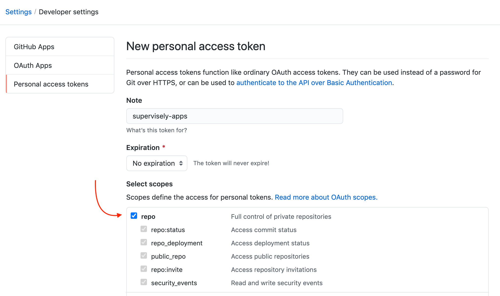
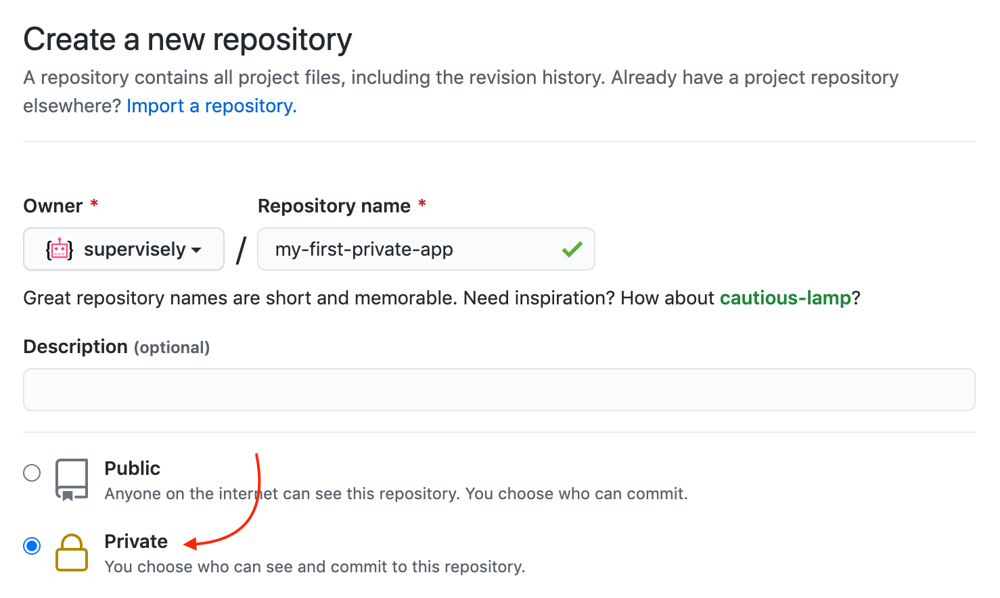
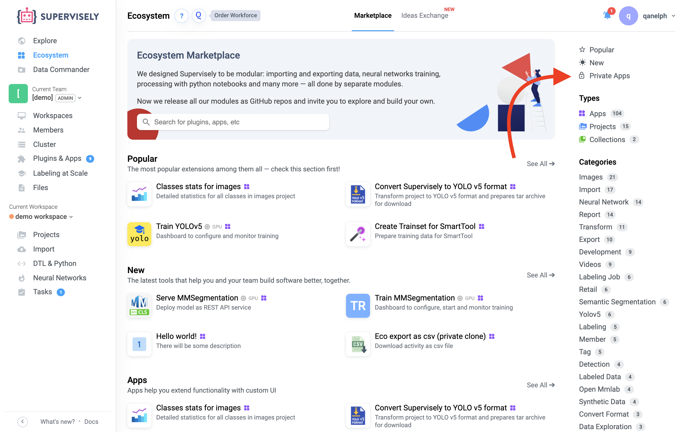
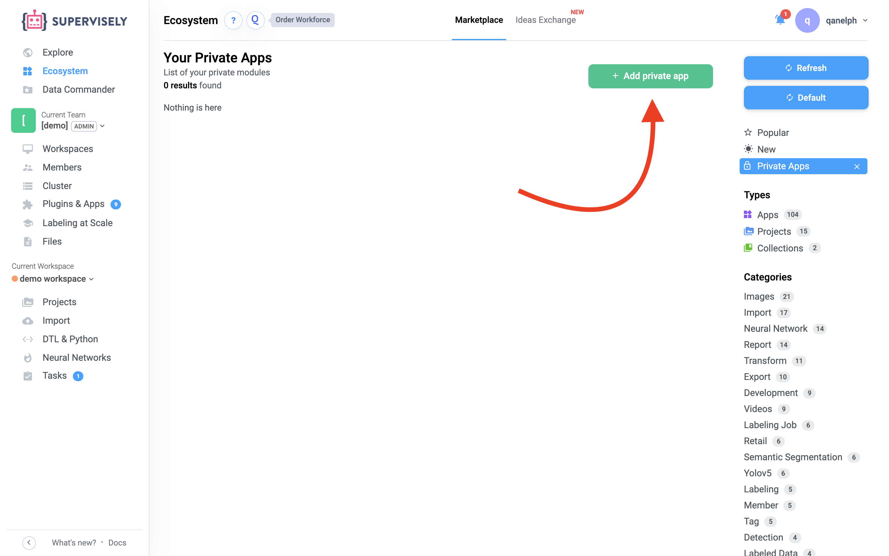
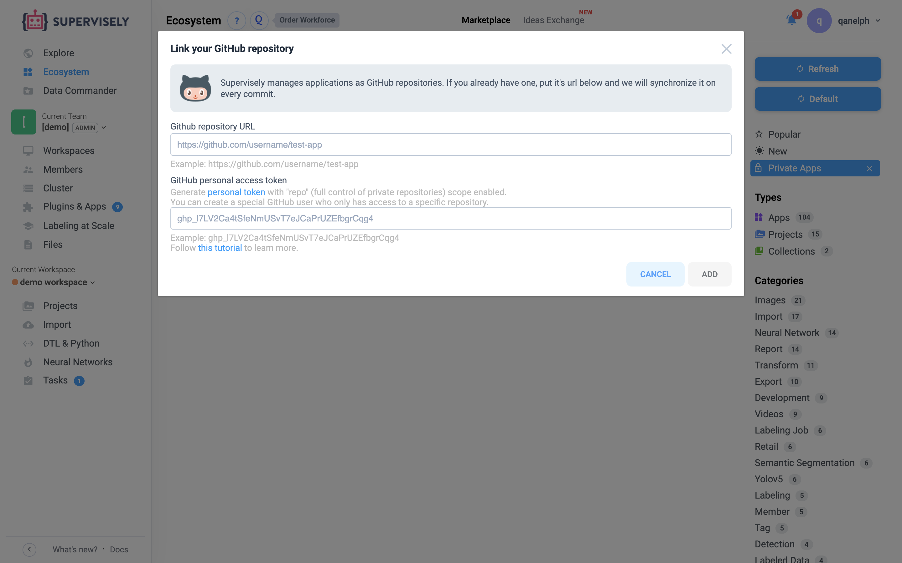

# Part 1 — Hello world! \[From your Python script to Supervisely APP]

### **Table of contents**

1. [Python code](part-1-hello-world-from-your-python-script-to-supervisely-app.md#step-1-python-code)
2. [Configuration file](part-1-hello-world-from-your-python-script-to-supervisely-app.md#step-2-configuration-file)
3. [Repository setup](part-1-hello-world-from-your-python-script-to-supervisely-app.md#step-3-repository-setup)
4. [Add app to Supervisely](part-1-hello-world-from-your-python-script-to-supervisely-app.md#step-4-add-app-to-supervisely)
5. [Results](part-1-hello-world-from-your-python-script-to-supervisely-app.md#step-5-results)

### Step 1 — Python code

Let's start with a simple python code.

**src/main.py**

```python
worlds = ['Westeros', 'Azeroth', 'Middle Earth', 'Narnia']

for world in worlds:
    print(f'Hello {world}!')
```

### Step 2 — Configuration file

Config file. **We**. **Need**. **It**.\
To add a Python application to Supervisely, let's create a configuration file for it. An example of a config file:

**config.json**

```json
{
  "name": "Hello world!",
  "type": "app",
  "categories": [
    "quickstart"
  ],
  "description": "There will be some description",
  "docker_image": "supervisely/base-py-sdk:6.1.93",
  "main_script": "chapter-01-headless/part-01-hello-world/src/main.py",
  "task_location": "workspace_tasks",
  "isolate": true,
  "icon": "https://img.icons8.com/color/100/000000/1.png",
  "icon_background": "#FFFFFF"
}
```


 **Pay attention to important fields:**

* `docker_image` — SDK version you were using, it doesn't matter in this app
* `main_script` — path from repository `root` to `main.py` (entry point)

### Step 3 — Repository setup

In this step, we create a repository and add our code to it.

**1. Generate new personal token**

Open GitHub → Settings → Developer settings → [Personal access tokens](https://github.com/settings/tokens)\
Click `Generate new token`

Select "repo" access scope and click "Generate token" button.\
**Save generated token — you will need it later.**



**2. Create GitHub repository**

Let's create a new GitHub repository that we will use to deploy a new Supervisely application. Create a [new private GitHub repository](https://github.com/new):



**3. Push app to repository**

Make sure you have collected all the required files:

* `src/main.py`
* `config.json`

Then just push files to git:

```bash
git init
git add --all
git commit -m "init first app"
git branch -M main
git remote add origin https://github.com/link-to-your-repo.git
git push -u origin main
```

### Step 4 — Add app to Supervisely

We've almost reached the finish line!\
It remains to add the application to the Ecosystem.

**1. Go to the** [**Private Apps section**](http://supervise.ly/ecosystem/private)



**2. Add your application**




 Pay attention:

1. In the `Github repository URL` field, specify the link to the directory containing the application's `config.json`
2. In the `GitHub personal access token` field, paste your token that you saved in `step 1`



### Step 5 — Results


Hello World!

