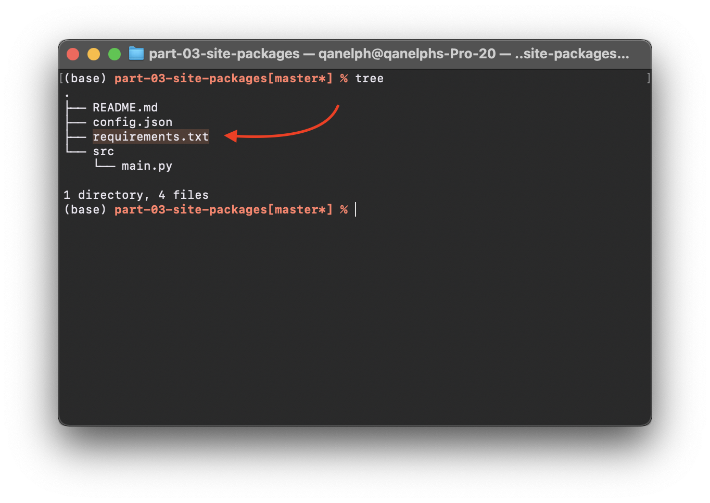

# Part 3 — Site Packages \[Customize your app]

### Table of content

1. [Create requirements.txt file in application root](part-3-site-packages-customize-your-app.md#step-1-create-requirements.txt-file-in-application-root)
2. [Add a list of all required libraries with versions](part-3-site-packages-customize-your-app.md#step-2-add-a-list-of-all-required-libraries-with-versions)
3. [Add library to code](part-3-site-packages-customize-your-app.md#step-3-add-library-to-code)
4. [Results](part-3-site-packages-customize-your-app.md#step-4-results)

### Step 1 — Create `requirements.txt` file in application root



### Step 2 — Add a list of all required libraries with versions

**requirements.txt**

```
tqdm==4.62.0
```

### Step 3 — Add library to code

**src/main.py**

```python
import supervisely_lib as sly
from tqdm import tqdm

worlds = ['Westeros', 'Azeroth', 'Middle Earth', 'Narnia']

sly_logger = sly.logger

try:
    for world in tqdm(worlds):
        sly_logger.info(f'Hello {world}!')

    if 'Our World' not in worlds:
        raise ValueError(f"Can't find Our World")

except Exception as ex:
    sly_logger.warning(ex)
```

### Step 4 — Results


Site packages

