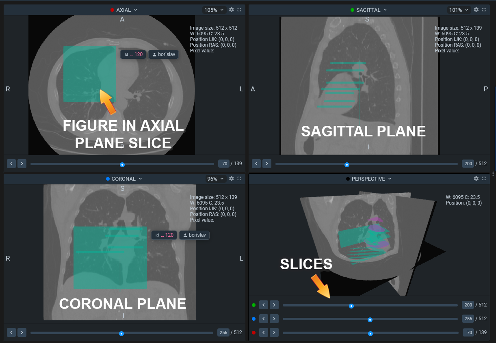

# Volumes Annotation



## Project Structure Example

Root folder for the project named `project name`

* `meta.json` file
* `key_id_map.json` file (optional)
* Dataset folders, Each named `dataset_name`, which contains:
  * `volume` folder, contains source volume files in [`.nrrd` file-format](https://en.wikipedia.org/wiki/Nrrd), for example `volume1.nrrd`
  * `ann` - folder, with annotations for volumes. (named as volume + `.json`) for example `volume1.nrrd.json`
  * `volumetric_interpolation` optional folder, created automatically while downloading project.
    * folders, named according to volume (`volume1_nrrd`), which contains an additional data files in [STL file format](https://en.wikipedia.org/wiki/STL\_\(file\_format\)), named with hex hash code of objects from key\_id\_map. For example: `24a56a26ed784e648d3dd6c5186b46ca.stl`

## Format of Annotations

For example (`/project_name/dataset_name/ann/volume1.nrrd.json`)

```
{
    "volumeId": 2388727,
    "volumeName": "volume1.nrrd",
    "datasetId": 42699,
    "volumeMeta": {
        "ACS": "RAS",
        "intensity": {"max": 3071, "min": -3024},
        "windowWidth": 6095,
        "rescaleSlope": 1,
        "windowCenter": 23.5,
        "channelsCount": 1,
        "dimensionsIJK": {"x": 512, "y": 512, "z": 139},
        "IJK2WorldMatrix": [
                            0.7617189884185793, 0,                  0,    -194.238403081894,
                            0,                  0.7617189884185793, 0,    -217.5384061336518,
                            0,                  0,                  2.5,  -347.7500000000001,
                            0,                  0,                  0,    1
                        ],
        "rescaleIntercept": 0
    },
    "createdAt": "2021-11-13T08:05:28.771Z",
    "updatedAt": "2021-11-13T08:05:28.771Z",
    "description": "",
    "tags": [],
    "objects": [
        {
            "id": 593494,
            "datasetId": 42699,
            "labelerLogin": "username",
            "createdAt": "2021-11-13T08:05:28.771Z",
            "updatedAt": "2021-11-13T08:05:28.771Z",
            "tags": [],
            "entityId": 2388727,
            "classTitle": "v"
        },
        {
            "id": 593495,
            "datasetId": 42699,
            "tags": [],
            "entityId": 2388727,
            "classTitle": "bbb"
        }
    ],
    "planes": [
        {
            "name": "axial",
            "normal": {
                "x": 0,
                "y": 0,
                "z": 1
            },
            "slices": [
                {
                    "index": 51,
                    "figures": [
                        {
                            "id": 57036532,
                            "objectId": 593494,
                            "description": "",
                            "geometryType": "bitmap",
                            "labelerLogin": "username",
                            "createdAt": "2021-11-13T08:05:28.771Z",
                            "updatedAt": "2021-11-13T08:05:28.771Z",
                            "geometry": {
                                "bitmap": {
                                    "data": "eJwBp ... AADUlIRFIAAACeA==",
                                    "origin": [
                                        156,
                                        275
                                    ]
                                }
                            }
                        }
                    ]
                },
                {
                    "index": 68,
                    "figures": [
                        {
                            "id": 57036538,
                            "objectId": 593495,
                            "description": "",
                            "geometryType": "rectangle",
                            "geometry": {
                                "points": {
                                    "exterior":[[305, 380], [167, 256]],
                                    "interior": []
                                }
                            }
                        }
                    ]
                }

            ]
        }
    ]
}
```


**Fields definitions:**

* `description` - string - (optional) - this field is used to store the text we want to assign to the volume
* `tags` - list of strings that will be interpreted as volume tags
* `objects` - list of objects that may be present on the volume
* `planes` - a list of figures that defined in these planes: [`coronal, sagittal, axial`](https://www.slicer.org/wiki/Coordinate\_systems#Anatomical\_coordinate\_system)
* `volumeMeta` - meta data for 3D reconstruction of volume
* `labelerLogin` - string - the name of the user that added this figure to the current frame

**Fields definitions for `objects` field:**

* `id` - int, an unique identifier of given object (used in key\_id\_map.json to get the object KEY
* `classTitle` - string - the title of a class. It's used to identify the class shape from the `meta.json` file
* `tags` - list of strings that will be interpreted as object tags
* `labelerLogin` - string - the name of the user that added this figure to the project

**Fields description for `volumeMeta` field:**

* `ACS` - string - "RAS" or "LPS" - name of type of [Anatomical coordinate system](https://www.slicer.org/wiki/Coordinate\_systems#Anatomical\_coordinate\_system) i.e. RAS means is Right-Anterior-Superior

```
╔════════╦════════════╗
║ Common ║ Anatomical ║
╠════════╬════════════╣
║ Left   ║ Left       ║
║ Right  ║ Right      ║
║ Up     ║ Superior   ║
║ Down   ║ Inferior   ║
║ Front  ║ Anterior   ║
║ Back   ║ Posterior  ║
╚════════╩════════════╝
```


* `intensity` - `{"min": int, "max": int}` - intensity range. Depends on the device getting the data
* `windowWidth` - float - Specify a linear conversion. Window Width contains the width of the window
* `windowCenter` - float - Specify a linear conversion. Window Center contains the value that is the center of the window
* `channelsCount` - float - channel count of your image data. Default: 1
* `dimensionsIJK` - dict {"x": int, "y": int, "z": int} - dimensions of volume described as vector in [IJK notation](https://en.wikipedia.org/wiki/Unit\_vector)
* `IJK2WorldMatrix` - matrix to transform coordinates from IJK to world (cartesian). See [here](https://www.slicer.org/wiki/Coordinate\_systems#Image\_transformation)

Grayscale transformations to be applied to Pixel Data are defined by the equivalent of the Modality LUT and Rescale Intercept, Value of Interest Attributes, Photometric Interpretation and the equivalent of the Presentation LUT.

`units = m*SV + b`

* `rescaleSlope` - float - m in the equation specified by Rescale Intercept
* `rescaleIntercept` - float - The value "b" in the relationship between stored values (SV) in Pixel Data and the output units specified in Rescale Type.

**Fields description for `planes` field:**

* `name` - string - the name of the plane, where the figures are placed. Can be [coronal, sagittal or axial](https://www.slicer.org/wiki/Coordinate\_systems#Anatomical\_coordinate\_system)


*   `normal` - dict with x,y,z as a keys and 0/1 as a values - normal is direction by axis, chosen according to plane name

    * sagittal - x
    * coronal - y
    * axial - z

    The value is binary `(int 0 or 1)` and one plane must be selected.
* `slices` - list of slices on the plane. Each list contain index and may contain figures.

**Fields description for `slices` field:**

* index - int value of slice index
* figures - list of figures placed on slice. It can be [bitmap](objects.md#bitmap) or [rectangle](objects.md#rectangle).

## Key id map file

Key\_id\_map.json file is optional. It is created when annotating the episode inside Supervisely interface and sets the correspondence between the unique identifiers of the object and the frame on which the figure is located. If you annotate manually, you do not need to create this file. This will not affect the work being done.

Json format of key\_id\_map.json:

```
{
    "tags": {},
    "objects": {
        "198f727d40c749eebcacc4aed299b39a": 20520
    },
    "figures": {
        "65f21690780e43b49863c3cbd07eab3a": 503130811
    }
}
```
