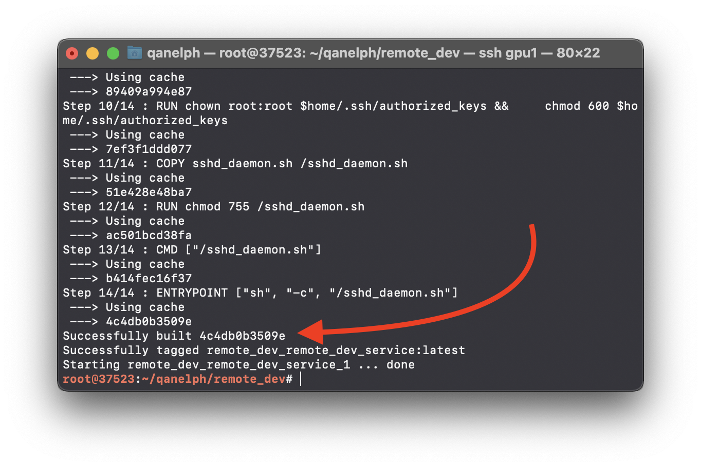

# Part 1 — Remote Developing with PyCharm \[Docker SSH Server]

### Table of contents

1. [Create a working directory](part-1-remote-developing-with-pycharm-docker-ssh-server.md#step-1-create-a-working-directory)
2. [Create SSH key](part-1-remote-developing-with-pycharm-docker-ssh-server.md#step-2-create-ssh-key)
3. [Docker Image](part-1-remote-developing-with-pycharm-docker-ssh-server.md#step-3-docker-image)
4. [Connect to container over SSH](part-1-remote-developing-with-pycharm-docker-ssh-server.md#step-4-connect-to-container-over-ssh)
5. [Connect to container in PyCharm](part-1-remote-developing-with-pycharm-docker-ssh-server.md#step-5-connect-to-container-in-pycharm)

### Step 1 — Create a working directory

The first thing you need to do is to create a directory in which you can store docker and ssh related files.

As an example, we will create a directory named **remote\_dev** inside our project and move into that directory with the command:

```bash
mkdir remote_dev && cd remote_dev
```

### Step 2 — Create SSH key

On your client system – the one you’re using to connect to the server – you need to create a pair of key codes.

To generate a pair of SSH key codes, enter the command:

```bash
ssh-keygen -t rsa -b 4096 -f my_key
```

Files `my_key` and `my_key.pub` will be created in the working directory.

.png>)

### Step 3 — Docker Image

Let's create all the files necessary for building the container.

**1. Create Dockerfile**

Let's create a simple image in which we will deploy the **SSH server**:

**remote\_dev/Dockerfile**

```docker
ARG IMAGE
FROM $IMAGE

RUN apt-get update && apt-get install -y openssh-server
EXPOSE 22

RUN apt-get install -y sudo
RUN mkdir -p /run/sshd

ARG home=/root
RUN mkdir $home/.ssh
COPY my_key.pub $home/.ssh/authorized_keys
RUN chown root:root $home/.ssh/authorized_keys && \
    chmod 600 $home/.ssh/authorized_keys

COPY sshd_daemon.sh /sshd_daemon.sh
RUN chmod 755 /sshd_daemon.sh
CMD ["/sshd_daemon.sh"]
ENTRYPOINT ["sh", "-c", "/sshd_daemon.sh"]
```

Add a script to start the server:

**remote\_dev/sshd\_daemon.sh**

```shell
#!/bin/bash -l

echo $PATH
/usr/sbin/sshd -D
```

**2. Create docker-compose**

Since we need a **GPU inside the container**, we will take **Image with** pre-installed **CUDA** as a basis and set runtime to **nvidia**.\
For convenience, let's create a **docker-compose** file:

**remote\_dev/docker-compose.yml**

```yaml
version: "2.2"
services:
  remote_dev_service:
    shm_size: '8gb'
    runtime: nvidia
    build:
      context: .
      args:
        IMAGE: nvidia/cuda:11.1.1-devel-ubuntu18.04
    ports:
      - "1234:22"
    volumes:
      - "./data:/data"
```

**3. Build container**

Don't forget to [install docker and nvidia-docker2](https://docs.nvidia.com/datacenter/cloud-native/container-toolkit/install-guide.html#docker)

```bash
curl https://get.docker.com | sh \
  && sudo systemctl --now enable docker
```

```bash
distribution=$(. /etc/os-release;echo $ID$VERSION_ID) \
&& curl -s -L https://nvidia.github.io/nvidia-docker/gpgkey | sudo apt-key add - \
&& curl -s -L https://nvidia.github.io/nvidia-docker/$distribution/nvidia-docker.list | sudo tee /etc/apt/sources.list.d/nvidia-docker.list
sudo apt update
sudo apt install -y nvidia-docker2
sudo systemctl restart docker
```

The basic syntax used to build an image using a docker-compose is:

```bash
docker-compose up --build -d
```



Once the image is successfully built, you can verify whether it is on the list of containers with the command:

```bash
docker ps | grep remote_dev_service
```

### Step 4 — Connect to container over SSH

Add server with the ports specified in **docker-compose.yml**

**\~/.ssh/config** (example)

```
Host docker_remote_container
    HostName ip_of_your_docker_container
    User root
    Port 1234
    IdentityFile path_to_ssh_secret_key
```

To connect to container by SSH, use command:

```bash
ssh docker_remote_container
```

### Step 5 — Connect to container in PyCharm

#### **1. Create new project**


#### **2. Add new interpreter**

* Open Preferences -> Python Interpreter
* Show all
* Plus button


**3. Configure interpreter**


**4. Run simple code**


