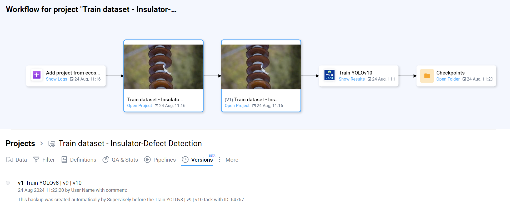

# Data versioning in MLOps (Pro & Enterprise)

This subsection describes how project versions are stored and restored in MLOps, and details specific behavior for Images, Videos and Volumes project types.

## Something special for Pro and Enterprise subscribers

**Exclusively for Pro and Enterprise subscribers**  
**Only Images, Videos and Volumes project types are supported**

A key aspect of the MLOps Workflow is data versioning. This mechanism allows you to preserve the state of a project to ensure the reproducibility of experiments. At any moment, you can recreate the current project as a new one, with its state corresponding to the selected save point. This approach has advantages over simple data copying.
It is recommended to implement this functionality for automatic project versioning in applications like "Train NN Model".

You can easily add a data backup to your workflow. All you need to do is decide before which data operation you want to create the backup and add a single method.

```python
from supervisely import Api
api = Api.from_env()
version_id = api.project.version.create(...)
```

|     Parameters      |                Type                 |             Description             |
| :-----------------: | :---------------------------------: | :---------------------------------: |
|    project_info     |       Union[ProjectInfo, int]       | `ProjectInfo` object or project ID. |
|    version_title    |            Optional[int]            |           Version title.            |
| version_description | Optional[Union[WorkflowMeta, dict]] |        Version description.         |


If a project already has a backup and there haven't been any changes since it was created, you'll receive the ID of that backup instead of creating a duplicate.


To recreate a project from a version, you need to use:

```python
api.project.version.restore(...)
```

|      Parameters      |          Type           |             Description             |
| :------------------: | :---------------------: | :---------------------------------: |
|     project_info     | Union[ProjectInfo, int] | `ProjectInfo` object or project ID. |
|      version_id      |      Optional[int]      |             Version ID.             |
|     version_num      |      Optional[int]      |           Version number.           |
| skip_missed_entities |     Optional[bool]      |         Skip missed Images          |

You can view the project version numbers and their corresponding IDs by using method

```python
api.project.version.get_list(...)
```

| Parameters |         Type         | Description |
| :--------: | :------------------: | :---------: |
| project_id |         int          | Project ID. |
|  filters   | Optional[List[dict]] |  Filters.   |

Here is how versioning appears in the Workflow:

<figure><figcaption></figcaption></figure>

## What is saved in a version

- Project structure: datasets, names and dataset associations.
- References to files in Team Files and basic file metadata (name, path, size, mime-type).
- Annotations: all objects, geometries (polygons, polylines, masks, keypoints), classes, labels and attributes.
- Per-item metadata: image/frame/slice dimensions, channels, timestamps (for videos), orientation and spacing (for volumes).

Note: the platform normally stores metadata and references to binary objects. For large binary files (video files, volume series) the system will try to reuse existing storage objects during restore; if they are missing, it may trigger re-upload or create placeholders depending on configuration.

## Videos specifics

- A version records the video file reference (Team Files) and all frame-level annotations: object-to-frame bindings, coordinates in frame space, keyframes and timestamps.
- During restore, video data will reference the same files in Team Files if available. If a file is missing and the restore policy allows it, the original file must be re-uploaded and frames remapped.
- For large videos we recommend storing an annotation export and a checksum of the original file alongside the version to verify integrity on restore.
- The `skip_missed_entities` option during restore allows skipping missing frames/files and restoring what is available.

Example (Python):

```python
from supervisely import Api
api = Api.from_env()

# Create a project version
version_id = api.project.version.create(project_id, version_title="checkpoint-1", version_description="after-augmentation")

# Restore a project from a version (skip missing entities)
api.project.version.restore(project_id, version_id=version_id, skip_missed_entities=True)
```

## Volumes specifics (DICOM / NRRD / NumPy)

- For volumes the version stores: volume structure (slice series), voxel spacing, orientation matrices, slice ordering and additional headers (DICOM tags) when present.
- A version records a pointer to the stored volume object (or archive) and the relation between the volume object and its dataset / Mask3D annotations.
- On restore the platform recreates the dataset with the same volume parameters (type, spacing, orientation). If the original binary is missing the restore may create placeholders or skip volumes depending on `skip_missed_entities`.
- Important: Supervisely normalizes volumes to an internal coordinate system (RAS) on upload; the same normalization happens during restore.

## Implementation details and recommendations

- Deduplication: before creating a new version the server checks whether there were changes since the last version. If no changes are detected, the existing version ID is returned to avoid duplication.
- Partial backups: versions may avoid duplicating unchanged binary files and instead reference existing storage objects to save space.
- API recommendation: ensure background tasks (export/import) are finished before calling `api.project.version.create(...)`, otherwise expected artifacts may be missing.

## Limitations and important notes

- Versioning in MLOps is available for Pro and Enterprise plans and officially supports Images, Videos and Volumes project types only.
- If external storage links are used they must be accessible during restore; otherwise part of the data may be skipped.
