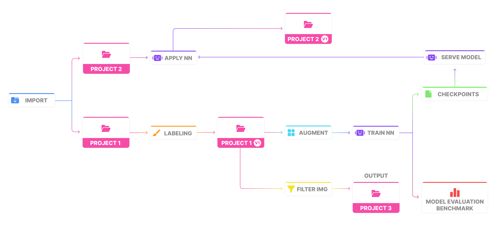

# MLOps Workflow integration

## What is Workflow and what is it used for

When working in teams, it's important to stay informed about what has happened with your data over time and have the ability to reproduce an experiment using the same data that was initially used. Thus, the workflow represents a graph where data cards are connected to application cards that process this data.

<figure><figcaption></figcaption></figure>

The Workflow functionality provides:
* Assurance that experiments are reproducible and models can be consistently retrained with the same results.
* A version control system for projects and models, enabling effective management of changes and tracking of their origins.
* Simplified tracking of the source and evolution of projects and models.
* Enhanced collaboration among team members.
* Quick access to view application sessions, open file locations for downloading, or navigate directly to projects, etc.

To access the Workflow, you can use three entry points: the context menu of the project, task, or workspace.

## The key formula for successfully building a Workflow

Almost every process on the platform has input and output data, so the workflow is mostly built around tasks.

<figure><figcaption></figcaption></figure>

Therefore, when you develop an application, it's nice to mark data import and export points for the workflow.

So, here are the types of import and export data that we can display in the workflow.

| **Input data types** | **Output data types** |
|----------------------|-----------------------|
| - project            | - project             |
| - dataset            | - dataset             |
| - file in Files      | - file in Files       |
| - folder in Files    | - folder in Files     |
| - task               | - task                |
| - labeling job       | - labeling job        |
|                      | - app session         |

## Workflow technical implementation

Applications you write using the SDK use an instance of the `Api` class to send requests. When the `Api` instance is initialized, it automatically initializes the `AppApi` and `Workflow` for it. Therefore, in your application's code, you need to use the corresponding methods in the places where you handle data retrieval and/or export.

```python
from supervisely import Api
api = Api.from_env()
```

### Project

These methods add project cards with preview and a link that allows you to directly access the project.

```python
api.app.workflow.add_input_project(...)
    # or
api.app.workflow.add_output_project(...)
```

|        Parameters        |                Type                 |                                           Description                                            |
| :----------------------: | :---------------------------------: | :----------------------------------------------------------------------------------------------: |
|         project          |  Optional[Union[int, ProjectInfo]]  |                               Project ID or `ProjectInfo` object.                                |
|        version_id        |            Optional[int]            |                                    Version ID of the project.                                    |
| `input only` version_num |            Optional[int]            | Version number of the project. This argument can only be used in conjunction with the `project`. |
|         task_id          |            Optional[int]            |             Task ID. If not specified, the task ID will be determined automatically.             |
|           meta           | Optional[Union[WorkflowMeta, dict]] |                             Additional data for node customization.                              |



📝 Customization of the project node is not supported. All customizations will be ignored. You can only customize the main node with this method.


### Dataset

These methods add dataset cards with preview and a link that allows you to directly access the project.

```python
api.app.workflow.add_input_dataset(...)
    # or
api.app.workflow.add_output_dataset(...)
```

| Parameters |                Type                 |                               Description                                |
| :--------: | :---------------------------------: | :----------------------------------------------------------------------: |
|  dataset   |       Union[int, DatasetInfo]       |                   Dataset ID or `DatasetInfo` object.                    |
|  task_id   |            Optional[int]            | Task ID. If not specified, the task ID will be determined automatically. |
|    meta    | Optional[Union[WorkflowMeta, dict]] |                 Additional data for node customization.                  |


### File in team Files

These methods add file cards with corresponding icons and a link that allows you to directly access the catalog where the files are stored.

You can set a parameter that helps identify that a file is a model with weights.

```python
api.app.workflow.add_input_file(...)
    # or
api.app.workflow.add_output_file(...)
```

|  Parameters  |                Type                 |                               Description                                |
| :----------: | :---------------------------------: | :----------------------------------------------------------------------: |
|     file     |      Union[int, FileInfo, str]      |          File ID, `FileInfo` object or file path in team Files.          |
| model_weight |                bool                 |             Flag to indicate if the file is a model weight.              |
|   task_id    |            Optional[int]            | Task ID. If not specified, the task ID will be determined automatically. |
|     meta     | Optional[Union[WorkflowMeta, dict]] |                 Additional data for node customization.                  |


### Folder in team Files

These methods are the same as for files, but already customized for folders.

```python
api.app.workflow.add_input_folder(...)
    # or
api.app.workflow.add_output_folder(...)
```

| Parameters |                Type                 |                               Description                                |
| :--------: | :---------------------------------: | :----------------------------------------------------------------------: |
|    path    |                 str                 |                    Path to the folder in Team Files.                     |
|  task_id   |            Optional[int]            | Task ID. If not specified, the task ID will be determined automatically. |
|    meta    | Optional[Union[WorkflowMeta, dict]] |                 Additional data for node customization.                  |


### Task

These methods add task cards with application icon and a link that allows you to directly access task logs.

```python
api.app.workflow.add_input_task(...)
    # or
api.app.workflow.add_output_task(...)
```

|           Parameters           |                Type                 |                               Description                                |
| :----------------------------: | :---------------------------------: | :----------------------------------------------------------------------: |
| input_task_id / output_task_id |                 int                 |                 Task ID that is used as input or output.                 |
|            task_id             |            Optional[int]            | Task ID. If not specified, the task ID will be determined automatically. |
|              meta              | Optional[Union[WorkflowMeta, dict]] |                 Additional data for node customization.                  |


### Offline session of application

This method is used to add a card that indicates the application with GUI has an offline session where you can find the result of its work.

```python
api.app.workflow.add_output_app(...)
```

| Parameters |                Type                 |                               Description                                |
| :--------: | :---------------------------------: | :----------------------------------------------------------------------: |
|  task_id   |            Optional[int]            | Task ID. If not specified, the task ID will be determined automatically. |
|    meta    | Optional[Union[WorkflowMeta, dict]] |                 Additional data for node customization.                  |


### Labeling Job

This method is used to add a card that indicates the application either uses a labeling job as a data source or creates a job as a result of its work.

```python
api.app.workflow.add_input_job(...)
    # or
api.app.workflow.add_output_job(...)
```

| Parameters |                Type                 |                               Description                                |
| :--------: | :---------------------------------: | :----------------------------------------------------------------------: |
|     id     |                 int                 |                             Labeling Job ID.                             |
|  task_id   |            Optional[int]            | Task ID. If not specified, the task ID will be determined automatically. |
|    meta    | Optional[Union[WorkflowMeta, dict]] |                 Additional data for node customization.                  |


## How to customize cards

Each card added to the workflow can be customized as to what type of data it displays and what type of connection it relates to. You can also customize the main node at the time of card creation. Therefore, customizations can be made for two linked elements at once within a single operation: for `relation` which is our input or output data card and for the main `node` which is usually a task.


However, if you configure the main node settings across different inputs or outputs, the state of the main node will be overwritten by the last action.


To prepare the settings for any card, you need to use the `WorkflowSettings` class:

```python
from supervisely import WorkflowSettings
input_card_settings = WorkflowSettings(...)
```

The class has the following properties, all of which are `Optional`:

|   Property    |     Type      |                                                                                            Description                                                                                             |
| :-----------: | :-----------: | :------------------------------------------------------------------------------------------------------------------------------------------------------------------------------------------------: |
|     title     | str |                                                   Title of the node. It is displayed in the node header. Title is formatted with the `<h4>` tag.                                                   |
|  description  | str | Description of the node. It is displayed under the title line. Do not recommend using it for long texts. Description is formatted with the `<small>` tag and used to clarify specific information. |
|     icon      | str |                         Icon of the node. It is displayed in the node body. The icon name should be from the Material Design Icons set. Do not include the 'zmdi-' prefix.                         |
|  icon_color   | str |                                                                         The color of the icon in hexadecimal format.format                                                                         |
| icon_bg_color | str |                                                                   The background color of the icon in hexadecimal format. format                                                                   |
|      url      | str |                                               URL to be opened when the user clicks on it. Must start with a slash and be relative to the instance.                                                |
|   url_title   | str |                                                                                      A short title or the URL                                                                                      |


To assign these settings to a card, you need to compile them into a `WorkflowMeta` object:

```python
from supervisely import WorkflowMeta
input_card_settings = WorkflowMeta(relation_settings=input_card_settings)
```

You can configure either one or both cards at the same time. When assigning the meta, there's no need to specify the relation to any particular operation; in input methods, it will always relate to the input.

## Minimum example for maximum understanding

Let’s imagine we have an application that works with annotations, and the application's session automatically ends after the main process. The input will usually be a project or dataset, and the output should be a new project that is immediately exported in a popular format as an archive.

A best practice is to add a separate module `workflow.py` in the `src` directory of your application. This module will contain all the logic for integrating the workflow into your application.

#### `workflow.py`

```python

from typing import Optional
import supervisely as sly

def workflow_input(api: sly.Api, project_info: sly.ProjectInfo):
    try:
        api.app.workflow.add_input_project(project_info.id)
        sly.logger.debug(f"Workflow: Input project - {project_info.id}")
    except Exception as e:
        sly.logger.debug(f"Workflow: Failed to add input project to the workflow: {repr(e)}")

def workflow_output(
    api: sly.Api,
    project_info: Optional[sly.ProjectInfo] = None,
    file_info: Optional[FileInfo] = None,
):
    if project_info is None and file_info is None:
        sly.logger.warning(
            "Workflow: at least one of the `project_info` or `file_info` must be provided. "
            "Workflow output will not be processed."
        )
        return
    try:
        if project_info is not None:
            api.app.workflow.add_output_project(project_info.id)
            sly.logger.debug(f"Workflow: Output project - {project_info.id}")
    except Exception as e:
        sly.logger.debug(f"Workflow: Failed to add output project to the workflow: {repr(e)}")
    try:
        if file_info is not None:
            relation_settings = sly.WorkflowSettings(
                title=f"Project Archive: {file_info.name}",
                description="COCO format",
                icon="archive",
                icon_color="#ff4c9e",
                icon_bg_color="#ffe3ed",
                url=f"/files/{file_info.id}/true/?teamId={file_info.team_id}",
                url_title="Download",
            )
            meta = sly.WorkflowMeta(relation_settings=relation_settings)
            api.app.workflow.add_output_file(file_info, meta=meta)
            sly.logger.debug(f"Workflow: Output file - {file_infos[0]}")
    except Exception as e:
        sly.logger.debug(
            f"Workflow: Failed to add output file with project archive to the workflow: {repr(e)}"
        )
```

Next, integrate the workflow into your application code.

#### `main.py`

```python

import globals as g # This is where we usually store the values of global variables
import workflow as w

def main()

    ... # Code where you retrieve project_info with the data you will work with

    w.workflow_input(g.api, project_info)

    ... # Code where you process the data, create a new project, and upload the result archive to Files

    w.workflow_output(g.api, res_project_info, file_info)
```

This way, we can track the history of data changes and visually see these changes at any time by accessing the MLOps Workflow.

<figure><figcaption></figcaption></figure>

## Something special for Pro and Enterprise subscribers

**`Exclusively for Pro and Enterprise subscribers`**<br>
**`Currently, only IMAGE projects are supported`**<br>

A key aspect of the MLOps Workflow is data versioning. This mechanism allows you to preserve the state of a project to ensure the reproducibility of experiments. At any moment, you can recreate the current project as a new one, with its state corresponding to the selected save point. This approach has advantages over simple data copying.<br>
It is recommended to implement this functionality for automatic project versioning in applications like "Train NN Model."

You can easily add a data backup to your workflow. All you need to do is decide before which data operation you want to create the backup and add a single method.

```python
from supervisely import Api
api = Api.from_env()
...
version_id = api.project.version.create(...)
...
```

|     Parameters      |                Type                 |             Description             |
| :-----------------: | :---------------------------------: | :---------------------------------: |
|    project_info     |       Union[ProjectInfo, int]       | `ProjectInfo` object or project ID. |
|    version_title    |            Optional[int]            |           Version title.            |
| version_description | Optional[Union[WorkflowMeta, dict]] |        Version description.         |



If a project already has a backup and there haven't been any changes since it was created, you'll receive the ID of that backup instead of creating a duplicate.


To recreate a project from a version, you need to use

```python
api.project.version.restore(...)
```

|      Parameters      |          Type           |             Description             |
| :------------------: | :---------------------: | :---------------------------------: |
|     project_info     | Union[ProjectInfo, int] | `ProjectInfo` object or project ID. |
|      version_id      |      Optional[int]      |             Version ID.             |
|     version_num      |      Optional[int]      |           Version number.           |
| skip_missed_entities |     Optional[bool]      |         Skip missed Images          |


You can view the project version numbers and their corresponding IDs by using method

```python
api.project.version.get_list(...)
```

| Parameters |         Type         | Description |
| :--------: | :------------------: | :---------: |
| project_id |         int          | Project ID. |
|  filters   | Optional[List[dict]] |  Filters.   |

<br>

<br>

