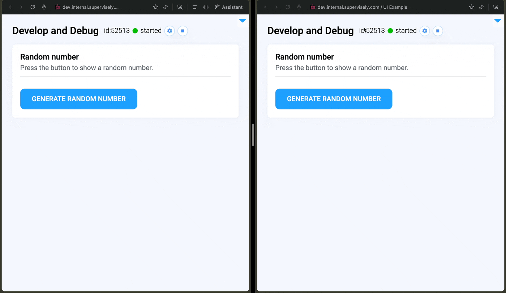

# Multi-User Session Apps



Supervisely SDK version ≥ **v6.73.453**

Supervisely instance version ≥ **v6.15.2**



## Introduction

In Supervisely SDK version 6.73.453, multi-user session management was introduced, allowing each user's interactions with app widgets to be isolated from others. This means that when one user interacts with a widget, it does not affect what other users see.

This is particularly useful for applications that can be used by a large number of users simultaneously, as it optimizes resource usage by avoiding the need to run separate app sessions for each user.

**Enable Multi-User Mode**

At the beginning of your app code, enable multi-user session management by calling:

```python
sly.env.enable_multiuser_app_mode()
```

This ensures that the app operates in a multi-user context.

**Session-Specific Data Handling**

Then, ensure that your callbacks and widget interactions are designed to work with session-specific data.



Avoid using global variables to store user-specific information, as this can lead to data leakage between sessions.



Instead of using global variables to store user-specific information (like filter states), retrieve user-specific data within the callbacks or use session-specific storage if available. This prevents data leakage between sessions.

- **Get Current User ID**: `user_id = sly.env.user_from_multiuser_app()`
- **Get API Instance**: `user_api = sly.app.session_user_api()`

For example:

```python
@widget.value_changed
def on_value_change(value):
    # Retrieve session-specific data
    user_id = sly.env.user_from_multiuser_app()
    user_api = sly.app.session_user_api()  # Get API instance for the current user
    # Process the value based on the current user's session
```


Note: This function works only when the app is running in multi-user mode on the Supervisely platform. It may not return a valid user ID when running the app locally. For local testing, you might need to use advanced debugging mode or mock user data.


### Example Application

Here is a simple example of a multi-user app that generates a random number for each user when they press a button. Each user will see their own random number without affecting others.

```python
import os
from random import randint

from dotenv import load_dotenv

import supervisely as sly
import supervisely.app.development as sly_app_development
from supervisely.app.widgets import Button, Card, Container, Text

load_dotenv(os.path.expanduser("~/supervisely.env"))
load_dotenv("local.env")

sly.env.enable_multiuser_app_mode()  # Enable multi-user session management
team_id = sly.env.team_id()
workspace_id = sly.env.workspace_id()

if sly.is_development():
    sly_app_development.enable_advanced_debug(team_id=team_id)

api = sly.Api.from_env()
info_widget = Text(status="info")
generate_random_number_button = Button("Generate random number", widget_id="mb")
card = Card(
    "Random number",
    "Press the button to show a random number.",
    content=Container([info_widget, generate_random_number_button]),
)


# Creating a callback function, which will be change the text of the Text widget
@generate_random_number_button.click
def generate_random_number():
    random_number = randint(1, 100)
    info_widget.text = f"Random number: {random_number}" # each user will see their own value


app = sly.Application(layout=card)
```



## Advanced Debugging in Multi-User Apps

When developing multi-user apps, you might want to test how the app behaves for different users. You can use the advanced debugging mode to simulate multiple users. Check the [Advanced Debugging](./advanced-debugging.md) documentation for detailed instructions on setting up and using advanced debugging mode.

## Recap

In this guide, we covered the basics of implementing multi-user session management in your Supervisely apps. By enabling multi-user mode and designing your app to handle session-specific data, you can create a more efficient and user-friendly experience for all users.
