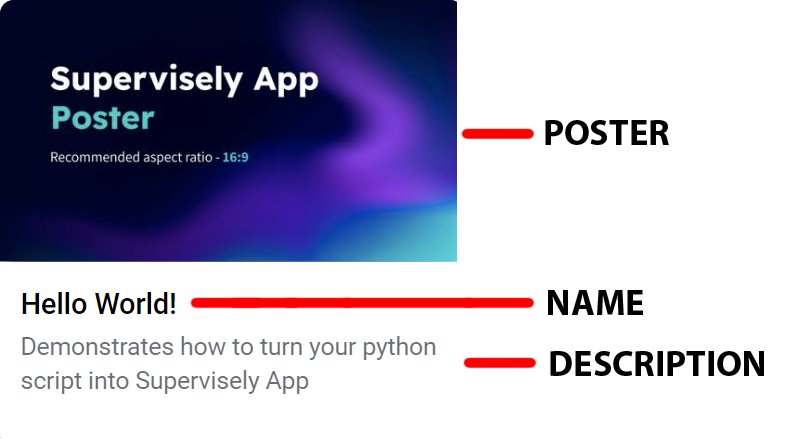

# App JSON config

## Introduction

The app config (**config.json**) is used for configuring how a project loads in Supervisely. All data is stored in app configuration as key-values, where keys are the string type and values must be in valid JSON format for Supervisely to process it correctly. Otherwise, app might fail. Configuration file must be located at the root of your project, next to the `.env` file.

**Here is a bare-minimum** [**example**](https://github.com/supervisely-ecosystem/hello-world-app/blob/master/config.json)**:**

```json
{
  "main_script": "src/main.py",
  "headless": true,
  "name": "Hello World!",
  "description": "Demonstrates how to turn your python script into Supervisely App",
  "categories": ["development"],
  "icon": "https://user-images.githubusercontent.com/12828725/182186256-5ee663ad-25c7-4a62-9af1-fbfdca715b57.png",
  "poster": "https://user-images.githubusercontent.com/12828725/182181033-d0d1a690-8388-472e-8862-e0cacbd4f082.png"
}
```

## Properties

The Supervisely app config configures many things such as app name, category, icon, poster, docker image and so on. A complete list of available properties with example values is described below. Don't worry, you don't need all of them.

|           Key          |                                                                                                                                   Value                                                                                                                                   |                                    Description                                    |
| :--------------------: | :-----------------------------------------------------------------------------------------------------------------------------------------------------------------------------------------------------------------------------------------------------------------------: | :-------------------------------------------------------------------------------: |
|          name          |                                                                                                                               "Hello World"                                                                                                                               |                                  Name of the app                                  |
|          type          |                                                                                                                                   "app"                                                                                                                                   | Specifies type of the Ecosystem entity. Available types: app, project, collection |
|         version        |                                                                                                                                  "2.0.0"                                                                                                                                  |                                 App engine version                                |
|     restart\_policy    |                                                                                                                                "on\_error"                                                                                                                                |                     Restarts app when certain condition occurs                    |
|       categories       |                                                                                                                              \["development"]                                                                                                                             |                             App category in Ecosystem                             |
|       description      |                                                                                                "Demo app for tutorial purposes, use it as a template for your custom apps"                                                                                                |                     Description of the app shown in Ecosystem                     |
|      docker\_image     |                                                                                                                        "supervisely/base-py-sdk:6"                                                                                                                        |                          Docker image used to run the app                         |
|      main\_script      |                                                                                                                         "src/my\_main\_script.py"                                                                                                                         |                                Path to main script                                |
|     modal\_template    |                                                                                                                              "src/modal.html"                                                                                                                             |                         Path to modal window html template                        |
| modal\_template\_state |                                                                                                                               {"lenght": 7}                                                                                                                               |           Initialize default values for state variables in modal window           |
|  modal\_template\_data |                                                                                                                 {"test1": "modalDataVal 1, "files": null}                                                                                                                 |            Initialize default values for data variables in modal window           |
|        headless        |                                                                                                                                    true                                                                                                                                   |                         Set true for the apps without GUI                         |
|    integrated\_into    |                                                   \["panel", "files", "standalone", "data\_commander", "image\_annotation\_tool", "video\_annotation\_tool", "dicom\_annotation\_tool", "pointcloud\_annotation\_tool"]                                                   |                                                                                   |
|         hotkeys        |                                                                                                                {"hotkey": "ctrl+m", "command": "inference"}                                                                                                               |                           Specifies hotkeys for the app                           |
|      gui\_template     |                                                                                                                               "src/gui.html"                                                                                                                              |                             Path to GUI html template                             |
|     task\_location     |                                                                                                                          "application\_sessions"                                                                                                                          |                Defines where the task will be created on app launch               |
|         isolate        |                                                                                                                                    true                                                                                                                                   |                         Runs app in the isolated container                        |
|          icon          |                                                                                                         "https://img.icons8.com/fluent/96/000000/source-code.png"                                                                                                         |                                      App icon                                     |
|       icon\_cover      |                                                                                                                                   false                                                                                                                                   |                                                                                   |
|    icon\_background    |                                                                                                                                 "#FFFFFF"                                                                                                                                 |                             App icon background color                             |
|      session\_tags     |                                                                                                            \["sly\_video\_tracking", "sly\_smart\_annotation"]                                                                                                            |                                                                                   |
|      context\_menu     | {"target": \["team", "workspace", "images\_project", "videos\_project", "point\_cloud\_project", "volumes\_project", "images\_dataset", "videos\_dataset", "point\_cloud\_dataset", "volumes\_dataset", "labeling\_job", "files\_folder", "files\_file", "team\_member"]} |               Determines where the application can be launched from               |
|       entrypoint       |                                                                                                        "python -m uvicorn src.main:app --host 0.0.0.0 --port 8000"                                                                                                        |                       Instruction for executing app scripts                       |
|          port          |                                                                                                                                    8000                                                                                                                                   |                  Use this key if you want to specify certain port                 |
|    community\_agent    |                                                                                                                                   false                                                                                                                                   |               Determines if app can be launched from community agent              |

### Configuration examples

Configurations will not vary that much depending on type of the project, whether it's a small headless app or complicated app with UI and a lot of widgets.

We'll consider a few examples of app configs:

1. Headless
2. Modal window
3. Single page app

### Example 1. Headless

We will take [`Hello World`](https://ecosystem.supervise.ly/apps/hello-world-app) app as an example of a simple headless app that can be launched from Ecosystem, it uses minimum properties.

<figure><figcaption><p>Hello World! app</p></figcaption></figure>

### Headless app properties break down

#### `main_script`

Relative path to the main script of the application from the root of the project

```json
"main_script": "src/main.py"
```

#### `headless`

Specifies that app does not have frontend elements such as GUI

```json
"headless": true
```

#### `name`

Name of the application in Ecosystem

```json
"name": "Hello World!"
```

[supervisely-ecosystem/hello-world-app/config.json](https://github.com/supervisely-ecosystem/hello-world-app/blob/master/config.json)

```json
{
  "main_script": "src/main.py",
  "headless": true,
  "name": "Hello World!",
  "description": "Demonstrates how to turn your python script into Supervisely App",
  "categories": ["development"],
  "icon": "https://user-images.githubusercontent.com/12828725/182186256-5ee663ad-25c7-4a62-9af1-fbfdca715b57.png",
  "poster": "https://user-images.githubusercontent.com/12828725/182181033-d0d1a690-8388-472e-8862-e0cacbd4f082.png"
}
```
