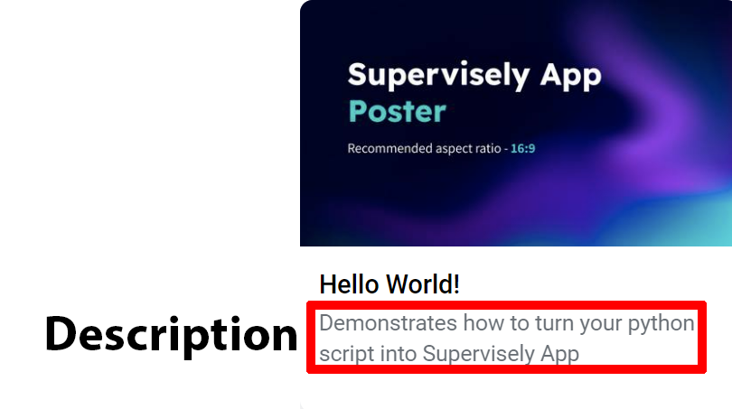
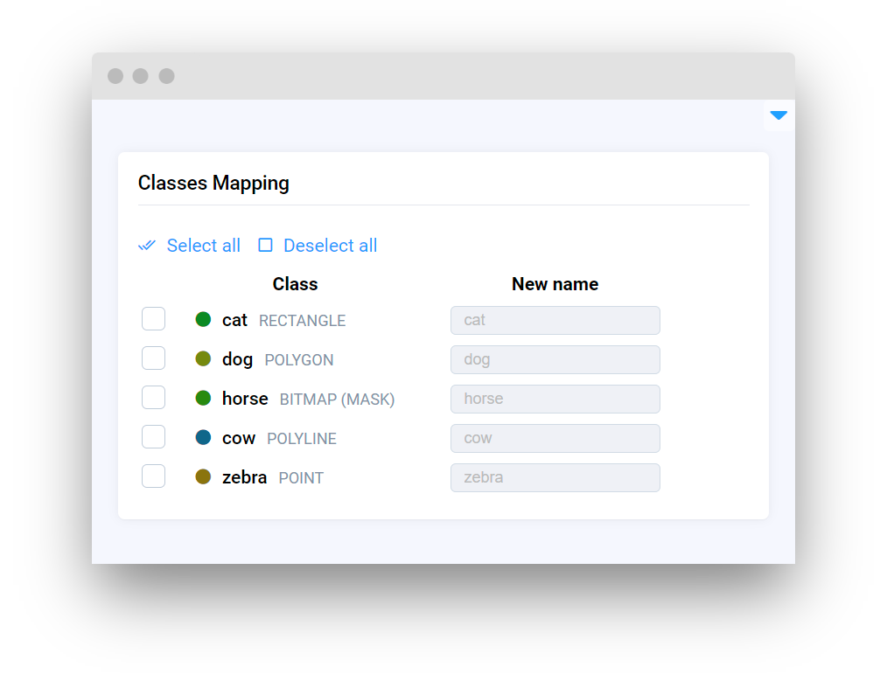
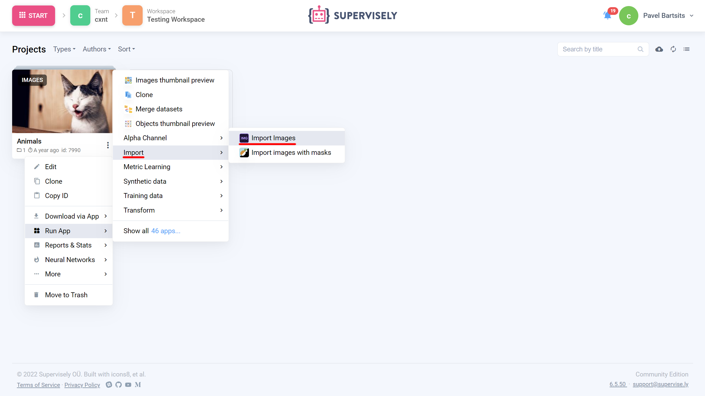

# App JSON config

## Introduction

The app config (**config.json**) is used for configuring how a project loads in Supervisely. All data is stored in app configuration as key-values, where keys are the string type and values must be in valid JSON format for Supervisely to process it correctly. Otherwise, app might fail. Configuration file must be located at the root of your project, next to the `.env` file.

**Here is a bare-minimum example:**

```json
{
  "name": "Hello World!",
  "entrypoint": "python -m uvicorn src.main:app --host 0.0.0.0 --port 8000"
}
```

## Properties

The Supervisely app config configures many things such as app name, category, icon, poster, docker image and so on. A complete list of available properties with example values is described below. Don't worry, you don't need all of them.

### `name`

Name of the app

.png>)

```json
"name": "Hello World"
```

### `description`

**Optional property**

App description in Ecosystem



```json
"description": "Working demo, use it as a template for your custom apps
```

### `type`

**Optional property**

Specifies type of the Ecosystem entity. Default value is `"app"`

Available types:&#x20;

* [Apps](https://ecosystem.supervise.ly/apps) - `"app"`
* [Projects](https://ecosystem.supervise.ly/projects) - `"project"`
* [Collections](https://ecosystem.supervise.ly/collections) - `"collection"`\


<figure><figcaption></figcaption></figure>

```json
"type": "app"
```

### `categories`

**Optional property**

List of categories that app are associated with in Ecosystem. App can have as many categories as you like.

<figure><figcaption><p>YOLOv5 app categories</p></figcaption></figure>

```json
"categories": [
    "neural network",
    "images",
    "videos",
    "object detection",
    "detection & tracking",
    "train"
    ]
```

**List of main categories:**

* [Import](https://ecosystem.supervise.ly/import) - `"import"`&#x20;
* [Export](https://ecosystem.supervise.ly/export) - `"export"`
* [Neural networks](https://ecosystem.supervise.ly/neural-network) - `"neural network"`
* [Labeling](https://ecosystem.supervise.ly/labeling) - `"labelling"`
* [Collaboration](https://ecosystem.supervise.ly/collaboration) - `"collaboration"`
* [Synthetic data](https://ecosystem.supervise.ly/synthetic) - `"synthetic"`
* [Data operations](https://ecosystem.supervise.ly/data-operations) - `"data operations"`
* [Visualization & stats](https://ecosystem.supervise.ly/visualization-stats) - `"visualization stats"`
* [Development](https://ecosystem.supervise.ly/development) - `"development"`
* [Other utilities](https://ecosystem.supervise.ly/other) - any other category that doesn't contain any category name from the above

<figure><figcaption><p>Main categories</p></figcaption></figure>

### `icon`

**Optional property**

Link to the application icon. If not specified the first two letters of the app name will be displayed as an icon


```json
"icon": "https://your-icon.png"
```

### `icon_cover`

**Optional property**

Stretches the icon to full width. Comparison of `icon cover` true (left) and false (right)

.png>)

```json
"icon_cover": false
```

### `icon_background`

**Optional property**

Icon background color in hex color code format

```json
"icon_background": "#FFFFFF"
```

### `poster`

**Optional property**

Link to the application poster. If not specified displays `icon` as poster

<figure><figcaption><p>Comparison of thumbnail with and without spcified poster</p></figcaption></figure>

```json
"poster": "https://your-poster.png"
```

### `version`

**Optional property**

App engine version. If you want to use legacy app engine do not specify version property.

```json
"version": "2.0.0"
```

### `entrypoint`

Instruction for executing app scripts v2.0.0 app engine only, for legacy apps use **`main_script`** property, but **not both**

```json
"entrypoint": "python -m uvicorn src.main:app --host 0.0.0.0 --port 8000"
```

### `port`

**Optional property**

Use this property if you want to specify certain port (v2.0.0 app engine only)

```json
"port": 8000
```

### `docker_image`

**Optional property**

Docker image used to run the app. If not specified uses latest [`supervisely/base-py-sdk`](https://hub.docker.com/r/supervisely/base-py-sdk) image by default. List of available supervisely docker images can be found at [Dockerhub](https://hub.docker.com/u/supervisely)

```json
"docker_image": "supervisely/base-py-sdk:6.68.6"
```

### `isolate`

**Optional property**

Runs app in the isolated container. Default value is `false`

```json
"isolate": true
```

### `community_agent`

**Optional property**

Determines if app can be launched from community agent. Default value is `false`

```json
"community_agent": true
```

### `min_agent_version`

**Optional property**

Minimum agent version to launch app. Current agent version can be found at the **`Team Cluster`** page. List of available agent versions can be found at [Dockerhub](https://hub.docker.com/r/supervisely/agent/tags)

<figure><figcaption></figcaption></figure>

```json
"min_agent_version": "6.7.4"
```

### `min_instance_version`

**Optional property**

Minimum instance version to launch app. Current instance version can be found at the bottom right corner at the Supervisely


```json
"min_instance_version": "6.5.50"
```

### `instance_version`

**Optional property**

Same as [**`min_instance_version`**](./#min\_instance\_version)**``**

```json
"instance_version": "6.5.50"
```

### `headless`

**Optional property**

Specifies if app do not use frontend. Set to false for the apps with GUI. Default value is `false`

```json
"headless": true
```

### `modal_template`

**Optional property**

Relative path to modal window template from project root

```json
"modal_template": "src/modal.html"
```

### `modal_template_data`

**Optional property**

Initializes default values for data variables in modal window

```json
  "modal_template_data": {
    "test_1": "modalDataVal 1",
    "files": null
  }
```

### `modal_template_state`

**Optional property**

Initializes default values for state variables in modal window

```json
"modal_template_state": {
    "checkbox_1": false,
    "checkbox_2": true,
    "input": ""
  }
```

### `context_menu`

**Optional property**

App context menu configuration options

`context_category`  - creates a sub section in context menu, you can name it whatever you like

`target`  - determines where the application can be launched from

```json
"context_menu": {
    "context_category": "Import",
    "target": ["files_folder", "images_project", "images_dataset", "agent_folder"]
  }
```



<figure><figcaption><p>files_folder/agent_folder</p></figcaption></figure>



<figure><figcaption><p>images_project/images_dataset</p></figcaption></figure>



**List of available context menu targets:**

* `"team"`
* `"workspace"`
* `"labeling_job"`
* `"team_member"`
* `"files_folder"`
* `"files_file"`
* `"agent_folder"`
* `"agent_file"`
* `"images_project"`
* `"images_dataset"`
* `"videos_project"`
* `"videos_dataset"`
* `"volumes_project"`
* `"volumes_dataset"`
* `"point_cloud_project"`
* `"point_cloud_dataset"`
* `"point_cloud_episodes_project"`
* `"point_cloud_episodes_dataset"`

### `session_tags`

**Optional property**

List of session tags. Makes app session available in another app session:

e.g [`serve YOLOV5`](https://ecosystem.supervise.ly/apps/yolov5/supervisely/serve) running app session is available in [`Apply NN to Images Project`](https://ecosystem.supervise.ly/apps/nn-image-labeling/project-dataset) app session

```json
"session_tags": [
    "sly_video_tracking",
    "sly_smart_annotation"
  ]
```

**List of available session tags:**

* `"sly_video_tracking"`
* `"sly_smart_annotation"`

### `integrated_into`

**Optional property**

Integrates app into selected tool.&#x20;

e.g [smart tool app](https://ecosystem.supervise.ly/apps/ritm-interactive-segmentation/supervisely) can be used in image annotation tool

```json
"integrated_into": ["image_annotation_tool", "video_annotation_tool"]
```

**List of available options:**

* `"panel"`
* `"files"`
* `"standalone"`
* `"data_commander"`
* `"image_annotation_tool"`
* `"video_annotation_tool"`
* `"dicom_annotation_tool"`
* `"pointcloud_annotation_tool"`

### `task_location`

**Optional property**

Defines where the task will be displayed on app launch

<figure><figcaption><p>Task Location</p></figcaption></figure>

```json
"task_location": "workspace_tasks"
```

**Available task locations:**

* `"workspace_tasks"` - suitable for one-time task applications that runs until completion (e.g. import apps)
* `"application_sessions"` - suitable for server-like apps that runs endlessly until a stop message is received (e.g. serving apps)

### `hotkeys`

**Optional property**

Specifies hotkeys that can be used in app

```json
"hotkeys": [
      {"hotkey": "ctrl+m", "command": "inference"}
  ]
```

### `restart_policy`

**Optional property**

Restarts app when certain condition occurs. **`restart_policy`** can be found in modal window advanced settings when launching app

```json
"restart_policy": "on_error"
```

<figure><figcaption><p>restart policy location</p></figcaption></figure>

### `main_script`

Relative path to main script from project root. **Legacy property**, can not be used with v2.0.0 apps, use this **`main_script`**or [**`entrypoint`**](./#entrypoint)**``**

```json
"main_script": "src/main.py"
```

### `gui_template`

**Optional property**

Relative path to GUI template from project root. **Legacy property**, **** can not be used with v2.0.0 apps.

```json
"gui_template": "src/gui.html"
```

## Configuration examples

Configurations will not vary that much depending on type of the project, whether it's a small headless app or complicated app with UI and a lot of widgets.

We'll consider a few examples of app configs:

1. ****[**Headless**](example-1.-headless.md)****
2. ****[**Modal window**](example-2.-modal-window.md)****
3. ****[**GUI**](example-3.-gui.md)****
