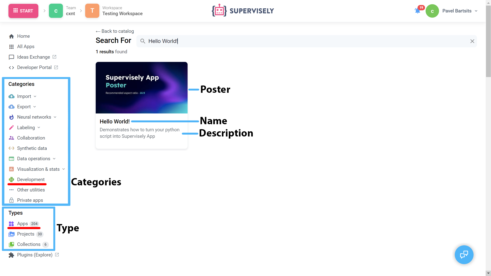

# Example 1. Headless

## Introduction

We will take [`Hello World`](https://ecosystem.supervise.ly/apps/hello-world-app) app as an example of a simple headless app that can be launched from Ecosystem, it uses minimum properties.

[supervisely-ecosystem/hello-world-app/config.json](https://github.com/supervisely-ecosystem/hello-world-app/blob/master/config.json)

```json
{
  "main_script": "src/main.py",
  "headless": true,
  "name": "Hello World!",
  "description": "Demonstrates how to turn your python script into Supervisely App",
  "categories": ["development"],
  "icon": "https://user-images.githubusercontent.com/12828725/182186256-5ee663ad-25c7-4a62-9af1-fbfdca715b57.png",
  "poster": "https://user-images.githubusercontent.com/12828725/182181033-d0d1a690-8388-472e-8862-e0cacbd4f082.png"
}
```

<figure><figcaption><p>Headless app visual properties</p></figcaption></figure>

## Properties

### `main_script`

Relative path to the main script of the application from the root of the project

```json
"main_script": "src/main.py"
```

### `headless`

Specifies that app does not have GUI

```json
"headless": true
```

### `name`

Name of the app in Supervisely

```json
"name": "Hello World!"
```

### `description`

Description of the app in Supervisely

```json
"description": "Demonstrates how to turn your python script into Supervisely App"
```

### `categories`

Сategories under which the app will be displayed in Ecosystem

```json
"categories": ["development"]
```

### `icon`

Link to the app icon

```json
"icon": "https://user-images.githubusercontent.com/12828725/182186256-5ee663ad-25c7-4a62-9af1-fbfdca715b57.png"
```

### `poster`

Link to the app poster

```json
"poster": "https://user-images.githubusercontent.com/12828725/182181033-d0d1a690-8388-472e-8862-e0cacbd4f082.png"
```
