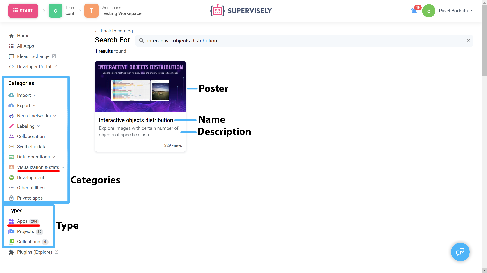
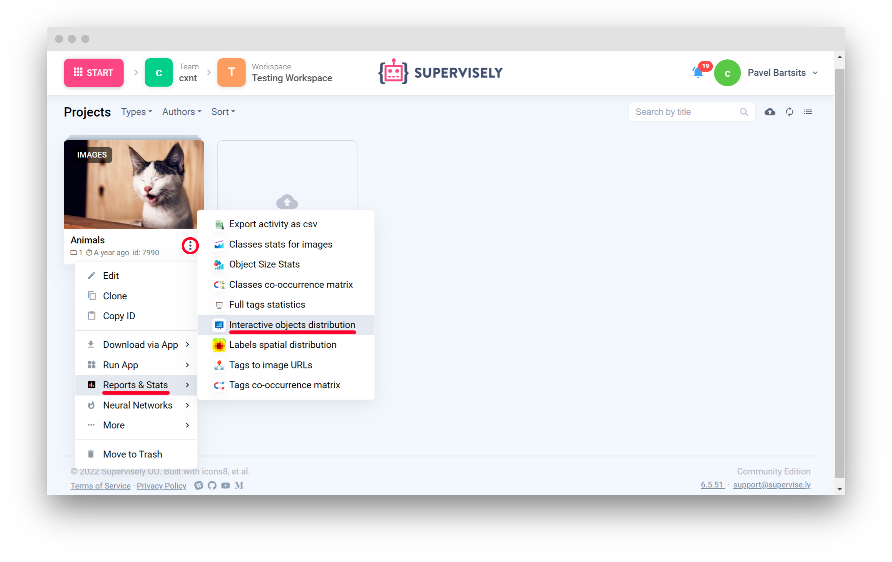

# Example 2. App with GUI

## Introduction

Configuration for apps with graphical user interface are pretty much the same like any other Supervisely apps. In this section we'll look into [`Interactive objects distribution`](https://github.com/supervisely-ecosystem/interactive-objects-distribution) app. Application calculates interactive heatmap chart for every class with objects distribution.

<figure><figcaption></figcaption></figure>

[supervisely-ecosystem/interactive-objects-distribution/config.json](https://github.com/supervisely-ecosystem/interactive-objects-distribution/blob/master/config.json)

```json
{
  "type": "app",
  "version": "2.0.0",
  "name": "Interactive objects distribution",
  "description": "Explore images with certain number of objects of specific class",
  "categories": [
    "images",
    "visualization",
    "exploration",
    "statistics",
    "visualization stats"
  ],
  "icon": "https://user-images.githubusercontent.com/12828725/183916661-224ff8cb-a3d1-4b82-a629-def8c6de1db5.png",
  "poster": "https://user-images.githubusercontent.com/106374579/187223426-ec7e0fae-8ba9-48fd-b71f-8680cc0f1b49.png",
  "entrypoint": "python -m uvicorn src.main:app --host 0.0.0.0 --port 8000",
  "port": 8000,
  "context_menu": {
    "target": ["images_project"],
    "context_root": "Report"
  },
  "min_instance_version": "6.5.22"
}
```

<figure><figcaption><p>App properties</p></figcaption></figure>

## Properties <a href="#properties" id="properties"></a>

### **`type`**

Type of the Ecosystem entity

```json
"type": "app"
```

### **`version`**

App engine version

```json
"version": "2.0.0"
```

### **`name`**

Name of the app

```json
"name": "Interactive objects distribution"
```

### **`description`**

App description in Ecosystem

```json
"description": "Explore images with certain number of objects of specific class"
```

### **`categories`**

List of categories that app are associated with in Ecosystem

<figure><figcaption><p>App categories</p></figcaption></figure>

```json
"categories": [
    "images",
    "visualization",
    "exploration",
    "statistics",
    "visualization stats"
  ]
```

### **`icon`**

Link to the application icon

```json
"icon": "https://user-images.githubusercontent.com/12828725/183916661-224ff8cb-a3d1-4b82-a629-def8c6de1db5.png"
```

### **`poster`**

Link to the application poster

```json
"poster": "https://user-images.githubusercontent.com/106374579/187223426-ec7e0fae-8ba9-48fd-b71f-8680cc0f1b49.png"
```

### **`entrypoint`**

Instruction for executing app scripts.

**`src.main` ** is a relative path to main.py which contains app object ** `:app`**

```json
"entrypoint": "python -m uvicorn src.main:app --host 0.0.0.0 --port 8000"
```

### **`port`**

Predefined standard port for the app

```json
"port": 8000
```

### **`context_menu`**

App context menu configuration options. If not specified, app can be launched only from Ecosystem

`context_category` - sub section in context menu

`target`  - determines where the application can be launched from

<figure><figcaption></figcaption></figure>

```json
"context_menu": {
    "target": ["images_project"],
    "context_root": "Report"
  }
```

### **`min_instance_version`**

Minimum instance version to launch app. Current instance version can be found at the bottom right corner at the Supervisely


```json
"min_instance_version": "6.5.22"
```
