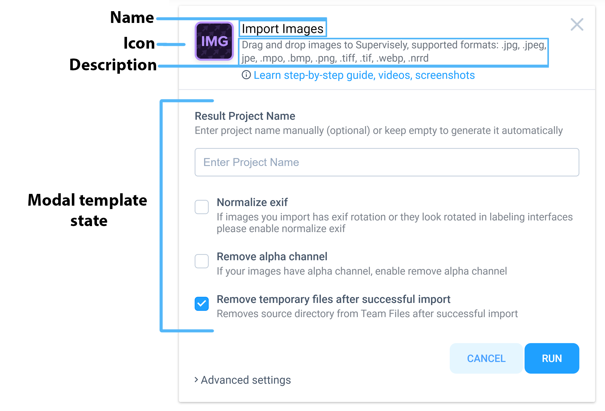
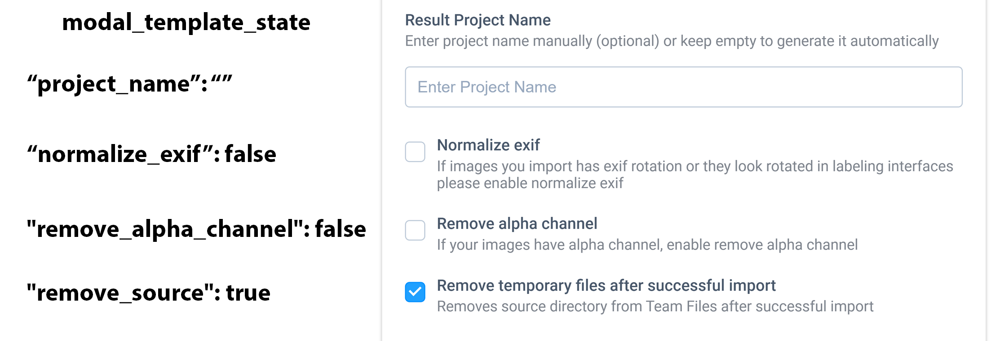
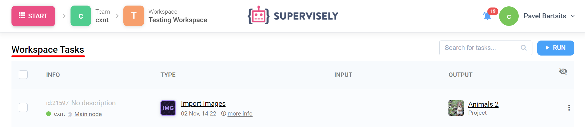
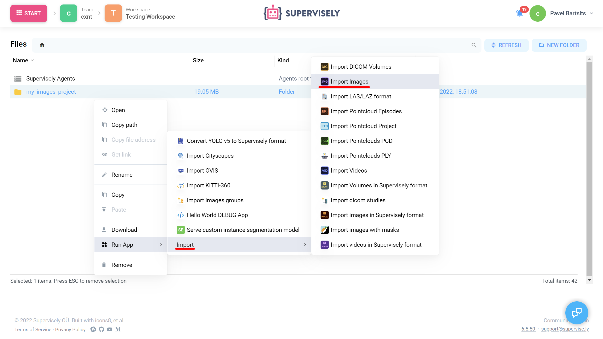
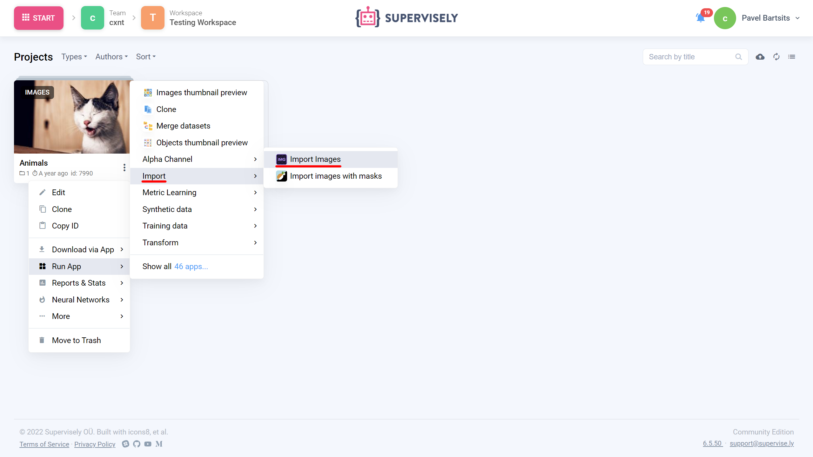

# Example 1. v1 Modal Window

## Introduction

Modal Window is designed to have all app pre-launch configuration options or contain critical information about app in a centralized dialog within one tab. We'll use [`Import Images`](https://ecosystem.supervise.ly/apps/import-images) app as an example in this section. This is a common app that import images without annotations to Supervisely.

[supervisely-ecosystem/import-images/config.json](https://github.com/supervisely-ecosystem/import-images/blob/master/config.json)

```json
{
  "name": "Import Images",
  "type": "app",
  "categories": ["import", "images", "essentials"],
  "description": "Drag and drop images to Supervisely, supported formats: .jpg, .jpeg, jpe, .mpo, .bmp, .png, .tiff, .tif, .webp, .nrrd",
  "docker_image": "supervisely/base-py-sdk:6.68.1",
  "main_script": "src/main.py",
  "modal_template": "src/modal.html",
  "modal_template_state": {
    "normalize_exif": false,
    "remove_alpha_channel": false,
    "remove_source": true,
    "project_name": ""
  },
  "task_location": "workspace_tasks",
  "icon": "https://github.com/supervisely-ecosystem/import-images/releases/download/v1.0.0/icon.png",
  "icon_cover": true,
  "icon_background": "#FFFFFF",
  "min_agent_version": "6.7.4",
  "min_instance_version": "6.5.46",
  "headless": true,
  "context_menu": {
    "context_category": "Import",
    "target": ["files_folder", "images_project", "images_dataset", "agent_folder"]
  },
  "poster": "https://github.com/supervisely-ecosystem/import-images/releases/download/v1.0.0/poster.png"
}
```

<figure><figcaption><p>Modal window properties</p></figcaption></figure>

## Properties

### `name`&#x20;

Name of the app in Supervisely

```json
"name": "Import Images"
```

### `type`

Entity type in Supervisely Ecosystem

```json
"type": "app"
```

### `categories`

Сategories under which the app will be displayed in Ecosystem

```json
"categories": ["import", "images", "essentials"]
```

### `description`

Description of the app in Supervisely

```json
"description": "Drag and drop images to Supervisely, supported formats: .jpg, .jpeg, jpe, .mpo, .bmp, .png, .tiff, .tif, .webp, .nrrd"
```

### `docker_image`

Docker image used to launch the app with all pre-installed requirements

```json
"docker_image": "supervisely/base-py-sdk:6.68.1"
```

### `main_script`

Relative path to the main script of the application from the root of the project

```json
"main_script": "src/main.py"
```

### `modal_template`

Relative path to the modal window template from the root of the project

```json
"modal_template": "src/modal.html"
```

### `modal_template_state`

Controls default values for modal window variables.

<figure><figcaption><p>modal template state</p></figcaption></figure>

```json
"modal_template_state": {
    "normalize_exif": false,
    "remove_alpha_channel": false,
    "remove_source": true,
    "project_name": ""
  }
```

### `task_location`

Specifies where to display task

<figure><figcaption><p>workspace task</p></figcaption></figure>

```json
"task_location": "workspace_tasks"
```

### `icon`

Link to the app icon

```json
"icon": "https://github.com/supervisely-ecosystem/import-images/releases/download/v1.0.0/icon.png"
```

### `icon_cover`

Stretches the icon to full width.

Comparison of `icon cover` true (left) and false (right)

.png>).png>)

```json
"icon_cover": true
```

### `icon_background`

Background of app icon in hex color code

```json
"icon_background": "#FFFFFF"
```

### `min_agent_version`

Minimum required agent version to launch the app. Agent version can be found at **`Team Cluster`** page

<figure><figcaption><p>Agent version</p></figcaption></figure>

```json
"min_agent_version": "6.7.4"
```

### `min_instance_version`

Minimum required instance version to launch the app. Current instance version can be found at the bottom right corner of the Supervisely page.


```json
"min_instance_version": "6.5.46"
```

### `headless`

Specifies that app does not have GUI

<pre class="language-json"><code class="lang-json"><strong>"headless": true</strong></code></pre>

### `context_menu`

App context menu configuration



<figure><figcaption><p>files_folder/agent_folder</p></figcaption></figure>



<figure><figcaption><p>images_project/images_dataset</p></figcaption></figure>



<pre class="language-json"><code class="lang-json"><strong>"context_menu": {
</strong>    "context_category": "Import",
    "target": ["files_folder", "images_project", "images_dataset", "agent_folder"]
  }</code></pre>

### `poster`

Link to app poster

<pre class="language-json"><code class="lang-json"><strong>"poster": "https://github.com/supervisely-ecosystem/import-images/releases/download/v1.0.0/poster.png"</strong></code></pre>
