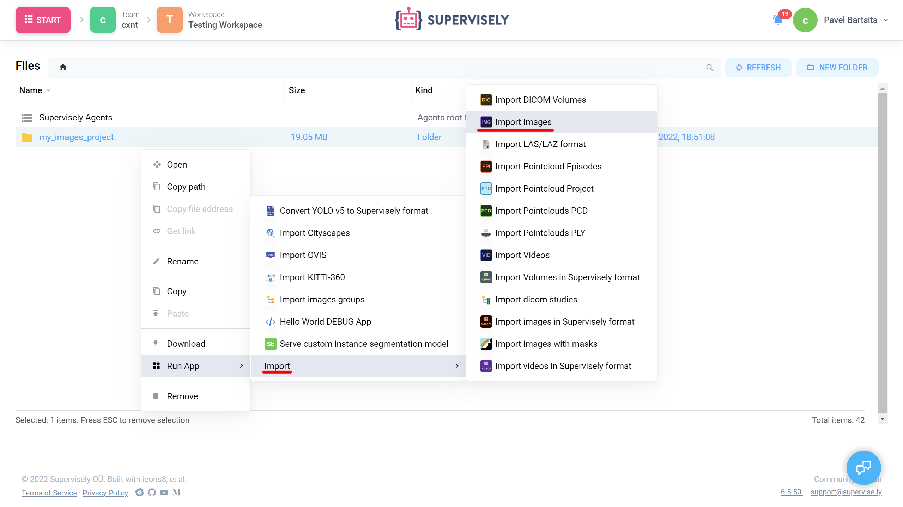

# Configuration file

## Introduction

The app config (**config.json**) is used for configuring how a project loads in Supervisely. All data is stored in app configuration as key-values, where keys are the string type and values must be in valid JSON format for Supervisely to process it correctly. Otherwise, app might fail. Configuration file must be located at the root of your project, next to the `.env` file.

**Here is a bare-minimum example:**

```json
{
  "name": "Hello World!",
  "version": "2.0.0",
  "entrypoint": "python -m uvicorn src.main:app --host 0.0.0.0 --port 8000"
}
```

## Properties

The Supervisely app config configures many things such as app name, category, icon, poster, docker image and so on. A complete list of available properties with example values is described below. Don't worry, you don't need all of them.

### `name`

**Required property**

Name of the app

.png>)

```json
"name": "Hello World"
```

### `description`

App description in Ecosystem


```json
"description": "Working demo, use it as a template for your custom apps
```

### `type`

Specifies type of the Ecosystem entity. Default value is `"app"`\


<figure><figcaption><p>Types</p></figcaption></figure>

**Available types:**&#x20;

* [Apps](https://ecosystem.supervise.ly/apps) - `"app"`
* [Projects](https://ecosystem.supervise.ly/projects) - `"project"`
* [Collections](https://ecosystem.supervise.ly/collections) - `"collection"`

```json
"type": "app"
```

### `categories`

List of categories that app are associated with in Ecosystem. App can have as many categories as you like.

<figure><figcaption><p>YOLOv5 app categories</p></figcaption></figure>

```json
"categories": [
    "neural network",
    "images",
    "videos",
    "object detection",
    "detection & tracking",
    "train"
    ]
```

**List of main categories:**

* `"import"` - [Import](https://ecosystem.supervise.ly/import)
* `"export"` - [Export](https://ecosystem.supervise.ly/export)
* `"neural network"`- [Neural networks](https://ecosystem.supervise.ly/neural-network)
* `"labelling"`- [Labeling](https://ecosystem.supervise.ly/labeling)
* `"collaboration"`- [Collaboration](https://ecosystem.supervise.ly/collaboration)
* `"synthetic"`- [Synthetic data](https://ecosystem.supervise.ly/synthetic)
* `"data operations"`- [Data operations](https://ecosystem.supervise.ly/data-operations)
* `"visualization stats"`- [Visualization & stats](https://ecosystem.supervise.ly/visualization-stats)
* `"development"`- [Development](https://ecosystem.supervise.ly/development)
* Any other category that doesn't contain any category name from the above goes to [Other utilities](https://ecosystem.supervise.ly/other)&#x20;

<figure><figcaption><p>Main categories</p></figcaption></figure>

**Category tags combination**

Main categories also contain sub-categories.

<figure><figcaption></figcaption></figure>

If you want your application to appear there you must combine multiple tags. Place order does not matter.

```json
"categories": [
    "images",
    "annotation transformation",
    "data operations"
  ]
```

<figure><figcaption></figcaption></figure>

**List of sub-categories:**

* `"images"`, `"videos"`, `"dicom"`, `"pointclouds"`
* `"object detection"`, `"semantic segmentation"`, `"instance segmentation"`, `"classification"`, `"interactive segmentation"`, `"metric learning"`
* `"detection & tracking"`, `"segmentation & tracking"`, `"interactive segmentation"`, `"interpolation"`
* `"annotation transformations"`, `"data transformations"`, `"modality transformations"`, `"projects management"`, `"composition & synthesizing"`, `"augmentation"`
* `"train"`, `"serve"`

### `icon`

Link to the application icon. If not specified the first two letters of the app name will be displayed as an icon


```json
"icon": "https://your-icon.png"
```

### `icon_cover`

Stretches the icon to full width. Comparison of `icon cover` true (left) and false (right)

 (2).png>) (1).png>)

```json
"icon_cover": false
```

### `icon_background`

Icon background color in hex color code format

```json
"icon_background": "#FFFFFF"
```

### `poster`

Link to the application poster. If not specified displays `icon` as poster

<figure><figcaption><p>Comparison of thumbnail with and without spcified poster</p></figcaption></figure>

```json
"poster": "https://your-poster.png"
```

### `version`

**Required property**

App engine version. If you want to use legacy app engine do not specify version property.

```json
"version": "2.0.0"
```

### `entrypoint`

**Required property**

Instruction for executing app scripts v2.0.0 app engine only, for legacy apps use **`main_script`** property, but **not both**

**`src.main` ** is a relative path to main.py which contains app object ** `:app`**

```json
"entrypoint": "python -m uvicorn src.main:app --host 0.0.0.0 --port 8000"
```

**Note:** if **`app` ** object is in a different script file like **`globals.py`**, and **`globals.py`** is imported to **`main.py`** script you can specify it like **`src.main:globals.app`**

### `port`

Use this property if you want to specify certain port (**v2.0.0 app engine only**)

```json
"port": 8000
```

### `docker_image`

Docker image used to run the app. If not specified uses [`supervisely/base-py-sdk`](https://hub.docker.com/r/supervisely/base-py-sdk) image based on supervisely version in requirements.txt file or uses latest version. List of available supervisely docker images can be found at [Dockerhub](https://hub.docker.com/u/supervisely)

```json
"docker_image": "supervisely/base-py-sdk:6.68.6"
```

### `community_agent`

Applicable only for Community Edition instances. Users of Enterprise Instances can ignore this field. If flag is `False` - then the app can not be run on public agents and has to be run only on user's agents. Default value is `true`.&#x20;

Practical example: by default users of Community Edition can run apps on the agents (computers) provided by Supervisely team for free. If app, for example, deploys NN inside, Supervisely team can not allow community users to run this app due to the limitation of available GPU resources.  That is why some resource-intensive apps have this flag: `"community_agent": false`

```json
"community_agent": false
```

### `min_agent_version`

Minimum agent version to launch app. Current agent version can be found at the **`Team Cluster`** page. List of available agent versions can be found at [Dockerhub](https://hub.docker.com/r/supervisely/agent/tags)

<figure><figcaption></figcaption></figure>

```json
"min_agent_version": "6.7.4"
```

### `min_instance_version`

Minimum instance version to launch app. Current instance version can be found at the bottom right corner at the Supervisely

If the current instance version is lower than the version specified in the application, the supervisely platform will try to find a compatible instance version


```json
"min_instance_version": "6.5.50"
```

### `instance_version`

Same as [**`min_instance_version`**](./#min\_instance\_version)**``**

```json
"instance_version": "6.5.50"
```

### `headless`

Specifies if app do not use frontend. Set to false for the apps with GUI. Default value is `false`

```json
"headless": true
```

### `modal_template`

Relative path to modal window template from project root

```json
"modal_template": "src/modal.html"
```

### `modal_template_data`

Initializes default values for data variables in modal window

```json
  "modal_template_data": {
    "test_1": "modalDataVal 1",
    "files": null
  }
```

### `modal_template_state`

Initializes default values for state variables in modal window

```json
"modal_template_state": {
    "checkbox_1": false,
    "checkbox_2": true,
    "input": ""
  }
```

### `context_menu`

App context menu configuration options. If not specified, app can be launched only from Ecosystem

`context_category` - sub section in context menu

`target`  - determines where the application can be launched from

```json
"context_menu": {
    "context_category": "Import",
    "target": ["files_folder", "images_project", "images_dataset", "agent_folder"]
  }
```



<figure><figcaption><p>files_folder/agent_folder</p></figcaption></figure>



<figure><figcaption><p>images_project/images_dataset</p></figcaption></figure>



**List of available context menu targets:**

* `"ecosystem"`
* &#x20;"team"
* `"workspace"`
* `"labeling_job"`
* `"team_member"`
* `"files_folder"`
* `"files_file"`
* `"agent_folder"`
* `"agent_file"`
* `"images_project"`
* `"images_dataset"`
* `"videos_project"`
* `"videos_dataset"`
* `"volumes_project"`
* `"volumes_dataset"`
* `"point_cloud_project"`
* `"point_cloud_dataset"`
* `"point_cloud_episodes_project"`
* `"point_cloud_episodes_dataset"`

### `session_tags`

List of session tags. Makes app session available in another app session:

e.g [`serve YOLOV5`](https://ecosystem.supervise.ly/apps/yolov5/supervisely/serve) running app session is available in [`Apply NN to Images Project`](https://ecosystem.supervise.ly/apps/nn-image-labeling/project-dataset) app session

```json
"session_tags": [
    "sly_video_tracking",
    "sly_smart_annotation"
  ]
```

**List of available session tags:**

* `"sly_video_tracking"`
* `"sly_smart_annotation"`
* `"deployed_nn"`

### `integrated_into`

Integrates app into selected tool.&#x20;

e.g [smart tool app](https://ecosystem.supervise.ly/apps/ritm-interactive-segmentation/supervisely) can be used in image annotation tool

```json
"integrated_into": ["image_annotation_tool", "video_annotation_tool"]
```

**List of available options:**

* `"panel"`
* `"files"`
* `"standalone"`
* `"image_annotation_tool"`
* `"video_annotation_tool"`
* `"dicom_annotation_tool"`
* `"pointcloud_annotation_tool"`

### `task_location`

Defines where the task will be displayed on app launch. If specified as `"workspace_tasks"`, app will be displayed in both workspace tasks and app session pages

<figure><figcaption><p>Task Location</p></figcaption></figure>

```json
"task_location": "workspace_tasks"
```

**Available task locations:**

* `"workspace_tasks"` - suitable for application that directly interacts with data from the workspace (e.g. import/export apps)
* `"application_sessions"` - suitable for the application that is tied to the team and can work in multiple workspaces (e.g. server-like apps)

### `hotkeys`

Specifies hotkeys that can be used in app

```json
"hotkeys": [
      {"hotkey": "ctrl+m", "command": "inference"}
  ]
```

### `restart_policy`

Restarts app when certain condition occurs. **`restart_policy`** can be found in modal window advanced settings when launching app

```json
"restart_policy": "on_error"
```

<figure><figcaption><p>restart policy location</p></figcaption></figure>

### `main_script`

**Legacy property**

Relative path to main script from project root. Can not be used with v2.0.0 apps, use **`main_script`** or [**`entrypoint`**](./#entrypoint)**``**

```json
"main_script": "src/main.py"
```

### `gui_template`

**Legacy property**

Relative path to GUI template from project root. Can not be used with v2.0.0 apps.

```json
"gui_template": "src/gui.html"
```

## Configuration examples

Configurations will not vary that much depending on type of the project, whether it's a small headless app or complicated app with UI and a lot of widgets.

**Common app config example:**

```json
{
  "name": "App name here",
  "type": "app",
  "version": "2.0.0",
  "categories": ["development"],
  "description": "App description here",
  "entrypoint": "python -m uvicorn src.main:app --host 0.0.0.0 --port 8000"
  "task_location": "workspace_tasks",
  "icon": "https://icon.png",
  "poster": "https://poster.png"
}
```

We'll consider a few examples of app configs:

1. ****[**Headless**](example-1.-headless.md)****
2. ****[**App with GUI**](example-2.-app-with-gui.md)****
3. ****[**v1 - Legacy**](v1-legacy/)****
