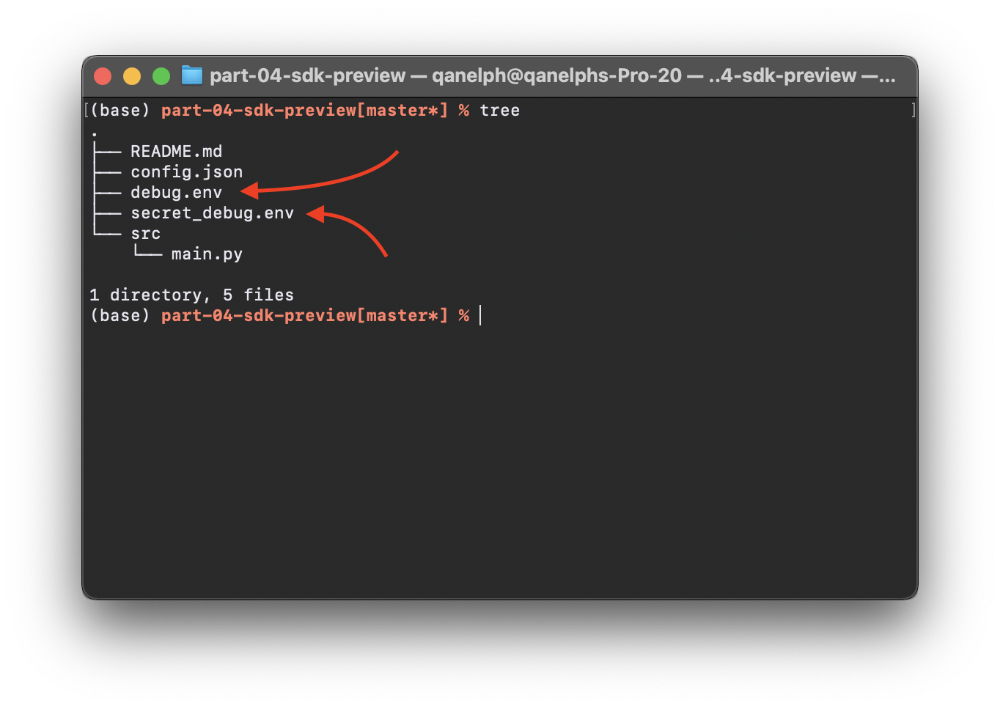

# Part 4 — SDK Preview \[Lemons counter app]

### Table of contents

1. [Clone Lemons (Annotated) project from Ecosystem](part-4-sdk-preview-lemons-counter-app.md#step-1-clone-lemons-annotated-project-from-ecosystem)
2. [Environments files](part-4-sdk-preview-lemons-counter-app.md#step-2-environments-files)
3. [Python script && Results](part-4-sdk-preview-lemons-counter-app.md#step-3-python-script-and-and-results)
4. [Complete SDK documentation](part-4-sdk-preview-lemons-counter-app.md#step-4-complete-sdk-documentation)

### Step 1 — Clone Lemons (Annotated) project from Ecosystem

Clone [Lemons (Annotated)](https://app.supervise.ly/ecosystem/projects/lemons-annotated) project from Ecosystem to your Workspace

### Step 2 — Environments files

For our convenience, let's make two files in application directory: debug.env and secret\_debug.env



We will add constants to these files to access the Supervisely SDK

**debug.env**

```python
PYTHONUNBUFFERED=1

modal.state.slyProjectId=6157

context.teamId=238
context.workspaceId=333

LOG_LEVEL="debug"
```

**secret\_debug.env** ( keep the file in secret)

```python
# This file is used for example! After filling in your personal data, keep the file secret!

SERVER_ADDRESS="https://app.supervise.ly/"
API_TOKEN=""  # get it in https://app.supervise.ly/user/settings/tokens
AGENT_TOKEN= # get it in https://app.supervise.ly/nodes/list
```

### Step 3 — Python script && Results

Let's write a simple script that:

1. downloads the project
2. retrieves annotations
3. counts the number of lemons

Here is the completed code:

**src/main.py**

```python
import supervisely_lib as sly
import os
import json
from dotenv import load_dotenv  # pip install python-dotenv
								# don't forget to add to requirements.txt!

# Loading env files
load_dotenv("../debug.env")
load_dotenv("../secret_debug.env", override=True)

# Extracting variables
address = os.environ['SERVER_ADDRESS']
token = os.environ['API_TOKEN']

team_id = int(os.environ['context.teamId'])
workspace_id = int(os.environ['context.workspaceId'])
project_id = int(os.environ['modal.state.slyProjectId'])

# Initialize API object
api = sly.Api(address, token)

# Downloading Project
project_local_dir = './project_local_dir/'

if sly.fs.dir_exists(project_local_dir):
    sly.fs.clean_dir(project_local_dir)  # clean dir before download

sly.download_project(api=api,
                     project_id=project_id,
                     dest_dir=project_local_dir)

# Getting project meta (Base project information — Labels, Shapes, Colors etc.)
project_meta_json = api.project.get_meta(project_id)  # we could also open a local file ./project_local_dir/meta.json
project_meta = sly.ProjectMeta.from_json(project_meta_json)

# Getting list of datasets folders in project
project_datasets = [potential_dir for potential_dir in os.listdir(project_local_dir)
                    if os.path.isdir(os.path.join(project_local_dir, potential_dir))]


# Getting list of Annotations in project
images_annotations = []

for current_dataset in project_datasets:  # for each dataset in project
    dataset_annotations_dir_path = os.path.join(project_local_dir, current_dataset, 'ann')
    annotation_filenames = os.listdir(dataset_annotations_dir_path)

    for annotation_filename in annotation_filenames:  # for each annotation file in dataset
        with open(os.path.join(dataset_annotations_dir_path, annotation_filename), 'r') as ann_file:
            image_annotations_json = json.load(ann_file)

        image_annotations = sly.Annotation.from_json(image_annotations_json, project_meta)
        images_annotations.append(image_annotations)  # store annotation


# Let's count lemons!

count = 0
class_of_interest = 'lemon'

for image_annotation in images_annotations:
    for label in image_annotation.labels:
        if label.obj_class.name == class_of_interest:
            count += 1

print(f'{project_id=} contains {count} {class_of_interest}(-s)')
```

**Results:**

```
project_id=6157 contains 8 lemon(-s)
```

### Step 4 — Complete SDK documentation

You can find more information here:

* [Learn SDK Basics with IPython Notebooks](https://supervisely.readthedocs.io/en/latest/rst\_templates/tutorials/notebooks/notebooks.html)
* [Complete Python SDK](https://supervisely.readthedocs.io/en/latest/sdk\_packages.html)
