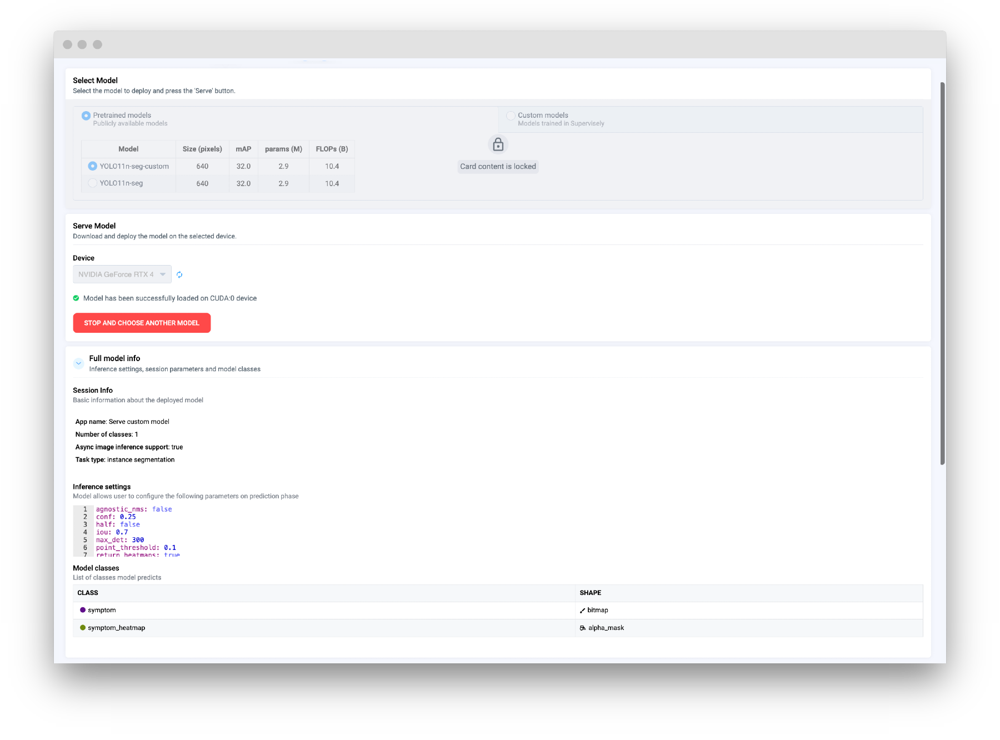
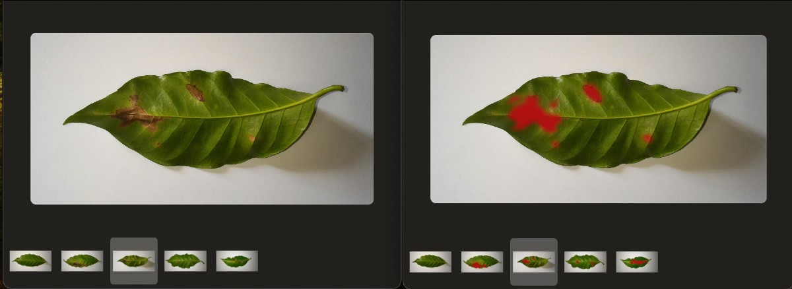
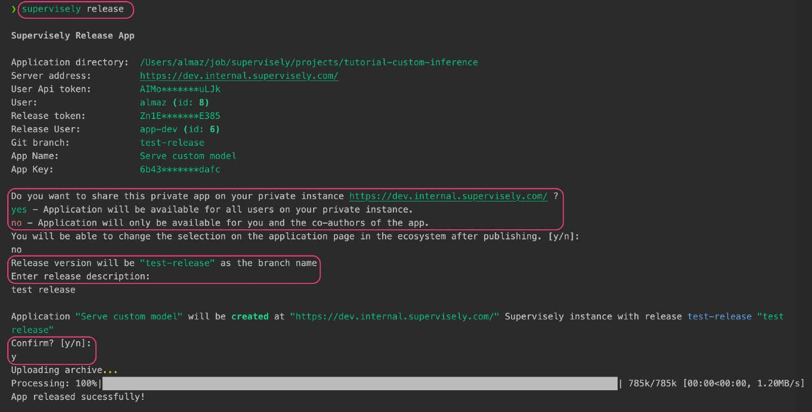

# Example: Custom Model Inference with Probability maps (Alpha-Mask Segmentation masks)



We have prepared a [GitHub repository](https://github.com/supervisely-ecosystem/tutorial-custom-inference) with the source code and resources for this guide (including the model checkpoint, test images, and other resources). You can clone the repository and follow the instructions to run the example on your local machine.



In this guide, we will demonstrate a practical and hands-on example of implementing custom model inference in Supervisely. Before we begin, please check out the [Custom Model Integration](https://docs.supervisely.com/neural-networks/overview-2) section in the documentation for detailed information on integrating custom models at various levels of the platform, including training, inference, and benchmarking.

In this example, our custom model in addition to binary masks returns probability maps, where each pixel represents a probability of the class (0 for 0% probability, 255 for 100% probability, and any value in between).


Disclaimer: To simplify the demonstration, we will use a pretrained YOLO model to generate binary masks and apply a Gaussian blur to simulate probability maps. In the real-world scenario, you would use a model that returns probability maps directly. Please note that this is a specific use case, and the principles and techniques can be applied to a wide range of custom models and tasks. You can adapt the code and methods to suit your specific requirements, check out the [integrate custom inference](https://docs.supervisely.com/neural-networks/overview-2/integrate-custom-inference) documentation for more details.


<figure><figcaption></figcaption></figure>

For this example, we've chosen a model trained on the [_Coffee Leaf Biotic Stress Dataset_](https://datasetninja.com/coffee-leaf-biotic-stress) from Dataset Ninja. The model checkpoint and all related materials are included in the repository, allowing you to follow along step by step.

<blog-dataset-ninja id="coffee-leaf-biotic-stress"></blog-dataset-ninja>

## Overview

To implement custom inference in Supervisely, you need to create a subclass of the `sly.nn.inference.Inference` base class. This class provides a set of built-in methods that handle various aspects of the inference process, such as loading the model, making predictions, creating annotations, or even built-in GUI, and more. Depending on your requirements, you may need to override some of these methods to customize the behavior of your model.

Here is a basic outline of the steps involved in this example:

1. Create a subclass of `sly.nn.inference.Inference` and implement methods to load the model, make predictions, and create annotations.

2. Prepare a simple script to deploy the model and infer images.

3. _Optional_: Render the heatmaps on the images to visualize the probability maps.

4. Prepare the app to serve the model with GUI.

5. Release the app as a private app in Supervisely.

6. Predict using the app and explore the results in the platform.

## Prerequisites

Before we begin, make sure you have the necessary tools and libraries installed. Clone the [repository](https://github.com/supervisely-ecosystem/tutorial-custom-inference) with the example and install the dependencies: We recommend using a virtual environment to manage the dependencies.

```bash
git clone git@github.com:supervisely-ecosystem/tutorial-custom-inference.git
cd tutorial-custom-inference
python3 -m venv venv
source venv/bin/activate
pip install -r requirements.txt
```

## Step 1. Custom Inference class

Before we start, let's create an `yaml` file with the inference settings, for example, `src/custom_settings.yaml`. This file will be used to configure the model and set the inference parameters. You can specify any parameters you want to use for inference, such as confidence threshold, IoU threshold, maximum number of detections, etc. In our example, we have added a `return_heatmaps` setting to return probability maps in addition to binary masks.

```yaml
# bounding box confidence threshold
conf: 0.25
# intersection over union (IoU) threshold for NMS
iou: 0.7
# use half precision (FP16)
half: False
# maximum number of detections per image
max_det: 300
# whether to use class-agnostic NMS or not
agnostic_nms: False
# whether to return heatmaps or not (for prabability maps)
return_heatmaps: True # ⬅︎ This setting will be used to return probability maps
```

Create a `src/custom_model.py` file and define a subclass of `sly.nn.inference.Inference` to implement the custom model. Depending on the CV task, you may inherit from appropriate subclass, such as `sly.nn.inference.SemanticSegmentation`, `sly.nn.inference.InstanceSegmentation`, `sly.nn.inference.ObjectDetection`, etc. Refer to the [documentation](https://docs.supervisely.com/neural-networks/overview-2/integrate-custom-inference#step-4.-create-inference-class) for more details.

```python
# src/custom_model.py
from typing import Dict, List, Optional

import cv2
import numpy as np
import supervisely as sly
from ultralytics import YOLO


class CustomModel(sly.nn.inference.InstanceSegmentation):
    INFERENCE_SETTINGS = "src/custom_settings.yaml"     # ⬅︎ Inference settings
```

Now, let's add `FRAMEWORK_NAME` and `MODELS` attributes to the `CustomModel` class ― these attributes will be used to generate the GUI for the app. The `MODELS` attribute should point to a JSON file with information about the pretrained models. This file will be used to display the available models in the GUI.

```python
class CustomModel(sly.nn.inference.InstanceSegmentation):
    INFERENCE_SETTINGS = "src/custom_settings.yaml"
    FRAMEWORK_NAME = "Custom YOLO"                      # ⬅︎ Framework name
    MODELS = "src/demo_data/models_data.json"     # ⬅︎ path to the pretrained models data
    # ... other methods and attributes (will be added in the next steps)
```

<details>

<summary>Example of the `models_data.json` file (click to expand)</summary>

```json
[
  {
    "Model": "YOLO11n-seg-custom",
    "Size (pixels)": "640",
    "mAP": "32.0",
    "params (M)": "2.9",
    "FLOPs (B)": "10.4",
    "meta": {
      "task_type": "instance segmentation",
      "model_name": "Custom yolo-n",
      "model_files": {
        "checkpoint": "https://github.com/supervisely-ecosystem/tutorial-custom-inference/releases/download/v0.0.1/best.pt"
      }
    }
  },
  {
    "Model": "YOLO11n-seg",
    "Size (pixels)": "640",
    "mAP": "32.0",
    "params (M)": "2.9",
    "FLOPs (B)": "10.4",
    "meta": {
      "task_type": "instance segmentation",
      "model_name": "Original yolo-n",
      "model_files": {
        "checkpoint": "https://github.com/ultralytics/assets/releases/download/v8.3.0/yolo11n-seg.pt"
      }
    }
  }
]
```

</details>

Next, let's implement the `load_model_meta` method to create a `ProjectMeta` object that describes the classes and geometry of the model. We will define two `ObjClass` objects for each class: one for binary masks and one for probability maps.

```python
class CustomModel(sly.nn.inference.InstanceSegmentation):
    # ... other methods

    def load_model_meta(self):
        """Create a ProjectMeta object that describes the classes and geometry of the model."""
        obj_classes = []
        for name in self.classes:  # ⬅︎ we will define classes later
            obj_classes.append(sly.ObjClass(name, sly.Bitmap))  # binary mask
            obj_classes.append(sly.ObjClass(f"{name}_heatmap", sly.AlphaMask))  # probability map
        self._model_meta = sly.ProjectMeta(obj_classes=obj_classes)
```

Now, let's implement the `load_model` method to initialize the model and prepare it for inference. We will use the pretrained `YOLO` model for demonstration purposes.

```python
class CustomModel(sly.nn.inference.InstanceSegmentation):
    # ... other methods

    def load_model(
        self,
        model_files: dict,
        model_source: str,
        model_info: Optional[dict] = None,
        device: Optional[str] = "cuda",
        runtime: Optional[str] = None,
        **kwargs,
    ):
        """Initialize the model and load the weights into memory."""
        checkpoint_path = model_files["checkpoint"]

        self.model = YOLO(checkpoint_path)
        self.classes = list(self.model.names.values())  # ⬅︎ 80 COCO classes
        self.model.to(device)
        self.load_model_meta()
```

Next, let's implement a method to make predictions. Here you can define the `predict` or `predict_batch` method to make predictions on a single image or a batch of images.

```python
class CustomModel(sly.nn.inference.InstanceSegmentation):
    # ... other methods

    def predict_batch(
        self, images_np: List[np.ndarray], settings: Dict
    ) -> List[List[sly.nn.Prediction]]:
        """
        Make predictions on a batch of images.
        For each image, return a list of DTOs (Data Transfer Objects) that represent the detected objects.
        """
        # RGB to BGR
        images_np = [cv2.cvtColor(img, cv2.COLOR_RGB2BGR) for img in images_np]
        # Predict
        predictions = self.model(
            source=images_np,
            conf=settings["conf"],
            iou=settings["iou"],
            half=settings["half"],
            device=self.device,
            max_det=settings["max_det"],
            agnostic_nms=settings["agnostic_nms"],
            retina_masks=True,
        )

        # Convert predictions to DTO (Data Transfer Object)
        results = self.to_dto(predictions, settings)  # ⬅︎ we will implement this method later
        return results
```

Different models may require different post-processing steps to convert the raw predictions into annotations. To handle this, we will implement the `to_dto` method to prepare the predictions for conversion to annotations. In our case, we will convert the predictions to `PredictionMask` (for binary masks) and `ProbabilityMask` (for probability maps) objects.


Disclaimer: To simplify the demonstration, we will simulate probability maps by applying a Gaussian blur to the binary masks. In a real-world scenario, you would use a model that returns probability maps directly.


```python
class CustomModel(sly.nn.inference.InstanceSegmentation):
    # ... other methods

    def to_dto(self, predictions: List, settings: Dict) -> List[List[sly.nn.Prediction]]:
        """Convert predictions to ProbabilityMask (DTO) objects."""

        # Check if we want to return probability maps
        return_heatmaps = settings.get("return_heatmaps", False)

        results = []
        for prediction in predictions:
            if not prediction.masks:
                continue
            temp_results = []
            for data, mask in zip(prediction.boxes.data, prediction.masks.data):
                mask_class_name = self.classes[int(data[5])]
                mask = mask.cpu().numpy()
                mask = np.where(mask > 0.5, 255, 0).astype(np.uint8)

                dto = sly.nn.PredictionMask(mask_class_name, mask)
                temp_results.append(dto)
                if return_heatmaps:  # If we want to return probability maps
                    mask = cv2.GaussianBlur(mask, (91, 91), 0)  # only for example purposes
                    heatmap_dto = sly.nn.ProbabilityMask(mask_class_name, mask)
                    temp_results.append(heatmap_dto)
            results.append(temp_results)
        return results
```


`sly.nn.PredictionMask` and `sly.nn.ProbabilityMask` are subclasses of `sly.nn.Prediction`, which is a simple Data Transfer Object (DTO) that represents the raw predicted object.

For more advanced use cases, you can implement a custom subclass of `sly.nn.Prediction` to handle specific types of predictions. This allows you to define custom logic for creating annotations from the model predictions. Refer to the [documentation](https://docs.supervisely.com/neural-networks/overview-2/integrate-custom-inference#custom-task-type) for more information.


Once the predictions are converted to DTO objects, we can create annotations from them. Lastly, we will implement the `_create_label` method to create a `sly.Label` object from the DTO object. This method will be used to create annotations in Supervisely format from the predictions.

```python
class CustomModel(sly.nn.inference.InstanceSegmentation):
    # ... other methods

    def _create_label(self, dto: Union[sly.nn.ProbabilityMask, sly.nn.PredictionMask]) -> sly.Label:
        if not dto.mask.any():
            sly.logger.debug(f"Mask of class {name} is empty and will be skipped")
            return None

        name = dto.class_name
        if isinstance(dto, sly.nn.PredictionMask):
            geometry = sly.Bitmap(dto.mask, extra_validation=False)
        elif isinstance(dto, sly.nn.ProbabilityMask):
            name = f"{name}_heatmap"
            geometry = sly.AlphaMask(dto.mask, extra_validation=False)
        obj_class = self.model_meta.get_obj_class(name)
        return sly.Label(geometry, obj_class)
```

That's it! You have successfully implemented a custom inference class that returns predictions with probability maps in addition to binary masks.

💫 Moreover, this class provides a GUI for the app, where you can select the model and deploy it. The GUI is generated based on the `FRAMEWORK_NAME` and `MODELS` attributes of the class.

Next, we will create a simple script to deploy the model as a serving app and make predictions.

## Step 2: Run Inference Locally

Once you have implemented the custom inference class, you can create a simple script to deploy the model and infer images. The following script demonstrates how to deploy the model and make predictions on a batch of images. As a result, you will get a list of annotations in Supervisely format.

```python
# src/main.py
import os

import supervisely as sly
from dotenv import load_dotenv

from src.custom_model import CustomModel

if sly.is_development():
    load_dotenv("local.env")
    load_dotenv(os.path.expanduser("~/supervisely.env"))


api = sly.Api.from_env()

m = CustomModel(use_gui=True, use_serving_gui_template=True)
m.serve()
```

Run the application locally to test the GUI. If you are using VS Code, you can use provided launch configurations to run using uvicorn, or you can run the following command:

```bash
uvicorn src.main:m.app --host 0.0.0.0 --port 8000 --ws websockets
```

The app will be available at <a href="http://localhost:8000" target="_blank">http://localhost:8000</a>.

By clicking the `Serve` button, you can deploy the model.

<figure><figcaption></figcaption></figure>


Please note that the `Custom Models` tab in GUI may be empty if you have not pretrained any custom models in Supervisely. Train a custom model using the platform's training tools, and available models will be displayed in this tab.

Useful links:

- [documentation for the custom inference implementation](https://docs.supervisely.com/neural-networks/overview-2/integrate-custom-inference#step-by-step-implementation).
- [documentation for the custom training implementation](https://docs.supervisely.com/neural-networks/overview-2/integrate-custom-training).



Now, when the model is deployed locally, you can connect to it and make predictions.
Prepare a simple script in `src/session_inference.py` and run it `python src/session_inference.py`:

```python
# src/session_inference.py
import os

import supervisely as sly
from dotenv import load_dotenv

if sly.is_development():
    load_dotenv("local.env")
    load_dotenv(os.path.expanduser("~/supervisely.env"))

api = sly.Api()
app_url = "http://localhost:8000"

session = sly.nn.inference.SessionJSON(
    api, session_url=app_url, inference_settings={"return_heatmaps": True}
)

image_path = "src/demo_data/input/2.jpg"  # ⬅︎ Put your image path here
ann = session.inference_image_path(image_path)
print(ann)
print("✅ Success!")
```

See more details in [Inference API Tutorial](https://developer.supervisely.com/app-development/neural-network-integration/inference-api-tutorial).

## Optional: Visualize Predictions

For local testing, you can visualize the predictions generated by the model. You can draw predictions on images or render heatmaps on the images:

```python
from render_heatmaps import render_heatmaps_on_image

output_dir = "src/demo_data/output"
sly.fs.mkdir(output_dir, remove_content_if_exists=True)
img = sly.image.read(image_path)
# ann.draw(img) # ⬅︎ draw predictions on the image
# or render heatmaps
img = render_heatmaps_on_image(image_path, ann)
sly.image.write(os.path.join(output_dir, os.path.basename(image_path)), img)
```

<details>

<summary>Render Heatmaps Script (click to expand)</summary>

```python
import cv2
import numpy as np
import supervisely as sly


def color_map(img_size, data: np.ndarray, origin: sly.PointLocation) -> np.ndarray:
    mask = np.zeros(img_size, dtype=np.uint8)
    x, y = origin.col, origin.row
    h, w = data.shape[:2]
    mask[y : y + h, x : x + w] = data
    cv2.normalize(mask, mask, 0, 255, cv2.NORM_MINMAX)
    mask = cv2.applyColorMap(mask, cv2.COLORMAP_JET)
    BG_COLOR = np.array([128, 0, 0], dtype=np.uint8)
    mask = np.where(mask == BG_COLOR, 0, mask)
    return mask


def render_heatmaps_on_image(img_path: str, ann: sly.Annotation) -> np.ndarray:
    img = cv2.imread(img_path)
    img = cv2.cvtColor(img, cv2.COLOR_BGR2RGB)
    temp = img.copy()
    for label in ann.labels[::-1]:
        if isinstance(label.geometry, sly.AlphaMask):
            mask = color_map(ann.img_size, label.geometry.data, label.geometry.origin)
            mask = cv2.cvtColor(mask, cv2.COLOR_BGR2RGB)
            temp = np.where(np.any(mask > 0, axis=-1, keepdims=True), mask, temp)
    result = cv2.addWeighted(img, 0.5, temp, 0.5, 0).astype(np.uint8)
    return result
```

</details>

<figure><figcaption>Binary Mask Predictions (`sly.Bitmap`)</figcaption></figure>

<figure><figcaption>Probability Map Predictions (`sly.AlphaMask`)</figcaption></figure>

<figure><figcaption>Heatmaps Rendered on Images</figcaption></figure>

## Step 3. Release as Private App

Once you have tested the application locally and are satisfied with the results, you can release it as a Supervisely private app. Refer to the [documentation](https://docs.supervisely.com/neural-networks/overview-2/integrate-custom-inference#releasing-your-app) for detailed instructions on how to package and release the app.

Prepare the `config.json` file with the necessary information about the app:

<details>

<summary>config.json (click to expand)</summary>

```json
{
  "type": "app",
  "version": "2.0.0",
  "name": "Serve custom model",
  "description": "Custom model integration example",
  "categories": [
    "neural network",
    "images",
    "object detection",
    "serve",
    "development"
  ],
  "session_tags": ["deployed_nn"],
  "need_gpu": true,
  "community_agent": false,
  "docker_image": "supervisely/base-py-sdk:6.73.308",
  "entrypoint": "python -m uvicorn src.main:m.app --host 0.0.0.0 --port 8000",
  "port": 8000
}
```

</details>

And run the following command to release the app:

```bash
supervisely release
```




## Step 4. Predict

After the app is released, you can find it in the `Ecosystem Apps` section of the platform. You can share the app with your team members and use it to get predictions from your custom model directly in Supervisely.

Check out this [documentation page](https://docs.supervisely.com/neural-networks/overview#predict) with various options to get predictions from your custom model.

For example, you can run the [Apply NN to Images Project](https://ecosystem.supervisely.com/apps/nn-image-labeling/project-dataset) app, connect to deployed custom model, and apply it to all images in the project in a few clicks.



Open the project with predictions and explore the results. By activating the `image matting` labeling interface, you can take advantage of the `AlphaMask` geometry type to visualize the probability maps generated by the custom model.

<figure><figcaption>Probability Maps in the Labeling Interface</figcaption></figure>

---

**Summary**

In this guide, we have demonstrated how to implement custom model inference in Supervisely. By creating a custom inference class and integrating it with the platform, you can deploy your custom models and make predictions directly in Supervisely.
