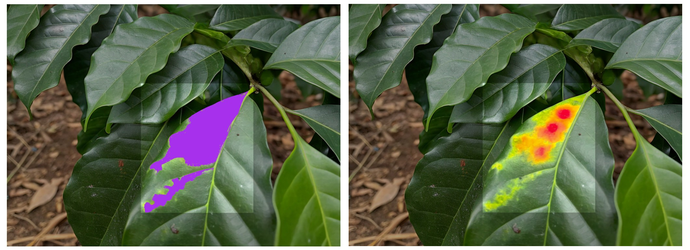
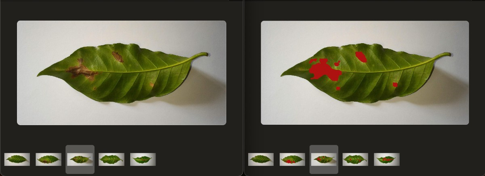
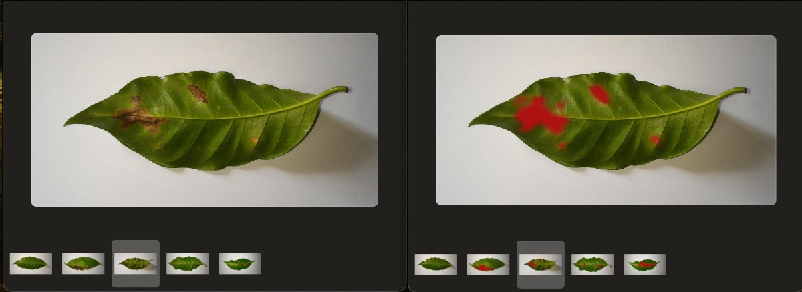
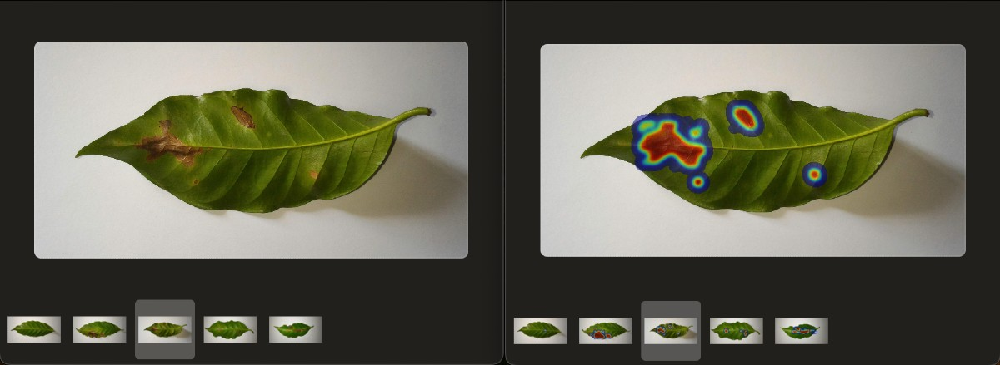
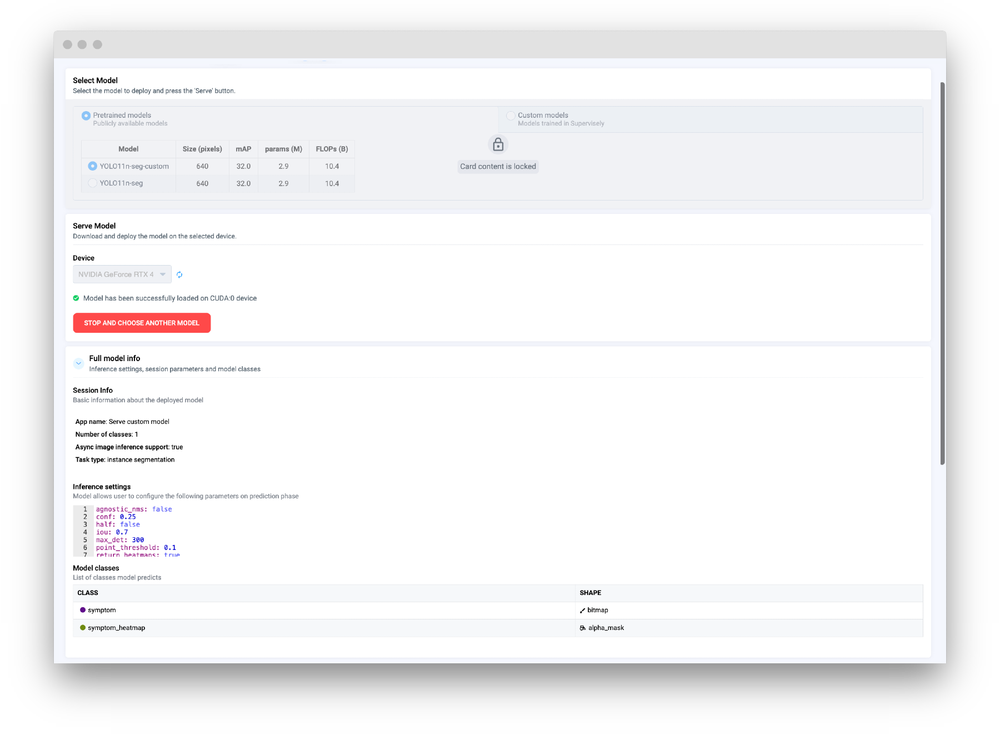
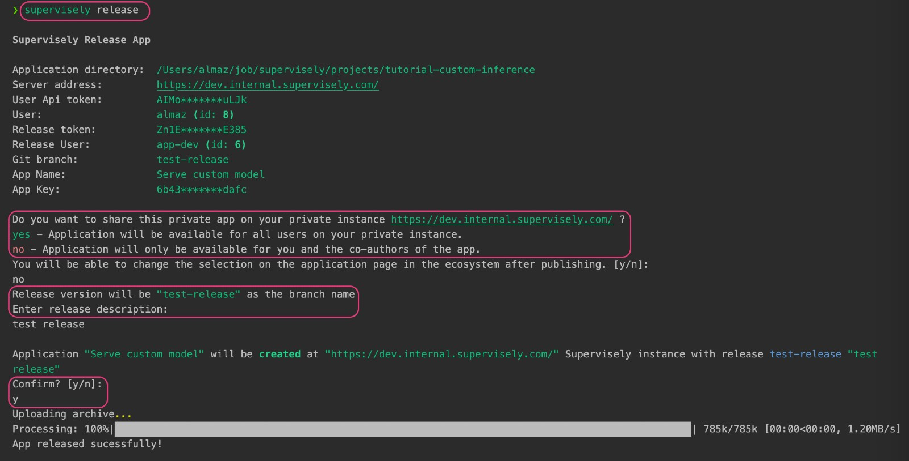

# Custom Inference Integration



We have prepared a [GitHub repository](https://github.com/supervisely-ecosystem/tutorial-custom-inference) with the source code and resources for this guide (including the model checkpoint, test images, and other resources). You can clone the repository and follow the instructions to run the example on your local machine.



In this guide, we will demonstrate a practical and hands-on example of implementing custom model inference in Supervisely. Before we begin, please review the [Custom Model Integration](https://docs.supervisely.com/neural-networks/overview-2) section in the documentation for detailed information on integrating custom models at various levels of the platform, including training, inference, and benchmarking.

Let's assume you have a trained model, that can return masks in two formats: binary masks and grayscale masks, where each pixel represents a probability of the class (0 for 0% probability, 255 for 100% probability, and any value in between). You may want to use this model to generate probability maps instead of binary masks. Supervisely provides all the necessary tools to handle this easily. This guide will show you how.


Please note that this guide demonstrates a specific use case, but the principles and techniques can be applied to a wide range of custom models and tasks. You can adapt the code and methods to suit your specific requirements.


<figure><figcaption></figcaption></figure>

For this example, we've chosen a model trained on the [_Coffee Leaf Biotic Stress Dataset_](https://datasetninja.com/coffee-leaf-biotic-stress) from Dataset Ninja. The model checkpoint and all related materials are included in the repository, allowing you to follow along step by step.

<blog-dataset-ninja id="coffee-leaf-biotic-stress"></blog-dataset-ninja>

## Prerequisites

Before we begin, make sure you have the necessary tools and libraries installed. Clone the repository with the example and install the dependencies:

```bash
git clone git@github.com:supervisely-ecosystem/tutorial-custom-inference.git
cd tutorial-custom-inference
pip install -r requirements.txt
```

## Overview

To implement custom inference in Supervisely, you need to create a subclass of the `sly.nn.inference.Inference` base class. This class provides a set of built-in methods that handle various aspects of the inference process, such as loading the model, making predictions, creating annotations, or even built-in GUI, and more. Depending on your requirements, you may need to override some of these methods to customize the behavior of your model.

Here is a basic outline of the steps involved in implementing custom inference:

1. Create a subclass of `sly.nn.inference.Inference` and implement methods to load the model, make predictions, and create annotations.

2. Optional: Prepare a class to represent a single raw prediction from the model. Depending on CV task, you can use appropriate subclass of `sly.nn.Prediction` (e.g., `sly.nn.PredictionBBox`, `sly.nn.PredictionMask`, etc.), or create a custom subclass to handle specific types of predictions.

3. Optional: Prepare a simple script to deploy the model and infer images.

4. Optional: Render the heatmaps on the project.

5. Optional: Enhance your custom model with additional features, such as a GUI or custom inference settings.

6. Release the app as a private app in Supervisely.

7. Predict.

## Step 1. Custom Inference class

Create a `src/custom_model.py` file and define a subclass of `sly.nn.inference.Inference` to implement the custom model. Depending on the CV task, you may inherit from appropriate subclass, such as `sly.nn.inference.InstanceSegmentation`, `sly.nn.inference.ObjectDetection`, etc. Refer to the [documentation](https://docs.supervisely.com/neural-networks/overview-2/integrate-custom-inference#step-4.-create-inference-class) for more details.


When your prediction mask is a grayscale image with pixel values ranging from 0 to 255, you can use the `sly.AlphaMask` geometry type. This allows you to store grayscale images as annotations in Supervisely.


```python
from typing import Dict, List, Optional

import cv2
import numpy as np
import supervisely as sly
from ultralytics import YOLO


class CustomModel(sly.nn.inference.InstanceSegmentation):
    def load_model_meta(self):
        """Create a ProjectMeta object that describes the classes and geometry of the model."""
        self.classes = list(self.model.names.values())
        obj_classes = []
        for name in self.classes:
            obj_classes.append(sly.ObjClass(name, sly.Bitmap))                  # ⬅︎ sly.ObjClass for binary masks
            obj_classes.append(sly.ObjClass(f"{name}_heatmap", sly.AlphaMask))  # ⬅︎ sly.ObjClass for probability maps
        self._model_meta = sly.ProjectMeta(obj_classes=obj_classes)

    def load_model(self, *arg, **kwargs):
        """Initialize the model and load the weights into memory."""
        checkpoint_path = kwargs.get("model_files", {}).get("checkpoint")

        # ⬇︎ For demonstration purposes, we use a pretrained model from the repository
        if checkpoint_path is None:
            checkpoint_path = os.path.join(sly.app.get_data_dir(), "models", "best.pt")
        if not sly.fs.file_exists(checkpoint_path):
            url = "https://github.com/supervisely-ecosystem/tutorial-custom-inference/releases/download/v0.0.1/best.pt"
            sly.fs.download(url, checkpoint_path)

        self.model = YOLO(checkpoint_path)
        self.model.to(kwargs.get("device", "cpu"))
        self.load_model_meta()

    def to_dto(self, predictions: List, settings: Dict) -> List[List[sly.nn.Prediction]]:
        """Convert predictions to Prediction DTO objects."""
        results = []
        for prediction in predictions:
            if not prediction.masks:
                continue
            temp_results = []
            for data, mask in zip(prediction.boxes.data, prediction.masks.data):
                mask_class_name = self.classes[int(data[5])]
                mask = mask.cpu().numpy()
                mask = np.where(mask > 0.5, 255, 0).astype(np.uint8)

                dto = sly.nn.PredictionMask(mask_class_name, mask)
                temp_results.append(dto)
            results.append(temp_results)
        return results

    def predict_batch(
        self, images_np: List[np.ndarray], settings: Dict
    ) -> List[List[sly.nn.Prediction]]:
        """
        Make predictions on a batch of images.
        For each image, return a list of DTOs (Data Transfer Objects) that represent the detected objects.
        """
        # RGB to BGR
        images_np = [cv2.cvtColor(img, cv2.COLOR_RGB2BGR) for img in images_np]
        # Predict
        predictions = self.model(
            source=images_np,
            conf=settings["conf"],
            iou=settings["iou"],
            half=settings["half"],
            device=self.device,
            max_det=settings["max_det"],
            agnostic_nms=settings["agnostic_nms"],
            retina_masks=True,
        )

        # Convert predictions to DTO (Data Transfer Object)
        results = self.to_dto(predictions, settings)
        return results
```

Here we have implemented the `CustomModel` class, which loads a YOLO model and predicts segmentation masks.

## Optional: Custom Task Type Implementation

For more advanced use cases, you can implement a custom task type to handle specific types of predictions. This allows you to define custom logic for creating annotations from the model predictions. Refer to the [documentation](https://docs.supervisely.com/neural-networks/overview-2/integrate-custom-inference#custom-task-type) for more information.

In the `to_dto` method, we have implemented the logic to return binary masks as `sly.nn.PredictionMask` objects (for `sly.Bitmap` geometry type). Now let's add support for probability maps by adding `sly.nn.PredictionAlphaMask` objects (for `sly.AlphaMask` geometry type) and updating the `_create_label` method to handle these new objects. This will allow us to generate probability maps in addition to binary masks.


`sly.nn.PredictionMask` and `sly.nn.PredictionAlphaMask` are subclasses of `sly.nn.Prediction`, which is a simple Data Transfer Object (DTO) that represents the raw predicted object.
You can create a custom subclass of `sly.nn.Prediction` to handle specific types of predictions and use it in the `to_dto` and `_create_label` methods. For example:

```python
class PredictionAlphaMask(sly.nn.Prediction):
    def __init__(self, class_name: str, mask: np.ndarray):
        super(PredictionAlphaMask, self).__init__(class_name=class_name)
        self.mask = mask
```



Update the `to_dto` and `_create_label` methods in the `CustomModel` class to handle probability maps:

<details>

<summary>`def to_dto` and `_create_label` methods (click to expand)</summary>

```python
class CustomModel(sly.nn.inference.InstanceSegmentation):

    # ... other methods

    def to_dto(self, predictions: List, settings: Dict) -> List[List[sly.nn.Prediction]]:
        """Convert predictions to Prediction DTO objects."""

        # Check if we want to return probability maps
        return_heatmaps = settings.get("return_heatmaps", False)

        results = []
        for prediction in predictions:
            if not prediction.masks:
                continue
            temp_results = []
            for data, mask in zip(prediction.boxes.data, prediction.masks.data):
                mask_class_name = self.classes[int(data[5])]
                mask = mask.cpu().numpy()
                mask = np.where(mask > 0.5, 255, 0).astype(np.uint8)

                dto = sly.nn.PredictionMask(mask_class_name, mask)
                temp_results.append(dto)
                if return_heatmaps:  # If we want to return probability maps
                    mask = cv2.GaussianBlur(mask, (91, 91), 0)  # only for example purposes
                    heatmap_dto = sly.nn.PredictionAlphaMask(mask_class_name, mask)
                    temp_results.append(heatmap_dto)
            results.append(temp_results)
        return results

    def _create_label(
        self, dto: Union[sly.nn.PredictionAlphaMask, sly.nn.PredictionMask]
    ) -> sly.Label:
        if not dto.mask.any():
            sly.logger.debug(f"Mask of class {name} is empty and will be skipped")
            return None

        name = dto.class_name
        if isinstance(dto, sly.nn.PredictionMask):
            geometry = sly.Bitmap(dto.mask, extra_validation=False)
        elif isinstance(dto, sly.nn.PredictionAlphaMask):
            name = f"{name}_heatmap"
            geometry = sly.AlphaMask(dto.mask, extra_validation=False)
        obj_class = self.model_meta.get_obj_class(name)
        return sly.Label(geometry, obj_class)

    # ... other methods
```

</details>

That's it! You have successfully implemented a custom inference class that returns probability maps in addition to binary masks. The full code is provided below.

<details>

<summary>FULL CODE (click to expand)</summary>

```python
from typing import Dict, List, Union

import cv2
import numpy as np
from ultralytics import YOLO

import supervisely as sly


class CustomModel(sly.nn.inference.InstanceSegmentation):

    def load_model_meta(self):
        """Create a ProjectMeta object that describes the classes and geometry of the model."""
        self.classes = list(self.model.names.values())
        obj_classes = []
        for name in self.classes:
            obj_classes.append(sly.ObjClass(name, sly.Bitmap))  # binary mask
            obj_classes.append(sly.ObjClass(f"{name}_heatmap", sly.AlphaMask))  # probability map
        self._model_meta = sly.ProjectMeta(obj_classes=obj_classes)

    def load_model(self, *arg, **kwargs):
        """Initialize the model and load the weights into memory."""
        checkpoint_path = kwargs.get("model_files", {}).get("checkpoint")
        if checkpoint_path is None:
            checkpoint_path = os.path.join(sly.app.get_data_dir(), "models", "best.pt")
        if not sly.fs.file_exists(checkpoint_path):
            checkpoint_url = "https://github.com/supervisely-ecosystem/tutorial-custom-inference/releases/download/v0.0.1/best.pt"
            sly.fs.download(checkpoint_url, checkpoint_path)

        self.model = YOLO(checkpoint_path)
        self.model.to(kwargs.get("device", "cpu"))
        self.load_model_meta()

    def _create_label(
        self, dto: Union[sly.nn.PredictionAlphaMask, sly.nn.PredictionMask]
    ) -> sly.Label:
        if not dto.mask.any():
            sly.logger.debug(f"Mask of class {name} is empty and will be skipped")
            return None

        name = dto.class_name
        if isinstance(dto, sly.nn.PredictionMask):
            geometry = sly.Bitmap(dto.mask, extra_validation=False)
        elif isinstance(dto, sly.nn.PredictionAlphaMask):
            name = f"{name}_heatmap"
            geometry = sly.AlphaMask(dto.mask, extra_validation=False)
        obj_class = self.model_meta.get_obj_class(name)
        return sly.Label(geometry, obj_class)

    def to_dto(self, predictions: List, settings: Dict) -> List[List[sly.nn.Prediction]]:
        """Convert predictions to Prediction DTO objects."""

        # Check if we want to return probability maps
        return_heatmaps = settings.get("return_heatmaps", False)

        results = []
        for prediction in predictions:
            if not prediction.masks:
                continue
            temp_results = []
            for data, mask in zip(prediction.boxes.data, prediction.masks.data):
                mask_class_name = self.classes[int(data[5])]
                mask = mask.cpu().numpy()
                mask = np.where(mask > 0.5, 255, 0).astype(np.uint8)

                dto = sly.nn.PredictionMask(mask_class_name, mask)
                temp_results.append(dto)
                if return_heatmaps:  # If we want to return probability maps
                    mask = cv2.GaussianBlur(mask, (91, 91), 0)  # only for example purposes
                    heatmap_dto = sly.nn.PredictionAlphaMask(mask_class_name, mask)
                    temp_results.append(heatmap_dto)
            results.append(temp_results)
        return results

    def predict_batch(
        self, images_np: List[np.ndarray], settings: Dict
    ) -> List[List[sly.nn.Prediction]]:
        """
        Make predictions on a batch of images.
        For each image, return a list of DTOs (Data Transfer Objects) that represent the detected objects.
        """
        # RGB to BGR
        images_np = [cv2.cvtColor(img, cv2.COLOR_RGB2BGR) for img in images_np]
        # Predict
        predictions = self.model(
            source=images_np,
            conf=settings["conf"],
            iou=settings["iou"],
            half=settings["half"],
            device=self.device,
            max_det=settings["max_det"],
            agnostic_nms=settings["agnostic_nms"],
            retina_masks=True,
        )

        # Convert predictions to DTO (Data Transfer Object)
        results = self.to_dto(predictions, settings)
        return results
```

</details>

## Optional: Run Inference Locally

Once you have implemented the custom inference class, you can create a simple script to deploy the model and infer images. The following script demonstrates how to deploy the model and make predictions on a batch of images. As a result, you will get a list of annotations in Supervisely format.

```python
import os

import cv2
import supervisely as sly
from dotenv import load_dotenv

from src.custom_model import CustomModel

if sly.is_development():
    load_dotenv("local.env")
    load_dotenv(os.path.expanduser("~/supervisely.env"))


api = sly.Api.from_env()

# deploy model
m = CustomModel()
m.serve()
deploy_params = {"device": "cuda:0"}
m._load_model(deploy_params)

# get predictions
test_images = sly.fs.list_files_recursively("src/demo_data/input", valid_extensions=[".jpg"])
inf_settings = {"conf": 0.25, "iou": 0.7, "half": False, "max_det": 300, "agnostic_nms": False, "return_heatmaps": True}
anns = m.inference(test_images, inf_settings)
```

## Optional: Visualize Predictions

To visualize the predictions generated by the model, you can draw predictions on images or using `ann.draw(img)` or render heatmaps on the images:

```python
from src.render_heatmaps import render_heatmaps_on_image

output_dir = "src/demo_data/output"
sly.fs.mkdir(output_dir, remove_content_if_exists=True)
for img_path, ann in zip(test_images, anns):
    img = sly.image.read(img_path)
    # ann.draw(img)
    # or render heatmaps
    img = render_heatmaps_on_image(img_path, ann)

    sly.image.write(os.path.join(output_dir, os.path.basename(img_path)), img)
```

<details>

<summary>Render Heatmaps Script (click to expand)</summary>

```python
import cv2
import numpy as np
import supervisely as sly


def color_map(img_size, data: np.ndarray, origin: sly.PointLocation) -> np.ndarray:
    mask = np.zeros(img_size, dtype=np.uint8)
    x, y = origin.col, origin.row
    h, w = data.shape[:2]
    mask[y : y + h, x : x + w] = data
    cv2.normalize(mask, mask, 0, 255, cv2.NORM_MINMAX)
    mask = cv2.applyColorMap(mask, cv2.COLORMAP_JET)
    BG_COLOR = np.array([128, 0, 0], dtype=np.uint8)
    mask = np.where(mask == BG_COLOR, 0, mask)
    return mask


def render_heatmaps_on_image(img_path: str, ann: sly.Annotation) -> np.ndarray:
    img = cv2.imread(img_path)
    img = cv2.cvtColor(img, cv2.COLOR_BGR2RGB)
    temp = img.copy()
    for label in ann.labels[::-1]:
        if isinstance(label.geometry, sly.AlphaMask):
            mask = color_map(ann.img_size, label.geometry.data, label.geometry.origin)
            mask = cv2.cvtColor(mask, cv2.COLOR_BGR2RGB)
            temp = np.where(np.any(mask > 0, axis=-1, keepdims=True), mask, temp)
    result = cv2.addWeighted(img, 0.5, temp, 0.5, 0).astype(np.uint8)
    return result
```

</details>

Run the script to render predictions. If you are using VS Code, you can use provided launch configurations to run the script in debug mode.

<figure><figcaption>Binary Mask Predictions (`sly.Bitmap`)</figcaption></figure>

<figure><figcaption>Probability Map Predictions (`sly.AlphaMask`)</figcaption></figure>

<figure><figcaption>Heatmaps Rendered on Images</figcaption></figure>

## Step 2. Serving App with GUI and Custom Inference Settings

Let's enhance the custom model with additional features.

For example, we can add a custom inference settings file to configure the model and set the inference parameters. These settings will be displayed in the GUI. You can specify any parameters you want to use for inference, such as confidence threshold, IoU threshold, maximum number of detections, etc.

In our example, we have added a `return_heatmaps` setting to return probability maps in addition to binary masks.

Create a `src/custom_settings.yaml` file. Here is an example of the settings file:

```yaml
# bounding box confidence threshold
conf: 0.25
# intersection over union (IoU) threshold for NMS
# (no effect for YOLOv10 models)
iou: 0.7
# use half precision (FP16)
half: False
# maximum number of detections per image
max_det: 300
# whether to use class-agnostic NMS or not
agnostic_nms: False
# point confidence threshold (for pose estimation)
point_threshold: 0.1
# whether to return heatmaps or not (for prabability maps)
return_heatmaps: False
```

Next, update the `CustomModel` class:

```python
class CustomModel(sly.nn.inference.InstanceSegmentation):
    INFERENCE_SETTINGS = "src/custom_settings.yaml"     # ⬅︎ Inference settings

    # ... other methods and attributes
```

Now, let's add `FRAMEWORK_NAME` and `MODELS` attributes to the `CustomModel` class – these attributes will be used to generate the GUI for the app. The `MODELS` attribute should point to a JSON file with information about the pretrained models. This file will be used to display the available models in the GUI.

```python
class CustomModel(sly.nn.inference.InstanceSegmentation):
    INFERENCE_SETTINGS = "src/custom_settings.yaml"
    FRAMEWORK_NAME = "Custom YOLO"                      # ⬅︎ Framework name
    MODELS = "src/demo_data/models_data.json"     # ⬅︎ path to the pretrained models data
    # ... other methods and attributes
```

<details>

<summary>Example of the `models_data.json` file (click to expand)</summary>

```json
[
  {
    "Model": "YOLO11n-seg-custom",
    "Size (pixels)": "640",
    "mAP": "32.0",
    "params (M)": "2.9",
    "FLOPs (B)": "10.4",
    "meta": {
      "task_type": "instance segmentation",
      "model_name": "Custom yolo-n",
      "model_files": {
        "checkpoint": "https://github.com/supervisely-ecosystem/tutorial-custom-inference/releases/download/v0.0.1/best.pt"
      }
    }
  },
  {
    "Model": "YOLO11n-seg",
    "Size (pixels)": "640",
    "mAP": "32.0",
    "params (M)": "2.9",
    "FLOPs (B)": "10.4",
    "meta": {
      "task_type": "instance segmentation",
      "model_name": "Original yolo-n",
      "model_files": {
        "checkpoint": "https://github.com/ultralytics/assets/releases/download/v8.3.0/yolo11n-seg.pt"
      }
    }
  }
]
```

</details>

Now let's enable the GUI in the app (`src/main.py`).

```python
# ... other code

m = CustomModel(use_gui=True, use_serving_gui_template=True) # ⬅︎ Enable GUI
m.serve()
```

Please note that the `Custom Models` tab may be empty if you have not pretrained any custom models in Supervisely. Once you have trained a custom model, they will appear in the `Custom Models` tab. Refer to the [documentation](https://docs.supervisely.com/neural-networks/overview-2/integrate-custom-training) for more information on how to integrate custom training to Supervisely.

Run the application locally to test the GUI. If you are using VS Code, you can use provided launch configurations to run using uvicorn, or you can run the following command:

```bash
uvicorn src.main:m.app --host 0.0.0.0 --port 8000 --ws websockets
```

The app will be available at <a href="http://localhost:8000" target="_blank">http://localhost:8000</a>.

A few lines of code can make a big difference in the user experience! 💫


Just a reminder: you can find the full documentation for the custom inference implementation in the [Supervisely documentation](https://docs.supervisely.com/neural-networks/overview-2/integrate-custom-inference#step-by-step-implementation).


By clicking the `Serve` button, you can deploy the model.

<figure><figcaption></figcaption></figure>

Now, when the model is deployed locally, you can connect to it and make predictions.
Prepare a simple script in `src/session_inference.py` and run it `python src/session_inference.py`:

```python
# src/session_inference.py
import os

import supervisely as sly
from dotenv import load_dotenv

if sly.is_development():
    load_dotenv("local.env")
    load_dotenv(os.path.expanduser("~/supervisely.env"))

api = sly.Api()
image_path = "src/demo_data/input/2.jpg"  # ⬅︎ Put your image path here
app_url = "http://localhost:8000"

session = sly.nn.inference.SessionJSON(
    api, session_url=app_url, inference_settings={"return_heatmaps": True}
)

prediction = session.inference_image_path(image_path)
print(prediction)
print("✅ Success!")
```

See more details in [Inference API Tutorial](https://developer.supervisely.com/app-development/neural-network-integration/inference-api-tutorial).

## Step 3. Release as Private App

Once you have tested the application locally and are satisfied with the results, you can release it as a Supervisely private app. Refer to the [documentation](https://docs.supervisely.com/neural-networks/overview-2/integrate-custom-inference#releasing-your-app) for detailed instructions on how to package and release the app.

Prepare the `config.json` file with the necessary information about the app:

<details>

<summary>config.json (click to expand)</summary>

```json
{
  "type": "app",
  "version": "2.0.0",
  "name": "Serve custom model",
  "description": "Custom model integration example",
  "categories": [
    "neural network",
    "images",
    "object detection",
    "serve",
    "development"
  ],
  "session_tags": ["deployed_nn"],
  "need_gpu": true,
  "community_agent": false,
  "docker_image": "supervisely/base-py-sdk:6.73.308",
  "entrypoint": "python -m uvicorn src.main:m.app --host 0.0.0.0 --port 8000",
  "port": 8000
}
```

</details>

And run the following command to release the app:

```bash
supervisely release
```



## Step 4. Predict

After the app is released, you can find it in the `Ecosystem Apps` section of the platform. You can share the app with your team members and use it to get predictions from your custom model directly in Supervisely.

Check out this [documentation page](https://docs.supervisely.com/neural-networks/overview#predict) with various options to get predictions from your custom model.

For example, you can run the [Apply NN to Images Project](https://ecosystem.supervisely.com/apps/nn-image-labeling/project-dataset) app, connect to deployed custom model, and apply it to all images in the project in a few clicks.



Open the project with predictions and explore the results. By activating the `image matting` labeling interface, you can take advantage of the `AlphaMask` geometry type to visualize the probability maps generated by the custom model.

<figure><figcaption>Probability Maps in the Labeling Interface</figcaption></figure>
