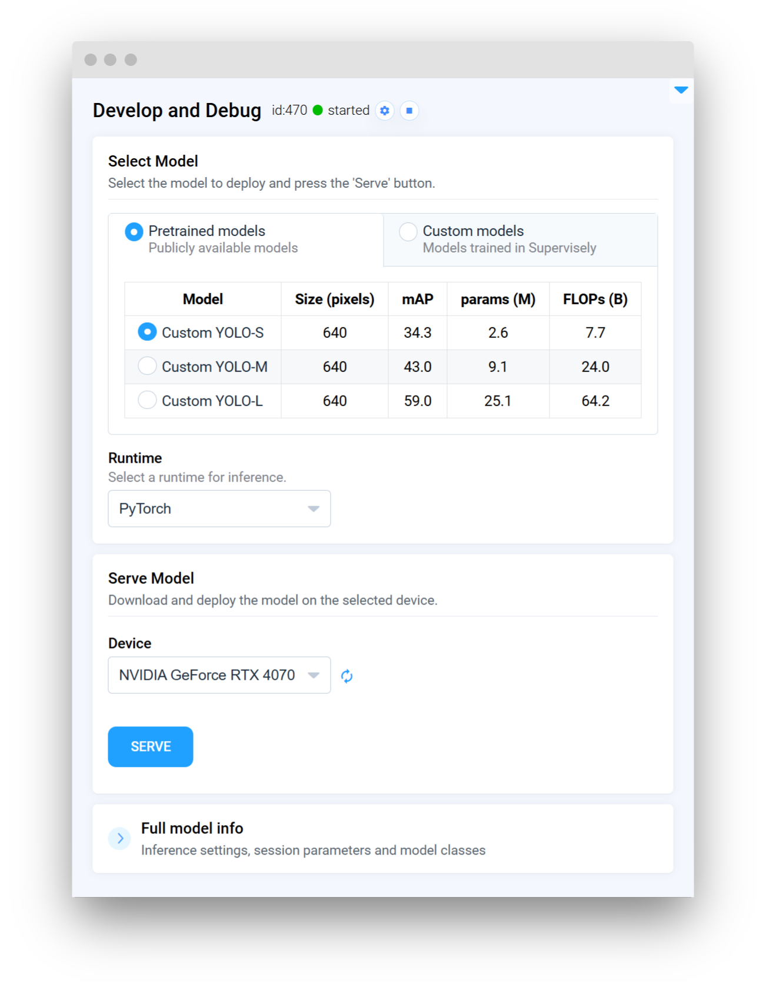

# Custom Inference Integration



We have prepared a [GitHub repository]() with the source code for this guide. You can clone the repository and follow the instructions to run the example on your local machine. The repository contains all the necessary files, including the model checkpoint, test images, and other resources.



Whether you are working with built-in models or custom models, Supervisely provides a flexible and extensible toolset for integrating neural networks into your workflow. In this guide, we will demonstrate a practical and hands-on example of implementing custom model inference in Supervisely. Before we begin, please review the [Custom Model Integration](https://docs.supervisely.com/neural-networks/overview-2) section in the documentation for detailed information on integrating custom models at various levels of the platform, including training, inference, and benchmarking.

Let's assume you have a trained model (if not, you can use the provided [example]() or train your own in Supervisely), that can return masks in two formats: binary masks and grayscale masks, where each pixel represents a probability of the class (0 for 0% probability, 255 for 100% probability, and any value in between). You may want to use this model to generate probability maps instead of binary masks. Supervisely provides all the necessary tools to handle this easily. This guide will show you how.


Please note that this guide demonstrates a specific use case, but the principles and techniques can be applied to a wide range of custom models and tasks. You can adapt the code and methods to suit your specific requirements.


<figure><figcaption></figcaption></figure>

For this example, we've chosen a model trained on the [_Coffee Leaf Biotic Stress Dataset_](https://datasetninja.com/coffee-leaf-biotic-stress) from Dataset Ninja. The model checkpoint and all related materials are included in the repository, allowing you to follow along step by step.

<blog-dataset-ninja id="coffee-leaf-biotic-stress"></blog-dataset-ninja>

## Prerequisites

Before we begin, make sure you have the necessary tools and libraries installed. Clone the repository with the example and install the dependencies:

```bash
git clone
cd custom_inference_example
pip install -r requirements.txt
```

## Overview

To implement custom inference in Supervisely, you need to create a subclass of the `sly.nn.inference.Inference` base class. This class provides a set of built-in methods that handle various aspects of the inference process, such as loading the model, making predictions, creating annotations, and more. Depending on your requirements, you may need to override some of these methods to customize the behavior of your model.

Here is a basic outline of the steps involved in implementing custom inference:

1. Create a subclass of `sly.nn.inference.Inference` and implement methods to load the model, make predictions, and create annotations.

2. Optional: Prepare a class to represent a single raw prediction from the model. Depending on CV task, you can use appropriate subclass of `sly.nn.Prediction` (e.g., `sly.nn.PredictionBBox`, `sly.nn.PredictionMask`, etc.), or create a custom subclass to handle specific types of predictions.

3. Prepare a simple script to deploy the model and infer images.

4. Optional: Render the heatmaps on the project.

5. Optional: Enhance your custom model with additional features, such as a GUI or custom inference settings.

6. Optional: Run the application locally or release it as a Supervisely private app.

## Step 1. Custom Inference class

Create a `src/custom_model.py` file and define a subclass of `sly.nn.inference.Inference` to implement the custom model. Depending on the CV task, you may inherit from appropriate subclass, such as `sly.nn.inference.InstanceSegmentation`, `sly.nn.inference.ObjectDetection`, etc. Refer to the [documentation](https://docs.supervisely.com/neural-networks/overview-2/integrate-custom-inference#step-4.-create-inference-class) for more details.

```python
from typing import Dict, List, Optional

import cv2
import numpy as np
import supervisely as sly
from ultralytics import YOLO


class CustomModel(sly.nn.inference.InstanceSegmentation):
    def load_model_meta(self):
        """Create a ProjectMeta object that describes the classes and geometry of the model."""
        self.classes = list(self.model.names.values())
        obj_classes = [sly.ObjClass(name, self._get_obj_class_shape()) for name in self.classes]
        self._model_meta = sly.ProjectMeta(obj_classes=obj_classes)

    def load_model(self, checkpoint_name: str, checkpoint_url: Optional[str] = None, **kwargs):
        """Initialize the model and load the weights into memory."""
        local_weights_path = "src/demo_data/model/best.pt"
        if not sly.fs.file_exists(local_weights_path) and checkpoint_url is not None:
            self.download(src_path=checkpoint_url, dst_path=local_weights_path)

        self.model = YOLO(local_weights_path)
        self.model.to(self.device)
        self.load_model_meta()

    def to_dto(self, predictions):
        """Convert predictions to sl.nn.Prediction objects."""
        results = []
        for prediction in predictions:
            if not prediction.masks:
                continue
            temp_results = []
            for data, mask in zip(prediction.boxes.data, prediction.masks.data):
                mask_class_name = self.classes[int(data[5])]
                mask = mask.cpu().numpy()

                # # Here we assume that the model returns binary masks,
                # we will modify this to return probability maps in the next step
                dto = sly.nn.PredictionMask(mask_class_name, mask)
                temp_results.append(dto)
            results.append(temp_results)
        return results

    def predict_batch(self, images_np: List[np.ndarray], settings: Dict):
        """Make predictions on a batch of images."""
        # RGB to BGR
        images_np = [cv2.cvtColor(img, cv2.COLOR_RGB2BGR) for img in images_np]
        # Predict
        predictions = self.model(
            source=images_np,
            conf=settings["conf"],
            iou=settings["iou"],
            half=settings["half"],
            device=self.device,
            max_det=settings["max_det"],
            agnostic_nms=settings["agnostic_nms"],
            retina_masks=True,
        )

        # Convert predictions to sly.nn.PredictionMask objects for each image
        results = self.to_dto(predictions)
        return results
```

Here we have implemented the `CustomModel` class, which loads a YOLO model and predicts instance segmentation masks.

## Step 2. Implement Custom Prediction Class

As you can see, we have implemented the `to_dto` method to convert the model predictions into `sly.nn.Prediction` objects, which represent the predicted binary masks. Let's modify this method to return probability maps instead of binary masks. To do this, we need to create a custom subclass of `sly.nn.Prediction` to handle the probability maps.

```python
class PredictionHeatmap(sly.nn.Prediction):
    def __init__(self, class_name: str, heatmap: np.ndarray):
        super(PredictionHeatmap, self).__init__(class_name=class_name)
        self.heatmap = heatmap
```

Now, update the `to_dto` method to return instances of `PredictionHeatmap` instead of `sly.nn.PredictionMask`.


In Supervisely, annotations for probability maps are represented using `sly.AlphaMask` geometry type. This geometry type is similar to `sly.Bitmap` but allows you to store grayscale images with pixel values ranging from 0 to 255. When you activate the special labeling interface `image matting`, you can take full advantage of the `sly.AlphaMask` geometry type.


Since our model returns binary masks, for demonstration purposes, we will apply a Gaussian blur to the masks to simulate probability maps. In a real-world scenario, you would replace this with the actual probability maps generated by your model.

```python
class CustomModel(sly.nn.inference.InstanceSegmentation):

    # ... other methods

    def _get_obj_class_shape(self):
        return sly.AlphaMask

    def to_dto(self, predictions):
        """Convert predictions to PredictionHeatmap objects."""
        results = []
        for prediction in predictions:
            if not prediction.masks:
                continue
            temp_results = []
            for data, mask in zip(prediction.boxes.data, prediction.masks.data):
                mask_class_name = self.classes[int(data[5])]
                mask = mask.cpu().numpy()
                mask = cv2.GaussianBlur(mask, (51, 51), 0)  # only for example purposes

                # Here we assume that the model returns probability maps
                dto = PredictionHeatmap(mask_class_name, mask)
                temp_results.append(dto)
            results.append(temp_results)
        return results

    # ... other methods
```

Once you have updated the `to_dto` method to return probability maps, you need to modify the `_create_label` method to handle the new `PredictionHeatmap` objects. This method creates a `sly.Label` object from the raw prediction data. Refer to the [documentation](https://docs.supervisely.com/neural-networks/overview-2/integrate-custom-inference#custom-task-type) for more information on implementing this method.

```python
class CustomModel(sly.nn.inference.InstanceSegmentation):

    # ... other methods

    def _create_label(self, dto: PredictionHeatmap):
        obj_class = self.model_meta.get_obj_class(dto.class_name)
        if obj_class is None:
            raise KeyError(f"Class {dto.class_name} not found in model classes {self.classes}")

        if not dto.heatmap.any():  # skip empty masks
            logger.debug(f"Mask of class {dto.class_name} is empty and will be skipped")
            return None

        geometry = sly.AlphaMask(dto.heatmap, extra_validation=False)
        return sly.Label(geometry, obj_class)

    # ... other methods
```

That's it! You have successfully implemented a custom inference class that returns probability maps instead of binary masks.

<details>

<summary>FULL CODE (click to expand)</summary>

```python
from typing import Dict, List, Optional

import cv2
import numpy as np
import supervisely as sly
from ultralytics import YOLO


class PredictionHeatmap(sly.nn.Prediction):
    def __init__(self, class_name: str, heatmap: np.ndarray):
        super(PredictionHeatmap, self).__init__(class_name=class_name)
        self.heatmap = heatmap


class CustomModel(sly.nn.inference.InstanceSegmentation):
    def load_model_meta(self):
        """Create a ProjectMeta object that describes the classes and geometry of the model."""
        self.classes = list(self.model.names.values())
        obj_classes = [sly.ObjClass(name, self._get_obj_class_shape()) for name in self.classes]
        self._model_meta = sly.ProjectMeta(obj_classes=obj_classes)

    def load_model(self, checkpoint_name: str, checkpoint_url: Optional[str] = None, **kwargs):
        """Initialize the model and load the weights into memory."""
        local_weights_path = "src/demo_data/model/best.pt"
        if not sly.fs.file_exists(local_weights_path) and checkpoint_url is not None:
            self.download(src_path=checkpoint_url, dst_path=local_weights_path)

        self.model = YOLO(local_weights_path)
        self.model.to(self.device)
        self.load_model_meta()

    def _get_obj_class_shape(self):
        return sly.AlphaMask

    def _create_label(self, dto: PredictionHeatmap):
        obj_class = self.model_meta.get_obj_class(dto.class_name)
        if obj_class is None:
            raise KeyError(f"Class {dto.class_name} not found in model classes {self.classes}")

        if not dto.heatmap.any():  # skip empty masks
            sly.logger.debug(f"Mask of class {dto.class_name} is empty and will be skipped")
            return None

        geometry = sly.AlphaMask(dto.heatmap, extra_validation=False)
        return sly.Label(geometry, obj_class)

    def to_dto(self, predictions):
        """Convert predictions to PredictionHeatmap objects."""
        results = []
        for prediction in predictions:
            if not prediction.masks:
                continue
            temp_results = []
            for data, mask in zip(prediction.boxes.data, prediction.masks.data):
                mask_class_name = self.classes[int(data[5])]
                mask = mask.cpu().numpy()
                mask = np.where(mask > 0.5, 255, 0).astype(np.uint8)
                mask = cv2.GaussianBlur(mask, (51, 51), 0)  # only for example purposes

                # Here we assume that the model returns probability maps
                dto = PredictionHeatmap(mask_class_name, mask)
                temp_results.append(dto)
            results.append(temp_results)
        return results

    def predict_batch(self, images_np: List[np.ndarray], settings: Dict):
        """Make predictions on a batch of images."""
        # RGB to BGR
        images_np = [cv2.cvtColor(img, cv2.COLOR_RGB2BGR) for img in images_np]
        # Predict
        predictions = self.model(
            source=images_np,
            conf=settings["conf"],
            iou=settings["iou"],
            half=settings["half"],
            device=self.device,
            max_det=settings["max_det"],
            agnostic_nms=settings["agnostic_nms"],
            retina_masks=True,
        )

        # Convert predictions to sly.nn.PredictionMask objects for each image
        results = self.to_dto(predictions)
        return results
```

</details>

## Step 3. Inference Script

Once you have implemented the custom inference class, you can create a simple script to deploy the model and infer images. The following script demonstrates how to deploy the model and make predictions on a batch of images. As a result, you will get a list of annotations in Supervisely format.

```python
import os

import cv2
import supervisely as sly
from dotenv import load_dotenv

from src.custom_model import CustomModel

if sly.is_development():
    load_dotenv("local.env")
    load_dotenv(os.path.expanduser("~/supervisely.env"))


api = sly.Api.from_env()
project_id = sly.env.project_id()

# deploy model
m = CustomModel(model_dir="app_data", use_gui=False)
m.serve()
deploy_params = {"device": "cpu"}
m._load_model(deploy_params)

test_images = sly.fs.list_files_recursively("src/demo_data/input", valid_extensions=[".jpg"])
inf_settings = {"conf": 0.25, "iou": 0.7, "half": False, "max_det": 300, "agnostic_nms": False}
anns = m.inference(test_images, inf_settings)
```

## Step 4. Visualize Predictions

To visualize the probability maps generated by the model, you can render the heatmaps on the project. The following script demonstrates how to render the heatmaps on the project and save the results to a directory.

```python
from src.render_heatmaps import render_heatmaps_on_image

output_dir = "src/demo_data/output"
sly.fs.mkdir(output_dir, remove_content_if_exists=True)
for img_path, ann in zip(test_images, anns):
    img = sly.image.read(img_path)
    ann.draw(img)
    # or render heatmaps
    # img = render_heatmaps_on_image(img_path, ann)

    sly.image.write(os.path.join(output_dir, os.path.basename(img_path)), img)
```

<details>

<summary>Render Heatmaps Script (click to expand)</summary>

```python
import cv2
import numpy as np
import supervisely as sly


def color_map(img_size, data: np.ndarray, origin: sly.PointLocation) -> np.ndarray:
    mask = np.zeros(img_size, dtype=np.uint8)
    x, y = origin.col, origin.row
    h, w = data.shape[:2]
    mask[y : y + h, x : x + w] = data
    cv2.normalize(mask, mask, 0, 255, cv2.NORM_MINMAX)
    mask = cv2.applyColorMap(mask, cv2.COLORMAP_JET)
    BG_COLOR = np.array([128, 0, 0], dtype=np.uint8)
    mask = np.where(mask == BG_COLOR, 0, mask)
    return mask


def render_heatmaps_on_image(img_path: str, ann: sly.Annotation) -> np.ndarray:
    img = cv2.imread(img_path)
    img = cv2.cvtColor(img, cv2.COLOR_BGR2RGB)
    temp = img.copy()
    for label in ann.labels[::-1]:
        if isinstance(label.geometry, sly.AlphaMask):
            mask = color_map(ann.img_size, label.geometry.data, label.geometry.origin)
            mask = cv2.cvtColor(mask, cv2.COLOR_BGR2RGB)
            temp = np.where(np.any(mask > 0, axis=-1, keepdims=True), mask, temp)
    result = cv2.addWeighted(img, 0.5, temp, 0.5, 0).astype(np.uint8)
    return result
```

</details>

Run the script to render predictions. If you are using VS Code, you can use provided launch configurations to run the script in debug mode.

<figure><figcaption>Binary Mask Predictions (`sly.Bitmap`)</figcaption></figure>

<figure><figcaption>Grayscale Mask Predictions (`sly.AlphaMask`)</figcaption></figure>

<figure><figcaption>Heatmaps Rendered on Images</figcaption></figure>

## Step 5. Serving App with GUI

To enhance your custom model with additional features, such as a GUI or custom inference settings, you can modify just a few lines of code.

```python
class CustomModel(sly.nn.inference.InstanceSegmentation):
    FRAMEWORK_NAME = "Custom YOLO" # ⬅︎
    MODELS = "src/demo_data/model/models_data.json"  # ⬅︎ path to the pretrained models data
    INFERENCE_SETTINGS = "src/custom_settings.yaml"  # ⬅︎ Inference settings

    # ... other methods

    def load_model(
        self, model_files: dict, model_info: dict, model_source: str, device: str, runtime: str
    ):
        """Initialize the model and load the weights into memory."""
        checkpoint_path = model_files["checkpoint"] # ⬅︎ path to the model checkpoint

        self.model = YOLO(checkpoint_path)
        self.model.to(device)
        self.load_model_meta()

    # ... other methods
```

Please note that the `Custom Models` tab may be empty if you have not trained any custom models in Supervisely. Once you have trained a custom model, thay will appear in the `Custom Models` tab. Refer to the [documentation](https://docs.supervisely.com/neural-networks/overview-2/integrate-custom-training) for more information on how to integrate custom training to Supervisely.

Run the application locally to test the GUI. If you are using VS Code, you can use provided launch configurations to run using uvicorn, or you can run the following command:

```bash
uvicorn src.main:m.app --host 0.0.0.0 --port 8000 --ws websockets
```

<figure><figcaption>Grayscale Mask Predictions (`sly.AlphaMask`)</figcaption></figure>

A few lines of code can make a big difference in the user experience! 💫


Just a reminder: you can find the full documentation for the custom inference implementation in the [Supervisely documentation](https://docs.supervisely.com/neural-networks/overview-2/integrate-custom-inference#step-by-step-implementation).


The app will be available at <a href="http://localhost:8000" target="_blank">http://localhost:8000</a>. By clicking the `Serve` button, you can deploy the model and start making predictions. To get the predictions, you can use following code:

```python
import os

import supervisely as sly
from dotenv import load_dotenv

if sly.is_development():
    load_dotenv("local.env")
    load_dotenv(os.path.expanduser("~/supervisely.env"))

api = sly.Api()
image_path = "path/to/your/image.jpg"  # ⬅︎ Put your image path here
app_url = "http://localhost:8000"

session = sly.nn.inference.SessionJSON(api, session_url=app_url)

prediction = session.inference_image_path(image_path)
print(prediction)
print("✅ Success!")
```

See more details in [Inference API Tutorial](https://developer.supervisely.com/app-development/neural-network-integration/inference-api-tutorial).

## Step 6. Release as Private App

Once you have tested the application locally and are satisfied with the results, you can release it as a Supervisely private app. Refer to the [documentation](https://docs.supervisely.com/neural-networks/overview-2/integrate-custom-inference#releasing-your-app) for detailed instructions on how to package and release the app.

Prepare the `config.json` file with the necessary information about the app:

<details>

<summary>config.json (click to expand)</summary>

```json
{
  "type": "app",
  "version": "2.0.0",
  "name": "Serve custom model",
  "description": "Custom model integration example",
  "categories": [
    "neural network",
    "images",
    "object detection",
    "serve",
    "development"
  ],
  "session_tags": ["deployed_nn"],
  "need_gpu": true,
  "community_agent": false,
  "docker_image": "user/custom-yolo:1.0.0",
  "entrypoint": "python -m uvicorn src.main:m.app --host 0.0.0.0 --port 8000",
  "port": 8000
}
```

And run the following command to release the app:

```bash
supervisely release
```


</details>

After the app is released, you can find it in the `Ecocystem Apps` section of the platform. You can share the app with your team members and use it to get predictions from your custom model directly in Supervisely.

Check out this [documentation page](https://docs.supervisely.com/neural-networks/overview#predict) with various options to get predictions from your custom model.
