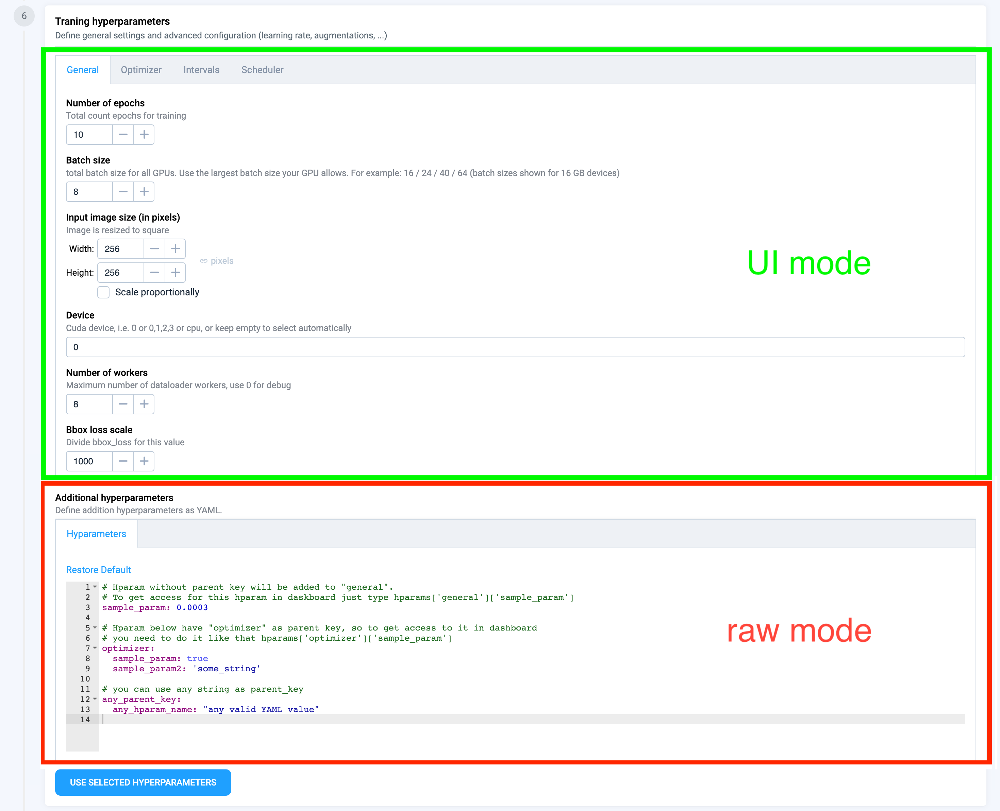

# Training dashboard

## Introduction

This tutorial will teach you how to integrate your custom object detection model into Supervisely by using TrainingDashboard class.
<figure>
<figcaption></figcaption>

</figure>

## How to debug this tutorial

**Step 1.** Prepare  `~/supervisely.env` file with credentials. [Learn more here.](../../getting-started/basics-of-authentication.md#use-.env-file-recommended)

**Step 2.** Clone [repository](https://github.com/supervisely-ecosystem/object-detection-training-template) with source code and create [Virtual Environment](https://docs.python.org/3/library/venv.html).

```bash
git clone https://github.com/supervisely-ecosystem/object-detection-training-template
cd object-detection-training-template
./create_venv.sh
```

**Step 3.** Open the repository directory in Visual Studio Code.&#x20;

```bash
code -r .
```

**Step 4.** Start debugging `src/main.py`

## Integrate your model
The integration of your own NN with TrainingDashboard is really simple:

1. Define pytorch dataset
2. Define neural network model
3. Define subclass **`TrainingDashboard`** and implement **`train`** method
4. That's all. 😎 We are ready to run the training dashboard app.

## Intergration sample 
```python
import os
import json
import random 

import torch
import torch.nn as nn
import numpy as np
import imgaug.augmenters as iaa
import torch.nn.functional as F
import supervisely as sly
from supervisely.app.widgets import InputNumber, Augmentations
from torch.utils.data import Dataset, DataLoader
from torch.utils.tensorboard import SummaryWriter
from torchvision import models

import src.sly_globals as g
from src.dashboard import TrainDashboard


###########################
### 1. Redefine your dataset and methods or use them as is
###########################
class CustomDataset(Dataset):
    def __init__(self, items_infos, classes, image_size, transforms=None):
        self.items_infos = items_infos
        self.classes = classes
        self.image_size = image_size
        self.transforms = transforms
    
    def __getitem__(self, index):
        image = sly.image.read(self.items_infos[index].img_path)
        meta = g.project_meta
        with open(self.items_infos[index].ann_path, 'r') as f:
            ann = sly.Annotation.from_json(json.loads(f.read()), meta)
        ann, meta = Augmentations.convert_ann_to_bboxes(ann, meta)

        if self.transforms:
            res_meta, image, ann = sly.imgaug_utils.apply(self.transforms, meta, image, ann)

        meta, image, ann = sly.imgaug_utils.apply(
            iaa.Sequential([
                iaa.Resize({"height": self.image_size[1], "width": self.image_size[0]})
            ]), 
            meta, 
            image, 
            ann
        )

        label = random.choice(ann.labels)
        class_id = self.classes.index(label.obj_class.name)
        bbox = label.geometry.to_bbox()
        bbox = np.array([bbox.left, bbox.top, bbox.right, bbox.bottom])
    
        image = np.rollaxis(image, 2)
        return image, class_id, bbox

    def __len__(self):
        return len(self.items_infos)

###########################
### 2. Define neural network model
###########################
class CustomModel(nn.Module):
    def __init__(self):
        super(CustomModel, self).__init__()
        resnet = models.resnet34()
        layers = list(resnet.children())[:8]
        self.features1 = nn.Sequential(*layers[:6])
        self.features2 = nn.Sequential(*layers[6:])
        self.classifier = nn.Sequential(nn.BatchNorm1d(512), nn.Linear(512, 4))
        self.bb = nn.Sequential(nn.BatchNorm1d(512), nn.Linear(512, 4))
        
    def forward(self, x):
        x = self.features1(x)
        x = self.features2(x)
        x = F.relu(x)
        x = nn.AdaptiveAvgPool2d((1,1))(x)
        x = x.view(x.shape[0], -1)
        return self.classifier(x), self.bb(x)

###########################
### 3. Define dashboard
###########################
class CustomTrainDashboard(TrainDashboard):
    def train(self):
        # getting selected classes from UI
        classes = self._classes_table.get_selected_classes()
        # getting configuration of splits from UI
        train_set, val_set = self.get_splits()
        # getting hyperparameters from UI
        hparams = self.get_hyperparameters()
        # this will return torch.optim.YOUR_SELECTED_OPTIMIZER
        optimizer = self.get_optimizer(name=hparams['optimizer']['name'])
        optimizer = optimizer(
            self.model.parameters(),
            hparams['optimizer']['lr'],
            hparams['optimizer']['eps'],
        )
        device = f"cuda:{hparams['general']['device']}" if hparams['general']['device'].isdigit() else hparams['general']['device']
        # extra hparam to scale loss
        C = hparams['general']['C']
        
        # getting selected augmentation from UI
        transforms = self.get_transforms()
        train_dataset = CustomDataset(
            train_set, 
            transforms=transforms, 
            classes=classes, 
            image_size=hparams['general']['input_image_size']
        )
        val_dataset = CustomDataset(
            val_set, 
            classes=classes, 
            image_size=hparams['general']['input_image_size']
        )
        train_loader = DataLoader(
            train_dataset, 
            batch_size=hparams['general']['batch_size'], 
            shuffle=True,
            num_workers=hparams['general']['workers_number']
        )
        val_loader = DataLoader(
            val_dataset, 
            batch_size=hparams['general']['batch_size'],
            num_workers=hparams['general']['workers_number']
        )

        # it will return None if pretrained model weights aren't selected in UI.
        pretrained_weights_path = self.get_pretrained_weights_path()
        if pretrained_weights_path:
            self.model = torch.load_state_dict(pretrained_weights_path)
        
        model.to(device)
        with self.progress_bar(message=f"Training...", total=hparams['general']['number_of_epochs']) as pbar:
            self.model.train()
            # change training and eval loops for your model if needed
            for epoch in range(hparams['general']['number_of_epochs']):
                train_total_samples = 0
                train_sum_loss = 0
                train_correct = 0 
                for batch_idx, (images, classes, bboxes) in enumerate(train_loader):
                    batch_size = images.shape[0]
                    images = images.to(device).float()
                    classes = classes.to(device)
                    bboxes = bboxes.to(device).float()

                    pred_classes, pred_bboxes = self.model(images)
                    loss_class = F.cross_entropy(pred_classes, classes, reduction="sum")
                    loss_bb = F.l1_loss(pred_bboxes, bboxes, reduction="none").sum(1)
                    loss_bb = loss_bb.sum()
                    loss = loss_class + loss_bb / C
    
                    optimizer.zero_grad()
                    loss.backward()
                    optimizer.step()
                    train_total_samples += batch_size
                    train_sum_loss += loss.item()
                    
                    _, pred = torch.max(pred_classes, 1)
                    train_correct += pred.eq(classes).sum().item()
                train_loss = train_sum_loss / train_total_samples
                train_accuracy = train_correct / train_total_samples

                if hparams['intervals'].get('validation', False):
                    if epoch % hparams['intervals']['validation'] == 0:
                        model.eval()
                        val_total_samples = 0
                        val_sum_loss = 0
                        val_correct = 0 
                        for batch_idx, (images, classes, bboxes) in enumerate(val_loader):
                            batch_size = images.shape[0]
                            images = images.to(device).float()
                            classes = classes.to(device)
                            bboxes = bboxes.to(device).float()

                            pred_classes, pred_bboxes = self.model(images)
                            loss_class = F.cross_entropy(pred_classes, classes, reduction="sum")
                            loss_bb = F.l1_loss(pred_bboxes, bboxes, reduction="none").sum(1)
                            loss_bb = loss_bb.sum()
                            loss = loss_class + loss_bb / C

                            val_sum_loss += loss.item()
                            val_total_samples += batch_size

                            _, pred = torch.max(pred_classes, 1)
                            val_correct += pred.eq(classes).sum().item()
                        val_loss = val_sum_loss / val_total_samples
                        val_accuracy = val_correct / val_total_samples

                if hparams['intervals'].get('сheckpoints_interval', False):
                    if epoch % hparams['intervals']['сheckpoints'] == 0:
                        torch.save(self.model.state_dict(), os.path.join(g.checkpoints_dir, f'model_epoch_{epoch}.pth'))

                if epoch % hparams['intervals'].get('logging_interval', 1) == 0:
                    # common method for logging your values to the dashboard is self.log().
                    # also you can log values only by your own logger if it is set to call it by class name.
                    # self.loggers.YOUR_LOGGER.add_scalar(tag='Loss/train', scalar_value=train_loss, global_step=epoch)
                    self.log('add_scalar', tag='Loss/train', scalar_value=train_loss, global_step=epoch)
                    self.log('add_scalar', tag='Loss/val', scalar_value=val_loss, global_step=epoch)
                    self.log('add_scalar', tag='Accuracy/train', scalar_value=train_accuracy, global_step=epoch)
                    self.log('add_scalar', tag='Accuracy/val', scalar_value=val_accuracy, global_step=epoch)
                
                self.log('add_text', tag='Main logs', text_string=f"Epoch: {epoch}\t|\tTrain loss: {train_loss:.3f}\t|\tVal loss: {val_loss:.3f}\t|\tTrain accuracy: {train_accuracy:.3f}\t|\tVal accuracy: {val_accuracy:.3f}")
                pbar.update(1)
            pbar.set_description_str("Training has been successfully finished")


###########################
### 4. Run dashboard app
###########################
dashboard = CustomTrainDashboard(
    # REQUIRED
    # your neural network to train
    model=model, 
    # These titles will be used for logging values while training as part of tags
    # self.log('add_scalar', tag='Loss/train', scalar_value=train_loss, global_step=epoch)
    plots_titles=['Loss', 'Accuracy'],
    # OPTIONAL
    # This row will add an additional hyperparam to the UI. 
    # You will have access to this hyperparam inside CustomTrainDashboard as
    # hparams = self.get_hyperparameters()
    # C = hparams['general']['C']
    extra_hyperparams={
        'general': [
            dict(key='C',
                title='Bbox loss scale', 
                description='Divide bbox_loss for this value', 
                content=InputNumber(1000, min=1, max=100000, size='small')),
        ],
    },
)
app = dashboard.run()
```

## Training dashboard configuration and customization 
### Configuration via optional params of TrainDashboard:
- **pretrained_weights**: `Dict` - it defines the table of pretraned model weights in UI as:
    
    Example:

    ``` python
    pretrained_weights = {
        'columns': ['Name', 'Description', 'Path'], # table headers
        'rows': [
            # The path can be local path, team files path or url
            ['Unet', 'Vanilla Unet', './weights/weights/unet.pth'], # local path
            ['Unet-11', 'VGG16', './weights/weights/unet11.pth'], # team files path
            ['Unet-16', 'VGG11', 'https://your_file_server/unet16.pth'] # url (in the future releases)
        ]
    }
    ```
    The "Pretrained weights" tab will appear in the model settings card automatically
    <figure>
    <figcaption></figcaption>
    
    </figure>

- **hyperparameters_categories**: `List` - list of tabs names in hyperparameters UI. 
    
    Default: `['general', 'checkpoints', 'optimizer', 'intervals', 'scheduler']`
    
    These names also will be used as parent keys for hyperparams from corresponding tabs
    
    <figure>
    <figcaption></figcaption>
    
    </figure>

- **extra_hyperparams**: `Dict` - additional hyperparams, which will be added to hyperparameters UI.
    
    Example:
    ``` python
    extra_hyperparams={
        # adding "addition_hparam1" and "addition_hparam2" to "general" tab
        'general': [
            dict(key='addition_hparam_1',
                title='Addition hyperparameter 1', 
                description='Some description about this hyperparameter', 
                content=InputNumber(1, min=1, max=1000, size='small')),
            dict(key='addition_hparam_2',
                title='Addition hyperparameter 1', 
                description='Some description about this hyperparameter', 
                content=InputNumber(6, min=2, max=10, step=2, size='small')),
        ],
        # adding "addition_hparam1" to "checkpoints" tab
        'checkpoints': [
            dict(key='addition_hparam_1',
                title='Addition hyperparameter 1', 
                description='Some description about this hyperparameter', 
                content=InputNumber(0.0001, min=0.0001, step=0.0001, size='small')),
        ],
    },
    ```        
    
    <figure>
    <figcaption>The General tab</figcaption>
    
    </figure>

    <figure>
    <figcaption>The Checkpoints tab</figcaption>
    
    </figure>

    
- **hyperparams_edit_mode**: `String` - the ways to define hyperparameters.

    Default: `'ui'`
    
    Supported values: [`'ui', 'raw', 'all'`]

    <figure>
    <figcaption>If you will set hyperparams_edit_mode to `raw` or `all`, this additional widget will be shown.</figcaption>
    
    </figure>
    
    
    The hyperparams from UI will overwrite hyperparams with the same names from the text editor widget.

    For example, if you declare `hparam_1` with "general" as the parent key in extra_hyperparams or in hyperparameters_ui method
    ``` python
    'general': [
        dict(key='hparam_1',
            title='Hyperparameter 1', 
            description='Some description', 
            content=InputNumber(100, min=100, max=1000, size='small')),
        ]
    ```
    and declare the same in the text editor widget
    ``` yaml
    general:
        hparam_1: 0.1
    ```
    then when you will call `get_hyperparameters` method, the `hparam_1` value will be equal to `100`, not `0.1`.
    
    
- **show_augmentations_ui**: `Bool` - show/hide flag for augmentations card
    
    Default: `True`

- **extra_augmentation_templates**: `List` - predefined augmentations list for selector in augmentations card:

    You can create your own augmentations template `.json` using [ImgAug Studio app](https://dev.supervise.ly/ecosystem/apps/imgaug-studio)
    
    Example:
    ``` python
    AUG_TEMPLATES = [
        # label - just title for selector option
        # value - local path or teamfiles path
        {'label': 'Label 1', 'value':'aug_templates/light.json'},
        {'label': 'Label 2', 'value':'aug_templates/light_corrupt.json'},
        {'label': 'Label 3', 'value':'aug_templates/medium.json'},
    ]
    ```
    <figure>
    <figcaption>If you will set hyperparams_edit_mode to `raw` or `all`, this additional widget will be shown.</figcaption>
    
    </figure>
    
- **task_type**: `String` - Type of CV task. It will be used for autoconverting project labels
    
    Default: `'detection'`
    
    Supported values: [`'detection', 'semantic_segmentation', 'instance_segmentation'`]

- **download_batch_size**: `int` - How much data to download per batch. Increase this value for speedup download on big projects.
    
    Default: 100

- **loggers**: `List` - additional user loggers

    Example:
    ``` python
    from torch.utils.tensorboard import SummaryWriter
    
    class CSVWriter:
        def __init__(self, log_dir):
            # your code
            pass
        def add_scalar(tag, scalar_value, global_step):
            # your code
            pass

    my_csv_logger = CSVWriter(g.csv_log_dir)
    my_tensorboard = SummaryWriter(g.tensorboard_runs_dir)
    loggers=[my_csv_logger, my_tensorboard]
    ```

    You can log value for all loggers by calling common method.

    All passed loggers should have the called method.

    ``` python
    self.log(method='add_scalar', tag='Loss/train', scalar_value=train_loss, global_step=epoch)
    ```

    If you want to log value for specific logger, then use `self.loggers.YOUR_LOGGER_CLASS` 
    
    ``` python
    self.loggers.SummaryWriter.add_scalar(tag='Loss/train', scalar_value=train_loss, global_step=epoch)
    ```

### How to edit/delete widgets in hyperparameters card 
To change content of hyperparameters card just re-define `hyperparameters_ui` method in subclass of `TrainingDashboard`

Example:
``` python
class CustomTrainDashboard(TrainDashboard):
    def hyperparameters_ui(self):
        hparams_widgets = {}
        # adding widgets to "my_hparam_tab" in IU. "my_hparam_tab" will be used as parent key.
        if 'my_hparam_tab' in self._hyperparameters_categories:
            hparams_widgets['my_hparam_tab'] = [
                # adding hparam 
                dict(key='key_for_hparam',
                    title='Name for added hyperparameter', 
                    description='Any description for added hyperparameter', 
                    # any widget from sly.app.widgets with "get_value" method or 
                    # you should redefine "get_hyperparameters" method to handle with these widgets
                    content=InputNumber(10, min=1, max=100000, size='small')),
                # this string required for adding additional widgets to "my_hparam_tab" 
                *self._extra_hyperparams.get('my_hparam_tab', [])
            ]
# Add new tab name to the list for displaying them in UI
hparams_tabs = ['my_hparam_tab']
dashboard = CustomTrainDashboard(
    ...
    hyperparameters_categories = hparams_tabs
)
```

## Additional notes
Environment variable `SLY_APP_DATA_DIR` in `src.globals` is used to provide access to app files when the app will be finished.
If something went wrong in your training process at any moment - you won't lose checkpoints and other important artifacts. 
They will be available by SFTP.
