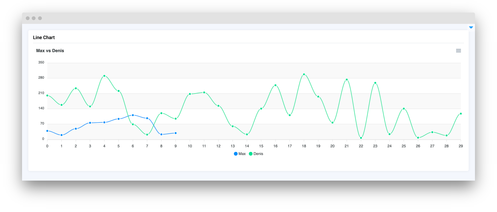
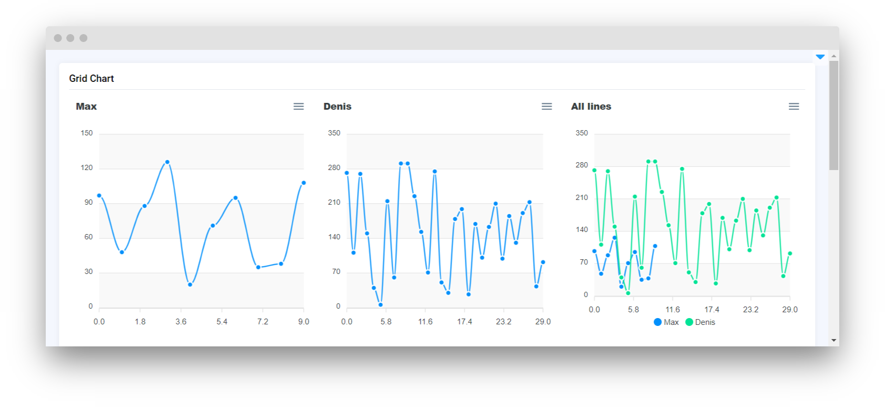
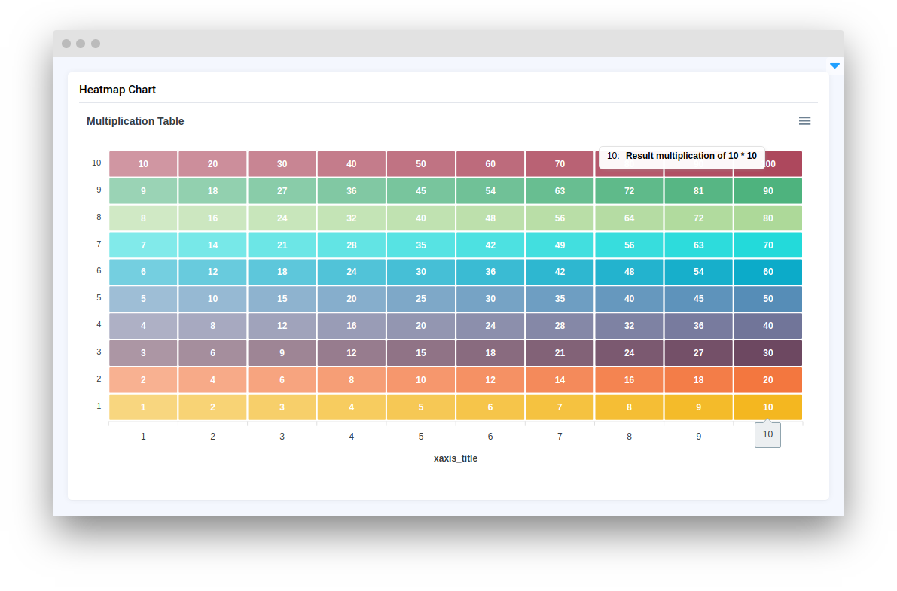
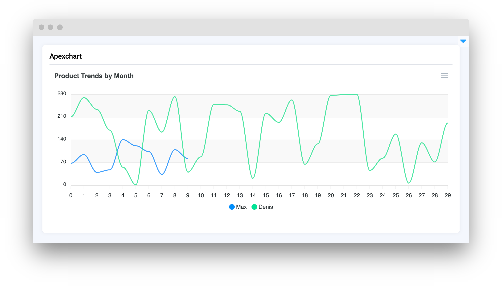
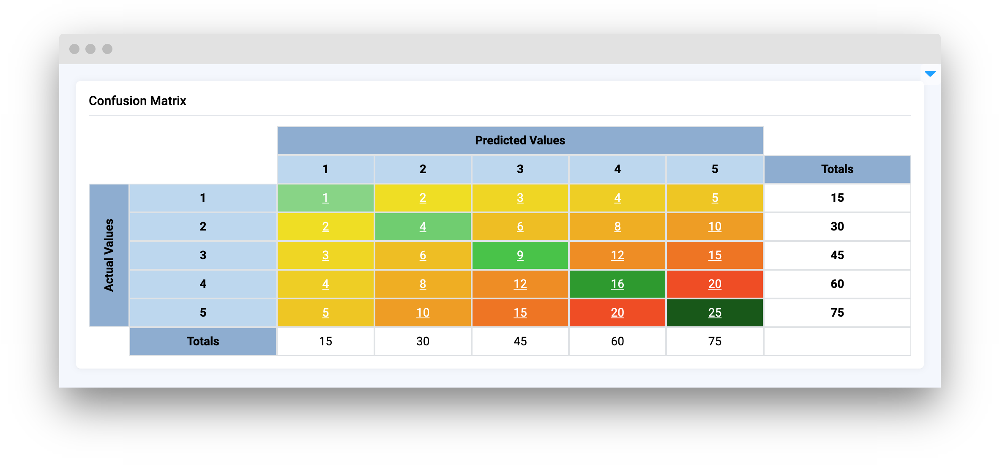
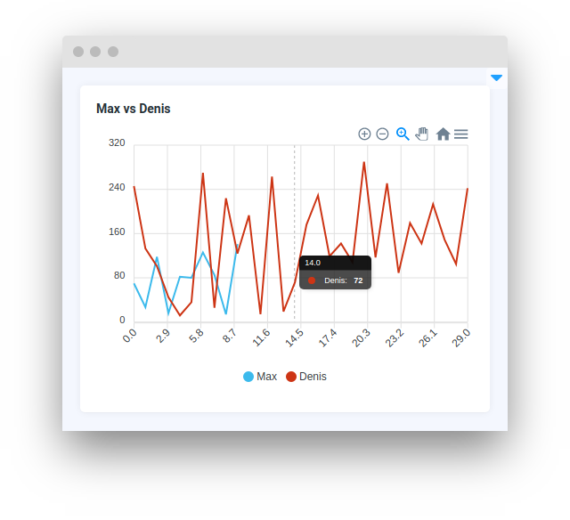
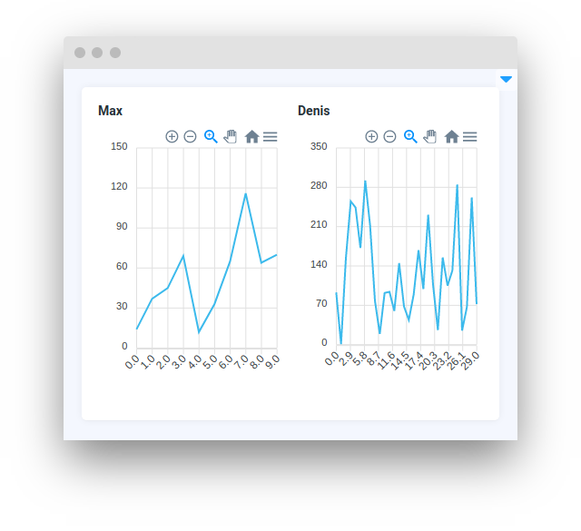
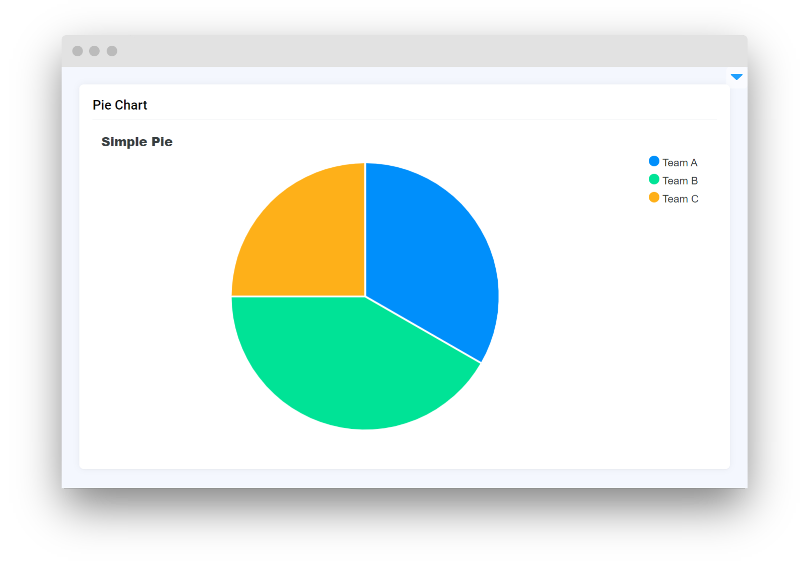

# Charts and Plots

<table data-card-size="large" data-view="cards"><thead><tr><th></th><th></th><th></th><th data-hidden data-card-target data-type="content-ref"></th></tr></thead><tbody><tr><td><strong>LineChart</strong></td><td></td><td><mark style="color:purple;">A widget that shows data as line graphs, ideal for tracking trends or comparing different data sets.</mark></td><td><a href="linechart.md">linechart.md</a></td></tr><tr><td><strong>GridChart</strong></td><td></td><td><mark style="color:purple;">The widget lets you easily view and access multiple LineChart plots arranged in a grid.</mark></td><td><a href="gridchart.md">gridchart.md</a></td></tr><tr><td><strong>HeatmapChart</strong></td><td></td><td><mark style="color:purple;">Shows data in a color-coded matrix, typically used to represent the intensity or frequency of occurrences, with colors representing the value ranges</mark></td><td><a href="heatmapchart.md">heatmapchart.md</a></td></tr><tr><td><strong>ApexChart</strong></td><td></td><td><mark style="color:purple;">Versatile charting widget capable of displaying data in a variety of visual formats such as line, area, or bar charts</mark></td><td><a href="apexchart.md">apexchart.md</a></td></tr><tr><td><strong>ConfusionMatrix</strong></td><td></td><td><mark style="color:purple;">Specialized chart for displaying the performance of a machine learning model, showing the actual versus predicted classifications and commonly used in classification problems to identify model performance</mark></td><td><a href="confusionmatrix.md">confusionmatrix.md</a></td></tr><tr><td><strong>LinePlot</strong></td><td></td><td><mark style="color:purple;">Similar to the LineChart, it displays data as a series of points connected by lines, which is typically used to observe trends and patterns in data over a continuous interval</mark></td><td><a href="lineplot.md">lineplot.md</a></td></tr><tr><td><strong>GridPlot</strong></td><td></td><td><mark style="color:purple;">Widget allows displaying multiple plots in a grid layout, enabling the comparison of different datasets or different aspects of a single dataset side by side</mark></td><td><a href="gridplot.md">gridplot.md</a></td></tr><tr><td><strong>ScatterChart</strong></td><td></td><td><mark style="color:purple;">Widget is used to display a scatter plot of numerical data, which is beneficial for identifying the relationship or correlation between two variables</mark></td><td><a href="scatterchart.md">scatterchart.md</a></td></tr><tr><td><strong>TreemapChart</strong></td><td></td><td><mark style="color:purple;">Displays a treemap chart of numerical data, where each category is represented by a rectangle, and sub-categories are nested as rectangles within these</mark></td><td><a href="treemapchart.md">treemapchart.md</a></td></tr><tr><td><strong>PieChart</strong></td><td></td><td><mark style="color:purple;">Widget for visualizing data in a pie chart format. It is commonly used to represent proportions or percentages, showing how individual parts make up a whole</mark></td><td><a href="piechart.md">piechart.md</a></td></tr></tbody></table>
