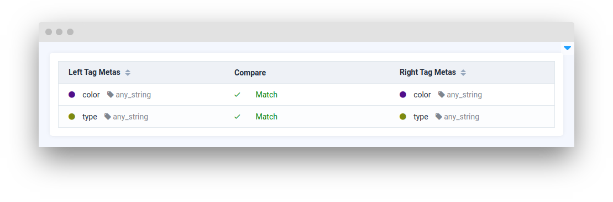
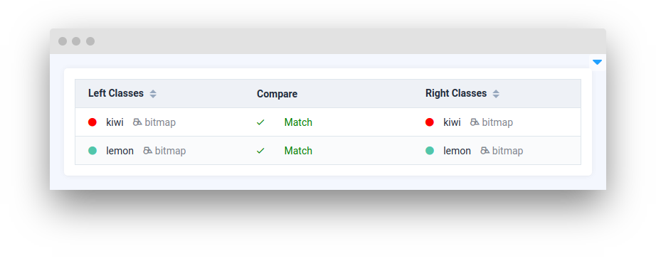
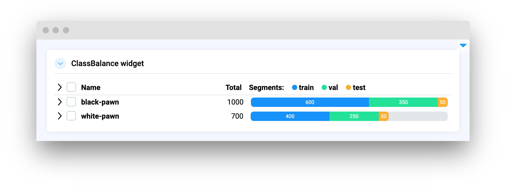

# Compare Data

<table data-view="cards"><thead><tr><th></th><th></th><th></th><th data-hidden data-card-target data-type="content-ref"></th></tr></thead><tbody><tr><td><strong>Match Datasets</strong></td><td></td><td><mark style="color:purple;">Compare and match datasets</mark></td><td><a href="matchdatasets.md">matchdatasets.md</a></td></tr><tr><td><strong>Match Tag Metas</strong></td><td></td><td><mark style="color:purple;">Compare and match tag metas based on their properties</mark></td><td><a href="matchtagmetas.md">matchtagmetas.md</a></td></tr>
<tr><td><strong>Match Obj Classes</strong></td><td></td><td><mark style="color:purple;">Compare and match object classes based on their properties</mark></td><td><a href="matchobjclasses.md">matchobjclasses.md</a></td><tr><td><strong>ClassBalance</strong></td><td></td><td><mark style="color:purple;">Display classes balance with rows and bar charts in table view</mark></td><td><a href="classbalance.md">classbalance.md</a></td></tr></tbody></table>
