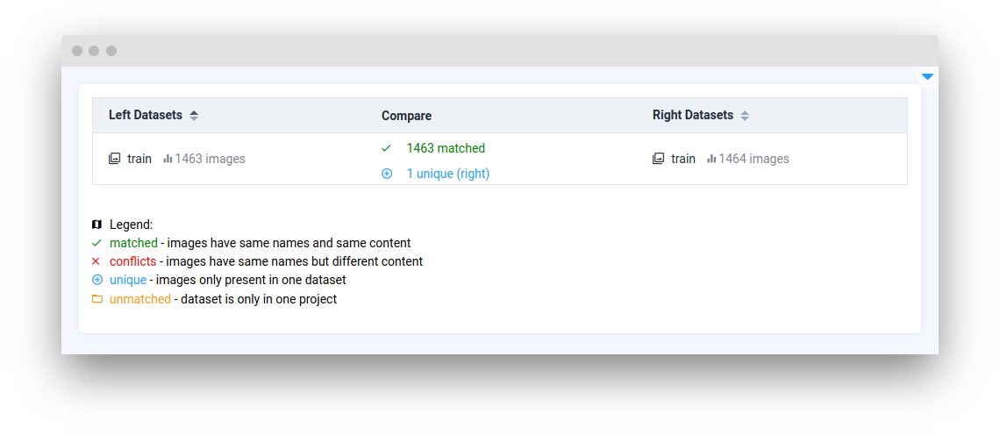

# Compare Data

<table data-view="cards"><thead><tr><th></th><th></th><th></th><th data-hidden data-card-target data-type="content-ref"></th></tr></thead><tbody><tr><td><strong>Match Datasets</strong></td><td></td><td></td><td><a href="matchdatasets.md">matchdatasets.md</a></td></tr><tr><td><strong>Match Tag Metas</strong></td><td></td><td></td><td><a href="matchtagmetas.md">matchtagmetas.md</a></td></tr><tr><td><strong>Match Obj Classes</strong></td><td></td><td></td><td><a href="matchobjclasses.md">matchobjclasses.md</a></td></tr></tbody></table>
