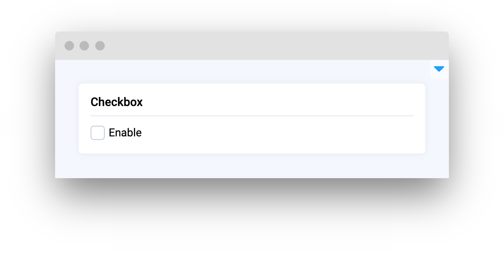

# Controls

<table data-view="cards"><thead><tr><th></th><th></th><th></th><th data-hidden data-card-target data-type="content-ref"></th></tr></thead><tbody><tr><td><strong>Button</strong></td><td></td><td><mark style="color:purple;">Clickable button to make things happen when users press it</mark></td><td><a href="button.md">button.md</a></td></tr><tr><td><strong>Checkbox</strong></td><td><mark style="color:purple;">A group of options for multiple choices</mark></td><td></td><td><a href="checkbox.md">checkbox.md</a></td></tr><tr><td><strong>Radio Group</strong></td><td></td><td><mark style="color:purple;">Single selection among multiple options</mark></td><td><a href="radiogroup.md">radiogroup.md</a></td></tr><tr><td><strong>Switch</strong></td><td></td><td><mark style="color:purple;">Shows that an option has been enabled or not</mark></td><td><a href="switch.md">switch.md</a></td></tr><tr><td><strong>Slider</strong></td><td></td><td><mark style="color:purple;">Adjustable slider with numeric values</mark></td><td><a href="slider.md">slider.md</a></td></tr></tbody></table>

