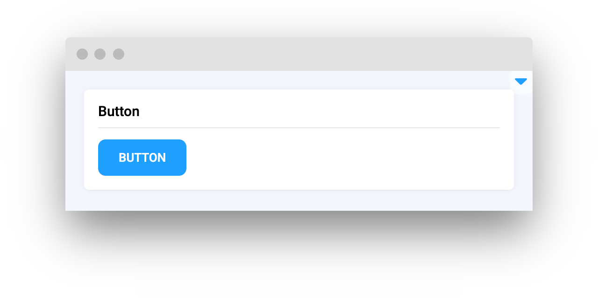
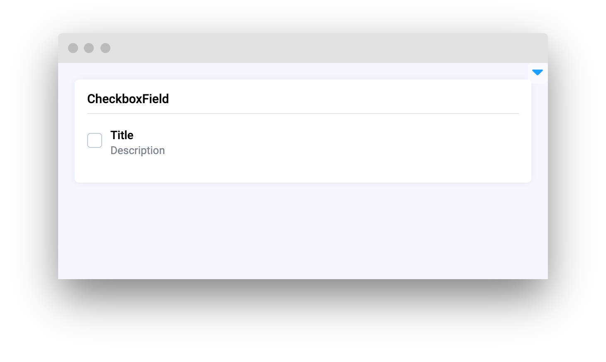
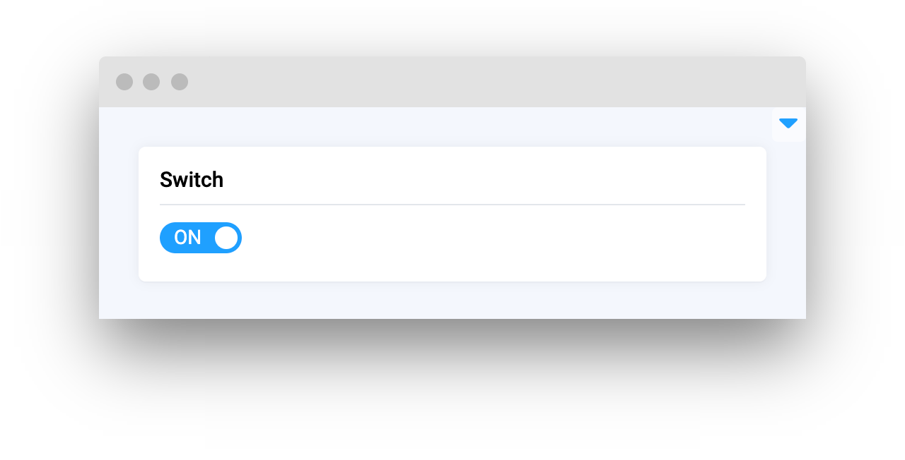

# Controls

<table data-card-size="large" data-view="cards"><thead><tr><th></th><th></th><th></th><th data-hidden data-card-target data-type="content-ref"></th></tr></thead><tbody><tr><td><strong>Button</strong></td><td></td><td><mark style="color:purple;">User-interactive button that executes a command or triggers an event when clicked</mark></td><td><a href="button.md">button.md</a></td></tr><tr><td><strong>Checkbox</strong></td><td></td><td><mark style="color:purple;">Toggleable box that allows users to make binary choices, often used for multiple selections</mark></td><td><a href="checkbox.md">checkbox.md</a></td></tr><tr><td><strong>CheckboxField</strong></td><td></td><td><mark style="color:purple;">Toggleable box that allows users to make binary choices in form field</mark></td><td><a href="checkboxfield.md">checkboxfield.md</a></td></tr><tr><td><strong>Radio Group</strong></td><td></td><td><mark style="color:purple;">Group of options where only one can be selected at a time, suitable for mutually exclusive choices</mark></td><td><a href="radiogroup.md">radiogroup.md</a></td></tr><tr><td><strong>Switch</strong></td><td></td><td><mark style="color:purple;">Control that provides a visual cue for enabling or disabling a feature or setting</mark></td><td><a href="switch.md">switch.md</a></td></tr><tr><td><strong>Slider</strong></td><td></td><td><mark style="color:purple;">Control that lets users select a value by sliding a knob within a range on a track</mark></td><td><a href="slider.md">slider.md</a></td></tr><tr><td><strong>TrainValSplits</strong></td><td></td><td><mark style="color:purple;">Interface for specifying parameters to divide data into training and validation subsets for model training</mark></td><td><a href="trainvalsplits.md">trainvalsplits.md</a></td></tr><tr><td><strong>FileStorageUpload</strong></td><td></td><td><mark style="color:purple;">Tool for uploading one or more files from the user's device, featuring progress indication and drag-and-drop support</mark></td><td><a href="filestorageupload.md">filestorageupload.md</a></td></tr><tr><td><strong>Timeline</strong></td><td></td><td><mark style="color:purple;">Interactive timeline for navigating video frames and segment highlights</mark></td><td><a href="timeline.md">timeline.md</a></td></tr><tr><td><strong>Pagination</strong></td><td></td><td><mark style="color:purple;">Page selector. If you have too much data to display in one page, use pagination.</mark></td><td><a href="pagination.md">pagination.md</a></td></tr></tbody></table>
