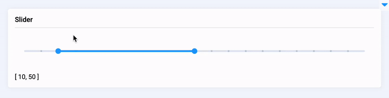

# Slider

## Introduction

**`Slider`** is a widget in Supervisely that allows users to input numerical values within a specific range. The widget is commonly used to set parameters such as batch size in machine learning models. Users can adjust the slider handle to select the desired value, and the corresponding numerical value is displayed. `Slider` widget also provides users with the ability to customize the slider range, height in vertical mode and step size between values, allowing for more precise and flexible inputs.

## Function signature

```python
Slider(
    value=0,
    min=0,
    max=100,
    step=1,
    show_input=False,
    show_input_controls=False,
    show_stops=False,
    show_tooltip=True,
    range=False,
    vertical=False,
    height=None,
    widget_id=None,
)
```

<figure><figcaption></figcaption></figure>

## Parameters

|      Parameters       |              Type              |                          Description                           |
|:---------------------:|:------------------------------:|:--------------------------------------------------------------:|
|        `value`        | `Union[int, float, List[int]]` |                      `Slider` start value                      |
|         `min`         |             `int`              |                         Minimum value                          |
|         `max`         |             `int`              |                         Maximum value                          |
|        `step`         |             `int`              |                           Step size                            |
|     `show_input`      |             `bool`             | Whether to display an input box, works when `range` is `False` |
| `show_input_controls` |             `bool`             | Whether to display control buttons when `show-input` is `True` |
|     `show_stops`      |             `bool`             |                 Whether to display breakpoints                 |
|    `show_tooltip`     |             `bool`             |                Whether to display tooltip value                |
|        `range`        |             `bool`             |                   Whether to select a range                    |
|      `vertical`       |             `bool`             |                         Vertical mode                          |
|       `height`        |             `int`              |           `Slider` height, required in vertical mode           |
|        `style`        |             `str`              |            Specifies an inline style for an element            |
|      `widget_id`      |             `str`              |                        ID of the widget                        |

### value

Determine `Slider` start value.

**type:** `Union[int, List[int]]`

**default value:** `0`

```python
slider = Slider(value=15)
```

<figure><figcaption></figcaption></figure>

### min

Determine `Slider` minimum value.

**type:** `int`

**default value:** `0`

### max

Determine `Slider` maximum value.

**type:** `int`

**default value:** `100`

```python
slider = Slider(min=30, max=50)
```

<figure><figcaption></figcaption></figure>

### step

Determine step size.

**type:** `int`

**default value:** `1`

```python
slider = Slider(step=5)
```

<figure><figcaption></figcaption></figure>

### show\_input

Whether to display an input box, works when `range` is false.

**type:** `bool`

**default value:** `false`

```python
slider = Slider(show_input=True)
```

<figure><figcaption></figcaption></figure>

### show\_input\_controls

Whether to display control buttons when `show-input` is true.

**type:** `bool`

**default value:** `false`

```python
slider = Slider(show_input=True, show_input_controls=True)
```

<figure><figcaption></figcaption></figure>

### show\_stops

Whether to display breakpoints.

**type:** `bool`

**default value:** `false`

```python
slider = Slider(show_stops=True, max=20, step=5)
```

<figure><figcaption></figcaption></figure>

### show\_tooltip

Whether to display tooltip value.

**type:** `bool`

**default value:** `true`

```python
slider = Slider(show_tooltip=False)
```

<figure><figcaption></figcaption></figure>

### range

Determine whether to select a range, equires value to be List\[int, int].

**type:** `bool`

**default value:** `true`

```python
slider = Slider(value=[5, 20], range=True)
```

<figure><figcaption></figcaption></figure>

### vertical

Determine vertical mode.

**type:** `bool`

**default value:** `false`

### height

Determine `Slider` height, required in vertical mode.

**type:** `int`

**default value:** `None`

```python
slider = Slider(vertical=True, height=100)
```

<figure><figcaption></figcaption></figure>

### style

Specifies an inline style for an element.

**type:** `str`

**default value:** ""

```python
slider = Slider(value=15, min=5, max=50, style="padding: 20px;")
```

### widget\_id

ID of the widget.

**type:** `str`

**default value:** `None`

## Methods and attributes

|              Attributes and Methods              | Description                                         |
|:------------------------------------------------:|-----------------------------------------------------|
| `set_value(value: Union[int, float, List[int]])` | Set `Slider` value.                                 |
|                  `get_value()`                   | Return `Slider` value.                              |
|                   `set_min()`                    | Set `Slider` minimum.                               |
|                   `get_min()`                    | Return `Slider` minimum.                            |
|                   `set_max()`                    | Set `Slider` maximum.                               |
|                   `get_max()`                    | Return `Slider` maximum.                            |
|                   `set_step()`                   | Set `Slider` step.                                  |
|                   `get_step()`                   | Return `Slider` step.                               |
|               `is_input_enabled()`               | Return `Slider` `showInput` value.                  |
|                  `show_input()`                  | Set `showInput` value to `True`.                    |
|                  `hide_input()`                  | Set `showInput` value to `False`.                   |
|          `is_input_controls_enabled()`           | Return `Slider` `showInputControls` value.          |
|             `show_input_controls()`              | Set `showInputControls` value to `True`.            |
|             `hide_input_controls()`              | Set `showInputControls` value to `False`.           |
|               `is_step_enabled()`                | Return `Slider` `showStops` value.                  |
|                  `show_steps()`                  | Set `showStops` value to `True`.                    |
|                  `hide_steps()`                  | ESet `showStops` value to `False`.                  |
|              `is_tooltip_enabled()`              | Return `Slider` `showTooltip` value.                |
|                 `show_tooltip()`                 | Set `showTooltip` value to `True`.                  |
|                 `hide_tooltip()`                 | Set `showTooltip` value to `False`.                 |
|                 `@value_changed`                 | Decorator function is handled when value is changed |

## Mini App Example

You can find this example in our Github repository:

[ui-widgets-demos/controls/005\_slider/src/main.py](https://github.com/supervisely-ecosystem/ui-widgets-demos/blob/master/controls/005\_slider/src/main.py)

### Import libraries

```python
import os

import supervisely as sly
from dotenv import load_dotenv
from supervisely.app.widgets import Card, Container, Slider, Text
```

### Init API client

First, we load environment variables with credentials and init API for communicating with Supervisely Instance:

```python
load_dotenv("local.env")
load_dotenv(os.path.expanduser("~/supervisely.env"))

api = sly.Api()
```

### Create `Text` widget we will use in UI for demo `Slider` widget

```python
text = Text()
```

### Initialize `Slider` widget

```python
slider = Slider(
    value=[10, 50],
    step=5,
    range=True,
    show_stops=True,
)
```

### Create app layout

Prepare a layout for app using `Card` widget with the `content` parameter and place widget that we've just created in the `Container` widget.

```python
card = Card(title="Slider", content=Container([slider, text]))
layout = Container(widgets=[card])
```

### Create app using layout

Create an app object with layout parameter.

```python
app = sly.Application(layout=layout)
```

### Add functions to control widget from code

```python
@slider.value_changed
def show_value(value):
    text.text = value
```

<figure><figcaption></figcaption></figure>
