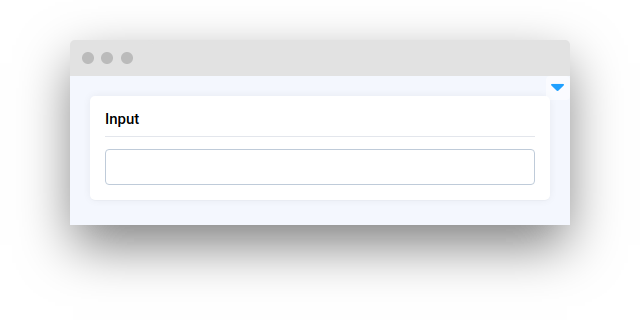

# Input

<table data-view="cards"><thead><tr><th></th><th></th><th></th><th data-type="files"></th><th data-hidden data-card-target data-type="content-ref"></th><th data-hidden data-card-cover data-type="files"></th></tr></thead><tbody><tr><td>
<strong>Input</strong>

</td><td><mark style="color:purple;">Input text or value that can be acquired by program</mark></td><td></td><td></td><td><a href="input.md">input.md</a></td><td></td></tr><tr><td><strong>InputNumber</strong></td><td></td><td><mark style="color:purple;">Input quantities of items, set limits</mark></td><td></td><td><a href="inputnumber.md">inputnumber.md</a></td><td></td></tr><tr><td><strong>InputTag</strong></td><td></td><td><mark style="color:purple;">Search items or filter by tag</mark></td><td></td><td><a href="inputtag.md">inputtag.md</a></td><td></td></tr><tr><td><strong>BindedInputNumber</strong></td><td></td><td><mark style="color:purple;">Fine-tune specific parameters within supervisely apps that require two numerical inputs</mark></td><td></td><td><a href="bindedinputnumber.md">bindedinputnumber.md</a></td><td></td></tr><tr><td><strong>DatePicker</strong></td><td></td><td><mark style="color:purple;">Pick a date</mark></td><td></td><td><a href="datepicker.md">datepicker.md</a></td><td></td></tr><tr><td><strong>DateTimePicker</strong></td><td></td><td><mark style="color:purple;">Pick date and time</mark></td><td></td><td><a href="datetimepicker.md">datetimepicker.md</a></td><td></td></tr></tbody></table>
