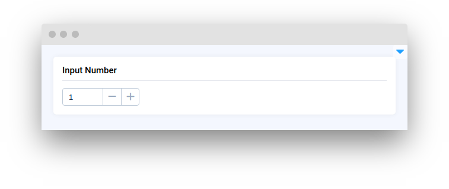
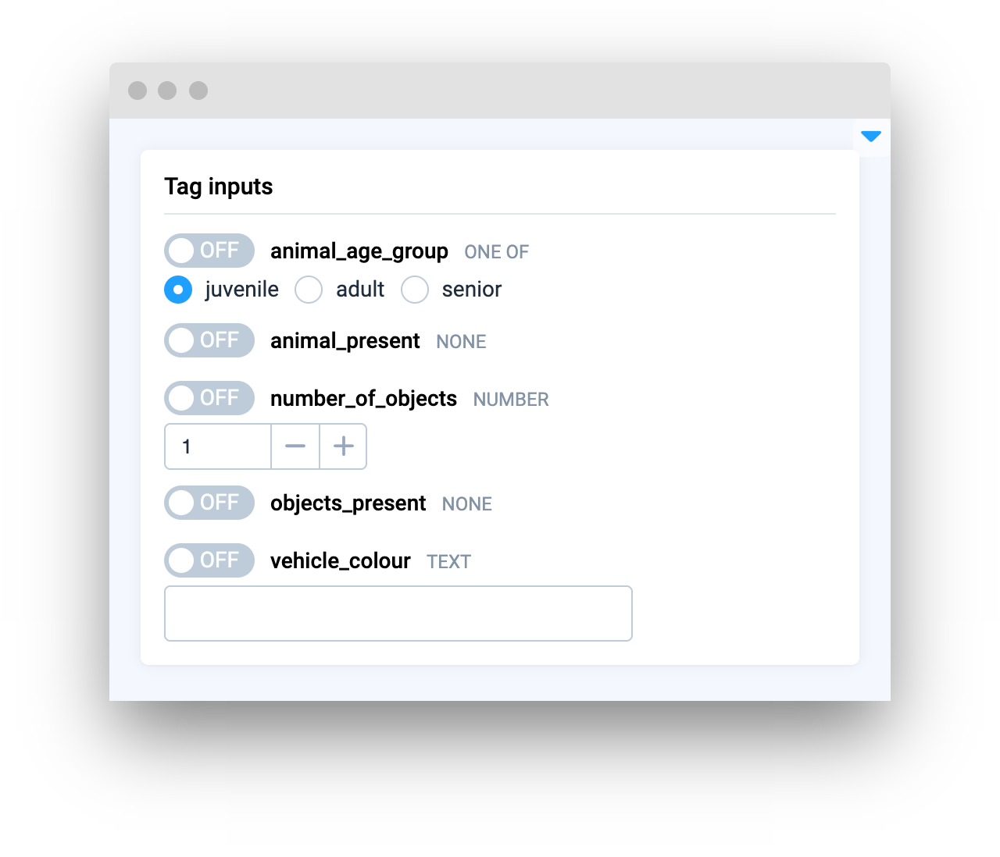
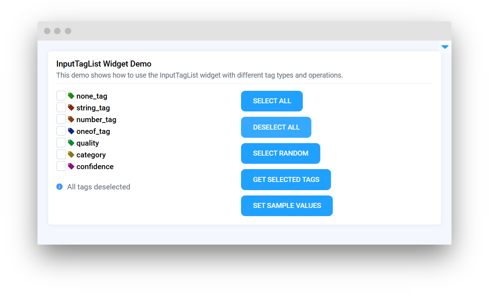
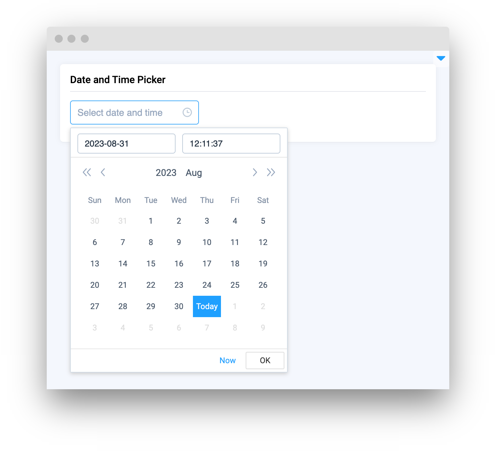
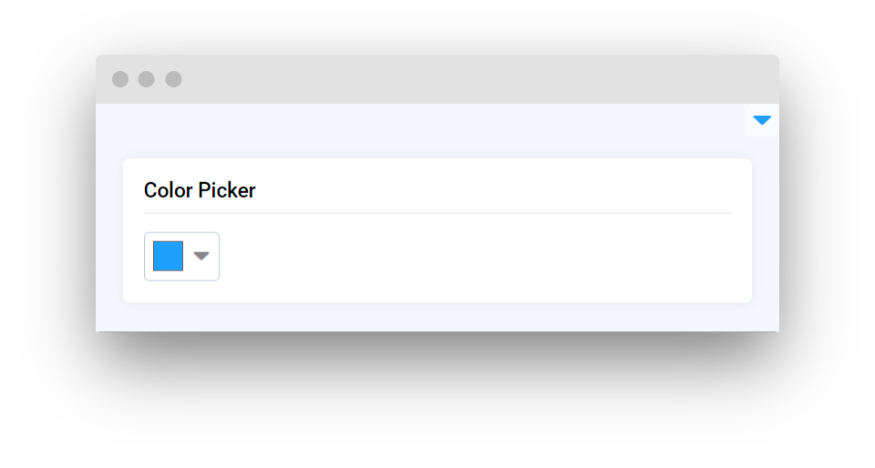
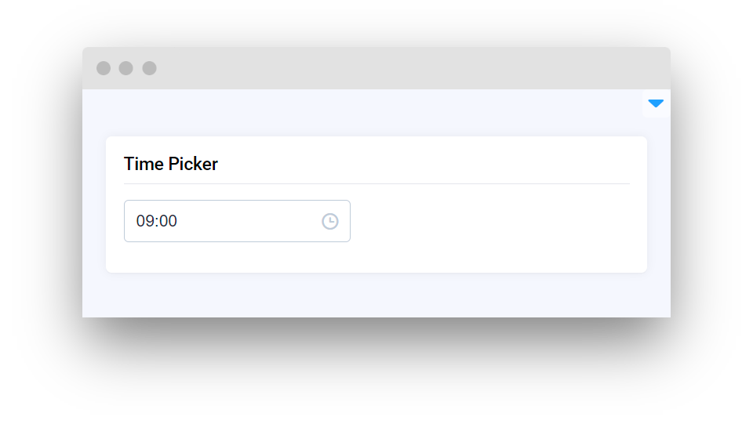

# Input

<table data-card-size="large" data-view="cards"><thead><tr><th></th><th></th><th></th><th data-hidden data-card-target data-type="content-ref"></th></tr></thead><tbody><tr><td><strong>Input</strong></td><td></td><td><mark style="color:purple;">Enables users to enter custom text for data processing or interaction</mark></td><td><a href="input.md">input.md</a></td></tr><tr><td><strong>InputNumber</strong></td><td></td><td><mark style="color:purple;">Allows users to input or select a numerical value within a defined range</mark></td><td><a href="inputnumber.md">inputnumber.md</a></td></tr><tr><td><strong>InputTag</strong></td><td></td><td><mark style="color:purple;">Select or enter multiple items and categorize them with tags for easy organization and retrieval</mark></td><td><a href="inputtag.md">inputtag.md</a></td></tr><tr><td><strong>InputTagList</strong></td><td></td><td><mark style="color:purple;">Select multiple tags.</mark></td><td><a href="inputtaglist.md">inputtaglist.md</a></td></tr><tr><td><strong>BindedInputNumber</strong></td><td></td><td><mark style="color:purple;">Dual fields for inputting and correlating two different numerical values, ideal for defining a range or related parameters</mark></td><td><a href="bindedinputnumber.md">bindedinputnumber.md</a></td></tr><tr><td><strong>DatePicker</strong></td><td></td><td><mark style="color:purple;">An interactive calendar allows users to select a specific date</mark></td><td><a href="datepicker.md">datepicker.md</a></td></tr><tr><td><strong>DateTimePicker</strong></td><td></td><td><mark style="color:purple;">Combines a calendar and clock interface for selecting both date and precise time</mark> </td><td><a href="datetimepicker.md">datetimepicker.md</a></td></tr><tr><td><strong>ColorPicker</strong></td><td></td><td><mark style="color:purple;">Color selector supporting multiple color formats</mark></td><td><a href="colorpicker.md">colorpicker.md</a></td></tr><tr><td><strong>TimePicker</strong></td><td></td><td><mark style="color:purple;">Interactive time selector</mark></td><td><a href="timepicker.md">timepicker.md</a></td></tr><tr><td><strong>ClassesMapping</strong></td><td></td><td><mark style="color:purple;">Rename classes</mark></td><td><a href="classesmapping.md">classesmapping.md</a></td></tr><tr><td><strong>ClassesColorMapping</strong></td><td></td><td><mark style="color:purple;">Change classes colors</mark></td><td><a href="classescolormapping.md">classescolormapping.md</a></td></tr></tbody></table>
