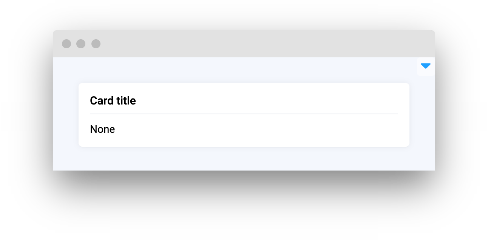
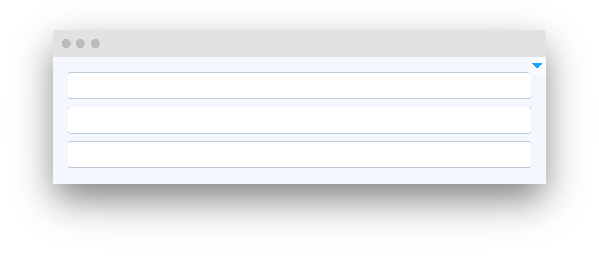
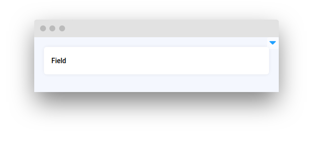
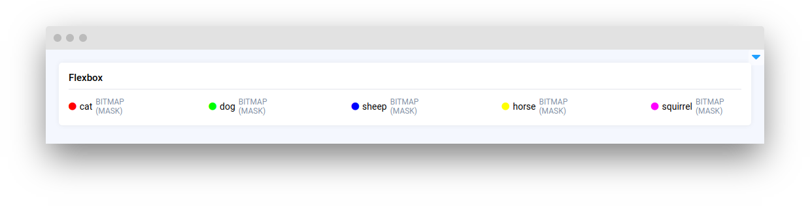
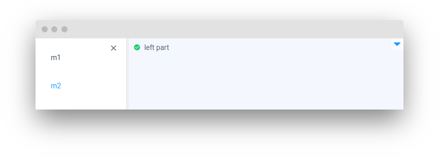
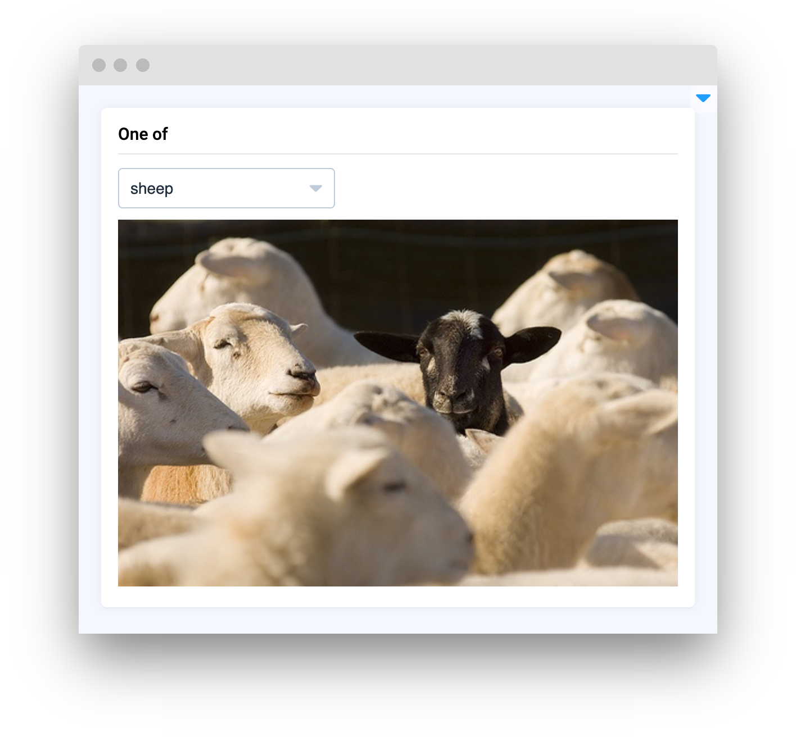
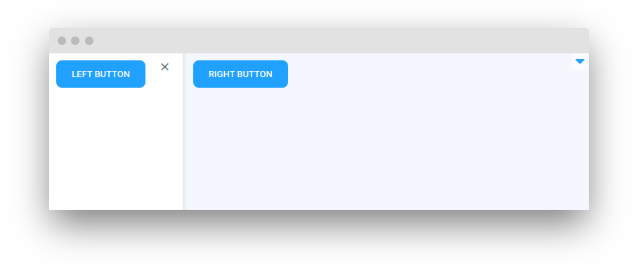
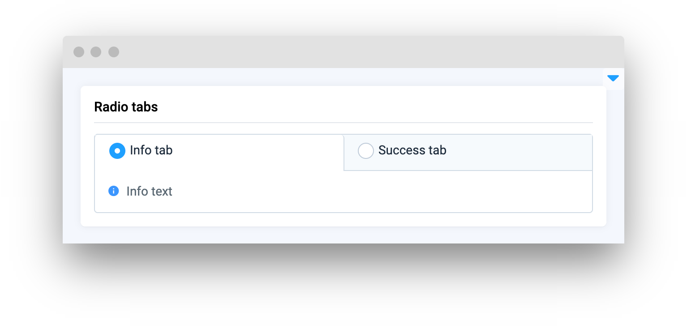
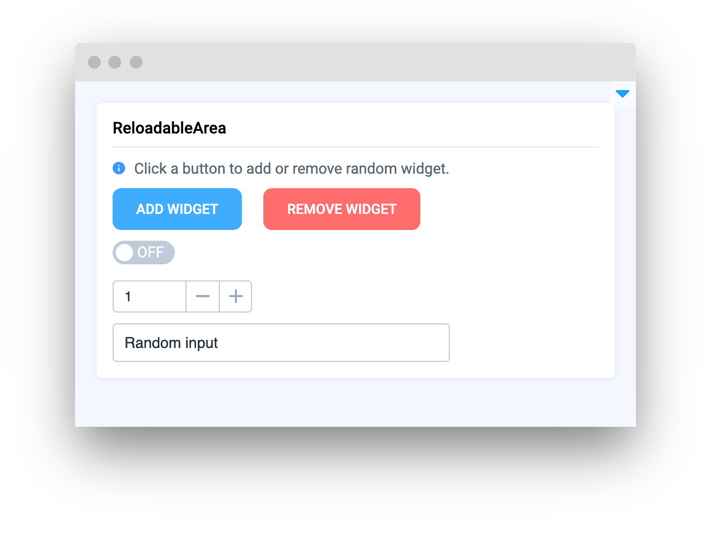

# Layouts and Containers

<table data-view="cards"><thead><tr><th></th><th></th><th></th><th data-hidden data-card-target data-type="content-ref"></th></tr></thead><tbody><tr><td><strong>Card</strong></td><td></td><td><mark style="color:purple;">Display content or data in a visually appealing and organized way</mark></td><td><a href="card.md">card.md</a></td></tr><tr><td><strong>Container</strong></td><td></td><td><mark style="color:purple;">Group widgets and contents in single container</mark></td><td><a href="container.md">container.md</a></td></tr><tr><td><strong>Empty</strong></td><td></td><td><mark style="color:purple;">Add empty spaces into UI</mark></td><td><a href="empty.md">empty.md</a></td></tr><tr><td><strong>Field</strong></td><td></td><td><mark style="color:purple;">Display content or data in a titled region of UI</mark></td><td><a href="field.md">field.md</a></td></tr><tr><td><strong>Flexbox</strong></td><td></td><td><mark style="color:purple;">Create a flexible containers for widgets</mark></td><td><a href="flexbox.md">flexbox.md</a></td></tr><tr><td><strong>Grid</strong></td><td></td><td><mark style="color:purple;">Add menu to the UI</mark></td><td><a href="grid.md">grid.md</a></td></tr><tr><td><strong>Menu</strong></td><td></td><td><mark style="color:purple;">Use grid to organize content and widgets</mark></td><td><a href="menu.md">menu.md</a></td></tr><tr><td><strong>One Of</strong></td><td></td><td><mark style="color:purple;">Choose which content to display</mark></td><td><a href="oneof.md">oneof.md</a></td></tr><tr><td><strong>Sidebar</strong></td><td></td><td><mark style="color:purple;">Add hideable sidebar to the UI</mark></td><td><a href="sidebar.md">sidebar.md</a></td></tr><tr><td><strong>Stepper</strong></td><td></td><td><mark style="color:purple;">Organize workflow with a steps</mark></td><td><a href="stepper.md">stepper.md</a></td></tr><tr><td><strong>RadioTabs</strong></td><td></td><td><mark style="color:purple;">Work with deifferent sections of content using tabs</mark></td><td><a href="radiotabs.md">radiotabs.md</a></td></tr><tr><td><strong>Tabs</strong></td><td></td><td><mark style="color:purple;">Work with deifferent sections of content using tabs</mark></td><td><a href="tabs.md">tabs.md</a></td></tr><tr><td><strong>TabsDynamic</strong></td><td></td><td><mark style="color:purple;">Add editable tabs</mark></td><td><a href="tabsdynamic.md">tabsdynamic.md</a></td></tr><tr><td><strong>ReloadableArea</strong></td><td></td><td><mark style="color:purple;">Seamlessly create and change widgets within GUI</mark></td><td><a href="reloadablearea.md">reloadablearea.md</a></td></tr><tr><td><strong>Collapse</strong></td><td></td><td><mark style="color:purple;">Create collapsing regions</mark></td><td><a href="collapse.md">collapse.md</a></td></tr><tr><td><strong>Dialog</strong></td><td></td><td><mark style="color:purple;">Pop-up for alerts or user confirmations</mark></td><td></td></tr></tbody></table>
