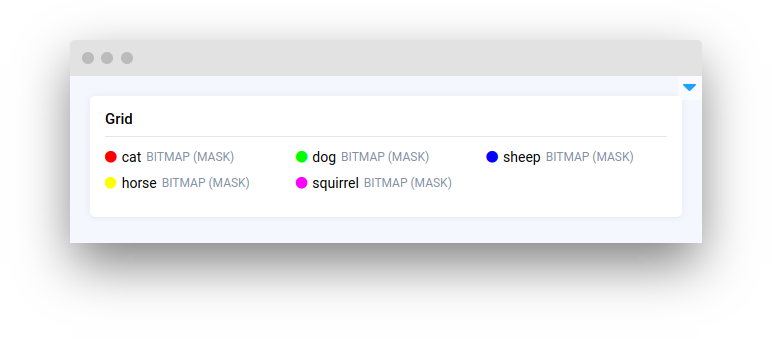
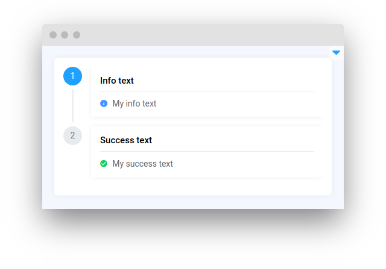

# Layouts and Containers

<table data-view="cards"><thead><tr><th></th><th></th><th></th><th data-hidden data-card-target data-type="content-ref"></th></tr></thead><tbody><tr><td><strong>Card</strong></td><td></td><td><mark style="color:purple;">Display content or data in a visually appealing and organized way</mark></td><td><a href="card.md">card.md</a></td></tr><tr><td><strong>Container</strong></td><td></td><td></td><td><a href="container.md">container.md</a></td></tr><tr><td><strong>Empty</strong></td><td></td><td></td><td><a href="empty.md">empty.md</a></td></tr><tr><td><strong>Field</strong></td><td></td><td></td><td><a href="field.md">field.md</a></td></tr><tr><td><strong>Flexbox</strong></td><td></td><td></td><td><a href="flexbox.md">flexbox.md</a></td></tr><tr><td><strong>Grid</strong></td><td></td><td></td><td><a href="grid.md">grid.md</a></td></tr><tr><td><strong>Menu</strong></td><td></td><td></td><td><a href="menu.md">menu.md</a></td></tr><tr><td><strong>One Of</strong></td><td></td><td></td><td><a href="oneof.md">oneof.md</a></td></tr><tr><td><strong>Sidebar</strong></td><td></td><td></td><td><a href="sidebar.md">sidebar.md</a></td></tr><tr><td><strong>Stepper</strong></td><td></td><td></td><td><a href="stepper.md">stepper.md</a></td></tr><tr><td><strong>RadioTabs</strong></td><td></td><td></td><td></td></tr><tr><td><strong>Tabs</strong></td><td></td><td></td><td></td></tr><tr><td><strong>TabsDynamic</strong></td><td></td><td></td><td></td></tr></tbody></table>
