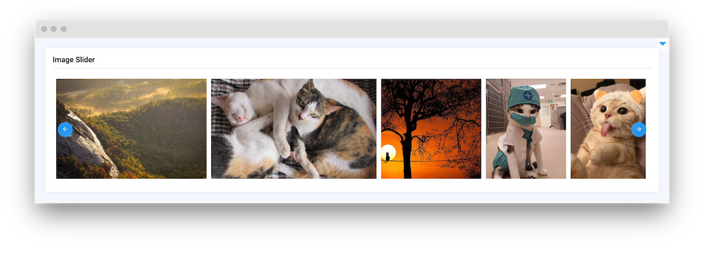
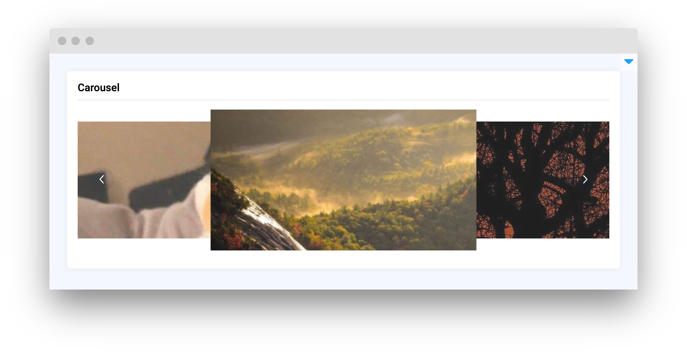

# Media

<table data-view="cards"><thead><tr><th></th><th></th><th></th><th data-hidden data-card-target data-type="content-ref"></th></tr></thead><tbody><tr><td><strong>Image</strong></td><td></td><td><mark style="color:purple;">Integrates images into your application for display and examination</mark></td><td><a href="image.md">image.md</a></td></tr><tr><td><strong>Labeled Image</strong></td><td></td><td><mark style="color:purple;">Showcases images with interactive labels and annotations for detailed visualization</mark></td><td><a href="labeledimage.md">labeledimage.md</a></td></tr><tr><td><strong>Grid Gallery</strong></td><td></td><td><mark style="color:purple;">Composite view to exhibit a collection of images in an organized grid layout, with support for annotations</mark></td><td><a href="gridgallery.md">gridgallery.md</a></td></tr><tr><td><strong>Video</strong></td><td></td><td><mark style="color:purple;">Preview video and annotation frame by frame</mark></td><td><a href="video.md">video.md</a></td></tr><tr><td><strong>Video Player</strong></td><td></td><td><mark style="color:purple;">Video playback component leveraging the HTML <code>&#x3C;video></code> element for embedded media streaming</mark></td><td><a href="videoplayer.md">videoplayer.md</a></td></tr><tr><td><strong>Image Pair Sequence</strong></td><td></td><td><mark style="color:purple;">Side-by-side comparison of image pairs, with annotation capabilities for in-depth analysis</mark></td><td><a href="imagepairsequence.md">imagepairsequence.md</a></td></tr><tr><td><strong>Icons</strong></td><td></td><td><mark style="color:purple;">Display a set of icons within the user interface</mark></td><td><a href="icons.md">icons.md</a></td></tr><tr><td><strong>ObjectClassView</strong></td><td></td><td><mark style="color:purple;">Displays information about a single object classs</mark></td><td><a href="objectclassview.md">objectclassview.md</a></td></tr><tr><td><strong>ObjectClassesList</strong></td><td></td><td><mark style="color:purple;">Organized list of object classes</mark></td><td><a href="objectclasseslist.md">objectclasseslist.md</a></td></tr><tr><td><strong>ImageSlider</strong></td><td></td><td><mark style="color:purple;">Scrollable display to showcase a series of images, providing multiple examples or variations</mark></td><td><a href="imageslider.md">imageslider.md</a></td></tr><tr><td><strong>Carousel</strong></td><td></td><td><mark style="color:purple;">Interactive slider component designed to present a sequence of images in a rotating carousel format</mark></td><td><a href="carousel.md">carousel.md</a></td></tr><tr><td><strong>TagMetaView</strong></td><td></td><td><mark style="color:purple;">Component for presenting metadata associated with a single tag</mark></td><td><a href="tagmetaview.md">tagmetaview.md</a></td></tr><tr><td><strong>TagMetasList</strong></td><td></td><td><mark style="color:purple;">Component that lists multiple metadata tags</mark></td><td><a href="tagmetaslist.md">tagmetaslist.md</a></td></tr><tr><td><strong>ImageAnnotationPreview</strong></td><td></td><td><mark style="color:purple;">Updated version of the original LabeledImage widget, offering improved features for viewing and interacting with image annotations</mark></td><td><a href="imageannotationpreview.md">imageannotationpreview.md</a></td></tr><tr><td><strong>ClassesMappingPreview</strong></td><td></td><td><mark style="color:purple;">Display classes mapping with original and new class names</mark></td><td><a href="classesmappingpreview.md">classesmappingpreview.md</a></td></tr><tr><td><strong>ClassesListPreview</strong></td><td></td><td><mark style="color:purple;">Display list of classes with shapes</mark></td><td><a href="classeslistpreview.md">classeslistpreview.md</a></td></tr><tr><td><strong>TagsListPreview</strong></td><td></td><td><mark style="color:purple;">Display list of tags with value types</mark></td><td><a href="tagslistpreview.md">tagslistpreview.md</a></td></tr><tr><td><strong>MembersListPreview</strong></td><td></td><td><mark style="color:purple;">Display list of given users with roles within the team</mark></td><td><a href="memberslistpreview.md">memberslistpreview.md</a></td></tr></tbody></table>
