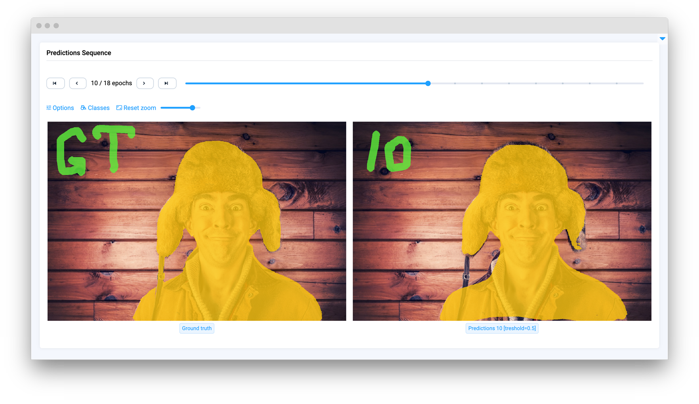

# Media

<table data-view="cards"><thead><tr><th></th><th></th><th></th><th data-hidden data-card-target data-type="content-ref"></th></tr></thead><tbody><tr><td><strong>Image</strong></td><td></td><td><mark style="color:purple;">Preview image in your app</mark></td><td><a href="image.md">image.md</a></td></tr><tr><td><strong>Labeled Image</strong></td><td></td><td><mark style="color:purple;">Preview image and visualize annotation with settings</mark></td><td><a href="labeledimage.md">labeledimage.md</a></td></tr><tr><td><strong>Grid Gallery</strong></td><td></td><td><mark style="color:purple;">Preview multiple images (including annotations) at once</mark></td><td><a href="gridgallery.md">gridgallery.md</a></td></tr><tr><td><strong>Video</strong></td><td></td><td><mark style="color:purple;">Preview video and annotation frame by frame</mark></td><td><a href="video.md">video.md</a></td></tr><tr><td><strong>Video Player</strong></td><td></td><td><mark style="color:purple;">Video player based on classic html<code>&#x3C;video></code>tag</mark></td><td><a href="videoplayer.md">videoplayer.md</a></td></tr><tr><td><strong>Image Pairs Sequence</strong></td><td></td><td><mark style="color:purple;">Display sequence of image pairs with annotations</mark></td><td><a href="imagepairssequence.md">imagepairssequence.md</a></td></tr></tbody></table>
