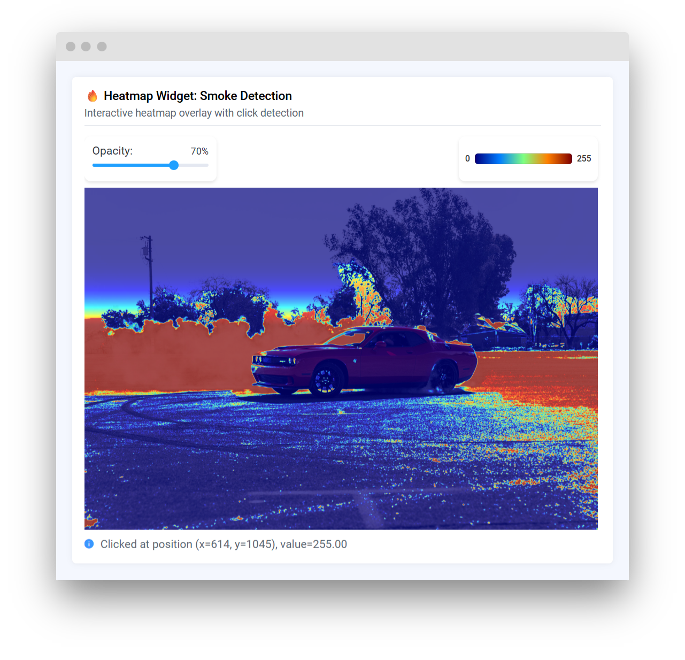
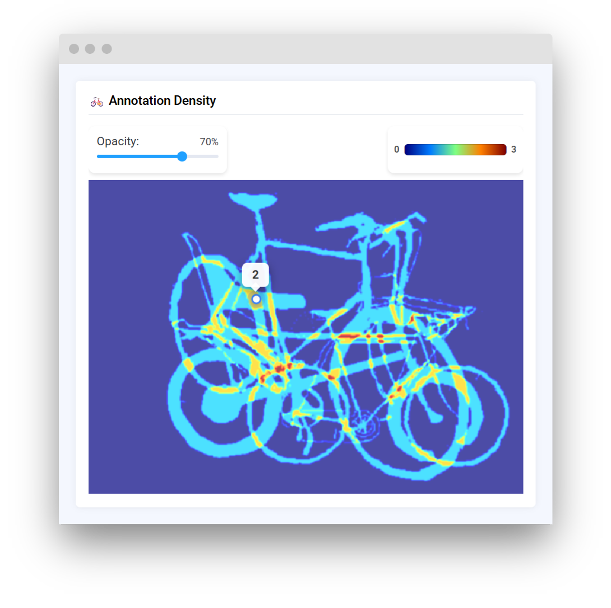
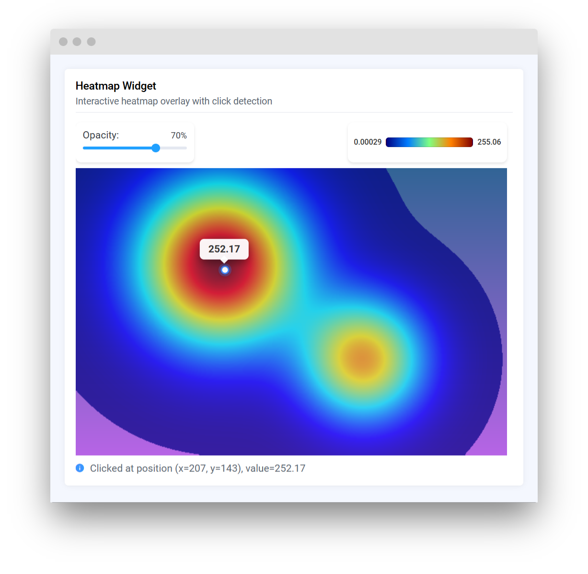

# Heatmap

## Introduction

**`Heatmap`** widget in Supervisely allows for displaying interactive heatmap overlays on top of background images. This widget is particularly useful for visualizing density maps, attention mechanisms, prediction confidence, or any other spatial data that can be represented as a 2D array of values.

The `Heatmap` widget provides built-in interactivity, allowing users to click on the heatmap to retrieve exact values at specific coordinates. It supports customizable colormaps, opacity control, and can work with both image files and NumPy arrays.

## Function signature

```python
heatmap = Heatmap(
    background_image=background_img,
    heatmap_mask=mask_array,
    vmin=0,
    vmax=100,
    transparent_low=False,
    colormap=cv2.COLORMAP_JET,
    width=800,
    height=600,
    widget_id=None,
)
```

<figure><figcaption></figcaption></figure>

## Parameters

|     Parameters     |              Type              |                           Description                            |
| :----------------: | :----------------------------: | :--------------------------------------------------------------: |
| `background_image` | `Union[str, np.ndarray, None]` |      Background image to display under the heatmap overlay.      |
|   `heatmap_mask`   |     `Optional[np.ndarray]`     |             NumPy array representing heatmap values.             |
|       `vmin`       |        `Optional[Any]`         | Minimum value for normalizing the heatmap (inferred if not set). |
|       `vmax`       |        `Optional[Any]`         | Maximum value for normalizing the heatmap (inferred if not set). |
| `transparent_low`  |             `bool`             |         Make low/zero values in the heatmap transparent.         |
|     `colormap`     |             `int`              |       OpenCV colormap constant for colorizing the heatmap.       |
|      `width`       |        `Optional[int]`         |                  Width of the widget in pixels.                  |
|      `height`      |        `Optional[int]`         |                 Height of the widget in pixels.                  |
|    `widget_id`     |        `Optional[str]`         |                Unique identifier for the widget.                 |

### background_image

Background image to display under the heatmap. Can be provided in multiple formats:

1. **NumPy array** - image as array (RGB or RGBA)
2. **File path** - absolute path to an image file on disk
3. **URL** - HTTP/HTTPS URL to an image

**type:** `Union[str, np.ndarray, None]`

**default value:** `None`

```python
# From NumPy array
img_array = cv2.imread("image.jpg")
heatmap = Heatmap(background_image=img_array)

# From file path
heatmap = Heatmap(background_image="/path/to/image.jpg")

# From URL
heatmap = Heatmap(background_image="https://example.com/image.jpg")
```

### heatmap_mask

NumPy array representing the heatmap values. Can be 2D (grayscale) or 3D (will be converted to grayscale by averaging channels). Values will be normalized and colorized according to the specified colormap.

**type:** `Optional[np.ndarray]`

**default value:** `None`

```python
# Create a simple gradient mask
mask = np.random.rand(100, 100) * 255
heatmap = Heatmap(heatmap_mask=mask)
```

### vmin

Minimum value for normalizing the heatmap. If not specified, it will be automatically inferred from the mask data using `np.nanmin()`.

**type:** `Optional[Any]`

**default value:** `None`

```python
heatmap = Heatmap(heatmap_mask=mask, vmin=0, vmax=100)
```

### vmax

Maximum value for normalizing the heatmap. If not specified, it will be automatically inferred from the mask data using `np.nanmax()`.

**type:** `Optional[Any]`

**default value:** `None`

```python
heatmap = Heatmap(heatmap_mask=mask, vmin=0, vmax=100)
```

### transparent_low

When set to `True`, pixels with zero values in the normalized heatmap will be rendered as fully transparent, making it easier to see the background image through areas with no data.

**type:** `bool`

**default value:** `False`

```python
heatmap = Heatmap(
    heatmap_mask=mask,
    transparent_low=True
)
```

### colormap

OpenCV colormap constant used to colorize the heatmap. Common options include:

-   `cv2.COLORMAP_JET` (default, blue to red)
-   `cv2.COLORMAP_HOT` (black to white through red)
-   `cv2.COLORMAP_VIRIDIS` (purple to yellow)
-   `cv2.COLORMAP_TURBO` (blue to red, perceptually uniform)

See [OpenCV ColormapTypes](https://docs.opencv.org/master/d3/d50/group__imgproc__colormap.html) for all available colormaps.

**type:** `int`

**default value:** `cv2.COLORMAP_JET`

```python
import cv2

heatmap = Heatmap(
    heatmap_mask=mask,
    colormap=cv2.COLORMAP_VIRIDIS
)
```

### width

Width of the widget display area in pixels. If not specified, width will be determined automatically.

**type:** `Optional[int]`

**default value:** `None`

```python
heatmap = Heatmap(width=800)
```

### height

Height of the widget display area in pixels. If not specified, height will be determined automatically.

**type:** `Optional[int]`

**default value:** `None`

```python
heatmap = Heatmap(height=600)
```

### widget_id

Unique identifier for the widget instance. If not provided, one will be generated automatically.

**type:** `Optional[str]`

**default value:** `None`

## Methods and attributes

|                             Attributes and Methods                              | Description                                                |
| :-----------------------------------------------------------------------------: | ---------------------------------------------------------- |
|                                    `opacity`                                    | Get or set heatmap overlay opacity (0-100).                |
|                                   `colormap`                                    | Get or set the OpenCV colormap used for visualization.     |
|                                     `vmin`                                      | Get or set minimum value for heatmap normalization.        |
|                                     `vmax`                                      | Get or set maximum value for heatmap normalization.        |
|                                     `width`                                     | Get or set widget width in pixels.                         |
|                                    `height`                                     | Get or set widget height in pixels.                        |
|                                    `click_x`                                    | Get X coordinate of the last click (in mask coordinates).  |
|                                    `click_y`                                    | Get Y coordinate of the last click (in mask coordinates).  |
|                                  `click_value`                                  | Get the heatmap value at the last click position.          |
|           `set_background(background_image: Union[str, np.ndarray])`            | Update the background image.                               |
|                         `set_heatmap(mask: np.ndarray)`                         | Update the heatmap overlay with a new mask.                |
| `set_heatmap_from_annotations(anns: List[Annotation], object_name: str = None)` | Generate heatmap from Supervisely annotations.             |
|                                    `@click`                                     | Decorator function called when user clicks on the heatmap. |

### set_background()

Updates the background image. Accepts the same formats as the `background_image` parameter (NumPy array, file path, or URL).

```python
# Update with a new image
new_image = cv2.imread("new_background.jpg")
heatmap.set_background(new_image)
```

### set_heatmap()

Updates the heatmap overlay with a new mask array. The mask will be normalized and colorized according to the widget's settings.

```python
# Update with new heatmap data
new_mask = np.random.rand(100, 100) * 255
heatmap.set_heatmap(new_mask)
```

### set_heatmap_from_annotations()

Generates a heatmap from a list of Supervisely annotations by drawing all labels onto a density map. Optionally filter by object class name.

The `anns` parameter should be a list of [`Annotation`](https://supervisely.readthedocs.io/en/latest/sdk/supervisely.annotation.annotation.Annotation.html#supervisely.annotation.annotation.Annotation) objects. Each annotation contains labels with geometric shapes that will be drawn onto the heatmap mask to create a density visualization.

```python
# Generate heatmap from all objects in annotations

import supervisely as sly

ann1 = sly.Annotation.load_json_file("/path/to/ann1.json", project_meta)
ann2 = sly.Annotation.load_json_file("/path/to/ann2.json", project_meta)
ann3 = sly.Annotation.load_json_file("/path/to/ann3.json", project_meta)

annotations = [ann1, ann2, ann3]  # List of Annotation objects
heatmap.set_heatmap_from_annotations(annotations)

# Filter by specific class name (e.g., only "bicycle" objects)
heatmap.set_heatmap_from_annotations(annotations, object_name="bicycle")
```

<figure><figcaption></figcaption></figure>

### opacity

Property to get or set the opacity of the heatmap overlay (0-100, where 0 is fully transparent and 100 is fully opaque).

```python
# Get current opacity
current_opacity = heatmap.opacity

# Set new opacity
heatmap.opacity = 50  # 50% transparent
```

### colormap

Property to get or set the OpenCV colormap used for visualization.

```python
# Change colormap
heatmap.colormap = cv2.COLORMAP_HOT
```

### click_x, click_y, click_value

Properties that return information about the last click on the heatmap:

-   `click_x`: X coordinate in mask space
-   `click_y`: Y coordinate in mask space
-   `click_value`: The actual value from the mask at that position

```python
print(f"Last click: ({heatmap.click_x}, {heatmap.click_y})")
print(f"Value at click: {heatmap.click_value}")
```

### @click decorator

Decorator to register a callback function that will be called when the user clicks on the heatmap. The callback receives coordinates and value in NumPy order: `(y, x, value)`.

```python
@heatmap.click
def handle_click(y: int, x: int, value: float):
    print(f"Clicked at row={y}, col={x}, value={value}")
```

## Mini App Example

You can find this example in our Github repository:

[supervisely-ecosystem/ui-widgets-demos/media/020_heatmap/src/main.py](https://github.com/supervisely-ecosystem/ui-widgets-demos/blob/master/media/020_heatmap/src/main.py)

### Import libraries

```python
import os
import cv2
import numpy as np
import supervisely as sly
from supervisely.app.widgets import Card, Container, Heatmap, Text
```

### Prepare data for the heatmap

```python
# Create a sample background image with gradient
height, width = 400, 600
background = np.zeros((height, width, 3), dtype=np.uint8)
# Create a simple gradient background
for i in range(height):
    background[i, :] = [50 + i // 3, 100, 150 + i // 5]

# Create a sample heatmap mask (multiple Gaussian blobs)
y, x = np.ogrid[:height, :width]
# First blob
center_y1, center_x1 = height // 3, width // 3
mask1 = np.exp(-((x - center_x1)**2 + (y - center_y1)**2) / (2 * 80**2))
# Second blob
center_y2, center_x2 = 2 * height // 3, 2 * width // 3
mask2 = np.exp(-((x - center_x2)**2 + (y - center_y2)**2) / (2 * 60**2))
# Combine masks
mask = (mask1 + mask2 * 0.7) * 255
mask = mask.astype(np.float32)
```

### Initialize `Heatmap` widget

```python
heatmap = Heatmap(
    background_image=background,
    heatmap_mask=mask,
    vmin=0,
    vmax=255,
    transparent_low=True,
    colormap=cv2.COLORMAP_JET,
    width=600,
    height=400,
)

# Set initial opacity
heatmap.opacity = 70
```

### Create text widget to display click information

```python
info_text = Text("Click on the heatmap to see values", status="info")
```

### Create app layout

Prepare a layout for the app using `Card` widget with the `content` parameter.

```python
card = Card(
    title="Heatmap Widget",
    description="Interactive heatmap overlay with click detection",
    content=Container([heatmap, info_text]),
)
```

### Create app using layout

Create an app object with layout.

```python
app = sly.Application(layout=card)
```

### Add click handler

```python
@heatmap.click
def handle_heatmap_click(y: int, x: int, value: float):
    info_text.text = f"Clicked at position (x={x}, y={y}), value={value:.2f}"
```

<figure><figcaption></figcaption></figure>

The resulting app will display an interactive heatmap with gradient background and multiple Gaussian blobs. Users can click on any part of the heatmap to see the exact coordinates and values at that position.