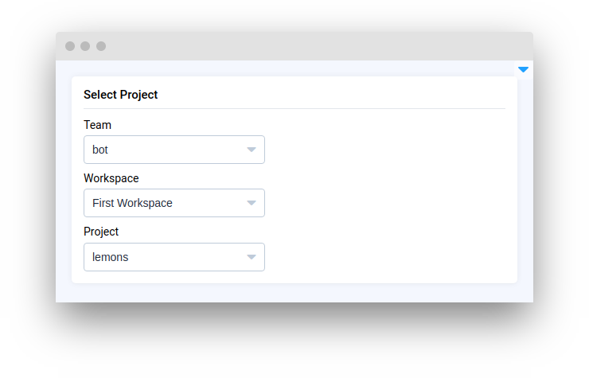

# Selection

<table data-view="cards"><thead><tr><th></th><th></th><th></th><th data-hidden data-card-target data-type="content-ref"></th></tr></thead><tbody><tr><td><strong>Select</strong></td><td></td><td><mark style="color:purple;">Drop down menu with predefined list of values</mark></td><td><a href="select.md">select.md</a></td></tr><tr><td><strong>Select Team</strong></td><td></td><td><mark style="color:purple;">Select from a list of Teams within your account</mark></td><td><a href="selectteam.md">selectteam.md</a></td></tr><tr><td><strong>Select Workspace</strong></td><td></td><td><mark style="color:purple;">Select from a list of workspaces within selected Team</mark></td><td><a href="selectworkspace.md">selectworkspace.md</a></td></tr><tr><td><strong>Select Project</strong></td><td></td><td><mark style="color:purple;">Select from a list of projects within selected workspace</mark></td><td><a href="selectproject.md">selectproject.md</a></td></tr><tr><td><strong>Select Dataset</strong></td><td></td><td><mark style="color:purple;">Select from a list of datasets within selected project</mark></td><td><a href="selectdataset.md">selectdataset.md</a></td></tr><tr><td><strong>Select Item</strong></td><td></td><td><mark style="color:purple;">Select certain item (image, video, volume...) within project</mark></td><td><a href="selectitem.md">selectitem.md</a></td></tr><tr><td><strong>Select Tag Meta</strong></td><td></td><td><mark style="color:purple;">Select TagMeta within project</mark></td><td><a href="selecttagmeta.md">selecttagmeta.md</a></td></tr><tr><td><strong>Select App Session</strong></td><td></td><td><mark style="color:purple;">Select active app session</mark></td><td><a href="selectappsession.md">selectappsession.md</a></td></tr><tr><td><strong>Select String</strong></td><td></td><td><mark style="color:purple;">Select a single string value from a list of predefined options</mark><td><a href="selectstring.md">selectstring.md</a></td><tr><td><strong>Transfer</strong></td><td></td><td><mark style="color:purple;">Transfer items between two lists</mark><td><a href="transfer.md">transfer.md</a></td></td><td></td></tr></tbody></table>
