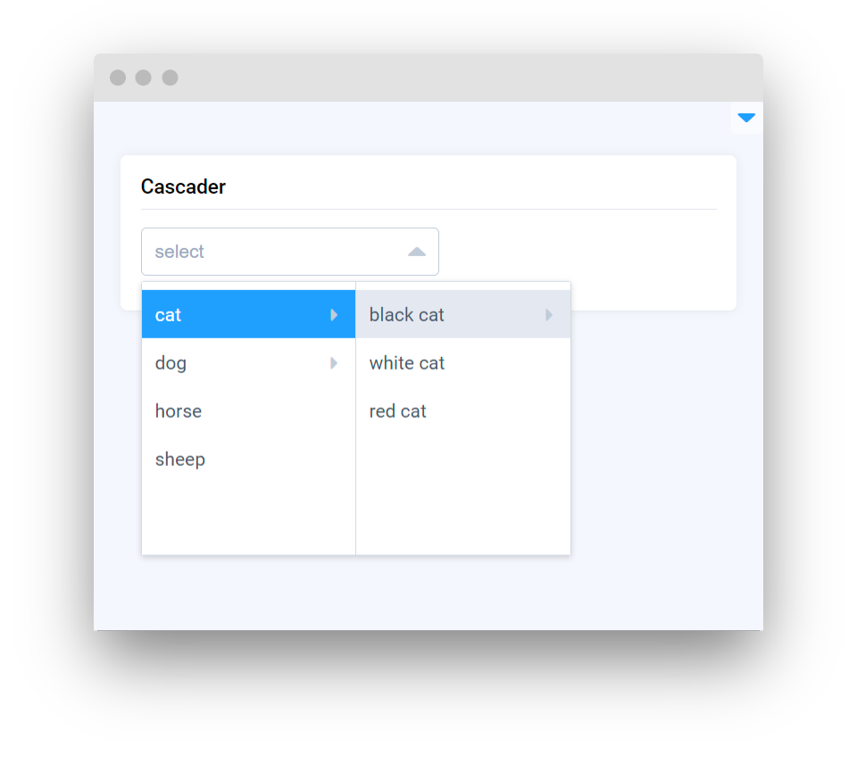

# Selection

<table data-card-size="large" data-view="cards"><thead><tr><th></th><th></th><th></th><th data-hidden data-card-target data-type="content-ref"></th></tr></thead><tbody><tr><td><strong>Select</strong></td><td></td><td><mark style="color:purple;">Provides a dropdown list that users can interact with to select one of the predefined options</mark></td><td><a href="select.md">select.md</a></td></tr><tr><td><strong>Select Team</strong></td><td></td><td><mark style="color:purple;">Dedicated dropdown for users to choose from a list of teams available within their account</mark></td><td><a href="selectteam.md">selectteam.md</a></td></tr><tr><td><strong>Select Workspace</strong></td><td></td><td><mark style="color:purple;">Allows users to choose from a list of available workspaces within a selected team</mark></td><td><a href="selectworkspace.md">selectworkspace.md</a></td></tr><tr><td><strong>Select Project</strong></td><td></td><td><mark style="color:purple;">Navigational element for selecting from a list of projects that belong to a particular workspace</mark></td><td><a href="selectproject.md">selectproject.md</a></td></tr><tr><td><strong>Select Dataset</strong></td><td></td><td><mark style="color:purple;">Enables users to select from a list of datasets that are part of a specific project, streamlining the data access process</mark></td><td><a href="selectdataset.md">selectdataset.md</a></td></tr><tr><td><strong>Select Item</strong></td><td></td><td><mark style="color:purple;">Flexible component for choosing a particular item (like an image, video, volume ...) within a project</mark></td><td><a href="selectitem.md">selectitem.md</a></td></tr><tr><td><strong>Select Tag Meta</strong></td><td></td><td><mark style="color:purple;">Selection of TagMeta within a project, providing a way to categorize or filter items based on metadata tags</mark></td><td><a href="selecttagmeta.md">selecttagmeta.md</a></td></tr><tr><td><strong>Select App Session</strong></td><td></td><td><mark style="color:purple;">Users can select an active app session, useful for navigating between different states or instances of app usage</mark></td><td><a href="selectappsession.md">selectappsession.md</a></td></tr><tr><td><strong>Select String</strong></td><td></td><td><mark style="color:purple;">Simple selector for picking a single string value from a set of predefined options</mark></td><td><a href="selectstring.md">selectstring.md</a></td></tr><tr><td><strong>Transfer</strong></td><td></td><td><mark style="color:purple;">Move or copy items between two lists</mark></td><td><a href="transfer.md">transfer.md</a></td></tr><tr><td><strong>DestinationProject</strong></td><td></td><td><mark style="color:purple;">This component is used to select the destination project and dataset where the user intends to move or copy data</mark></td><td><a href="destinationproject.md">destinationproject.md</a></td></tr><tr><td><strong>TeamFilesSelector</strong></td><td></td><td><mark style="color:purple;">Tool to choose files from a shared team directory</mark></td><td><a href="teamfilesselector.md">teamfilesselector.md</a></td></tr><tr><td><strong>FileViewer</strong></td><td></td><td><mark style="color:purple;">Allows users to navigate and browse files within the given directory, which could include various types of documents or media</mark></td><td><a href="fileviewer.md">fileviewer.md</a></td></tr><tr><td><strong>Dropdown</strong></td><td></td><td><mark style="color:purple;">Similar to the 'Select' component, it provides a dropdown menu with a predefined list of options for the user to choose from</mark></td><td><a href="dropdown.md">dropdown.md</a></td></tr><tr><td><strong>Cascader</strong></td><td></td><td><mark style="color:purple;">Dropdown list with hierarchical options</mark></td><td><a href="cascader.md">cascader.md</a></td></tr><tr><td><strong>ClassesListSelector</strong></td><td></td><td><mark style="color:purple;">Class selector that can be changed dynamically</mark></td><td><a href="classeslistselector.md">classeslistselector.md</a></td></tr><tr><td><strong>TagsListSelector</strong></td><td></td><td><mark style="color:purple;">Tags selector that can be changed dynamically</mark></td><td><a href="tagslistselector.md">tagslistselector.md</a></td></tr><tr><td><strong>MembersListSelector</strong></td><td></td><td><mark style="color:purple;">Users selector that can be changed dynamically</mark></td><td><a href="memberslistselector.md">memberslistselector.md</a></td></tr></tbody></table>
