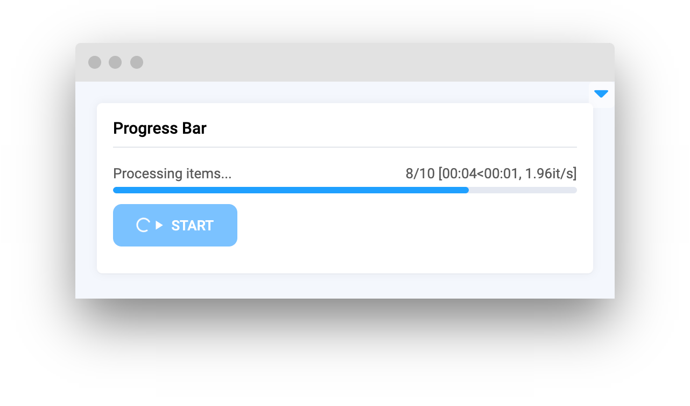
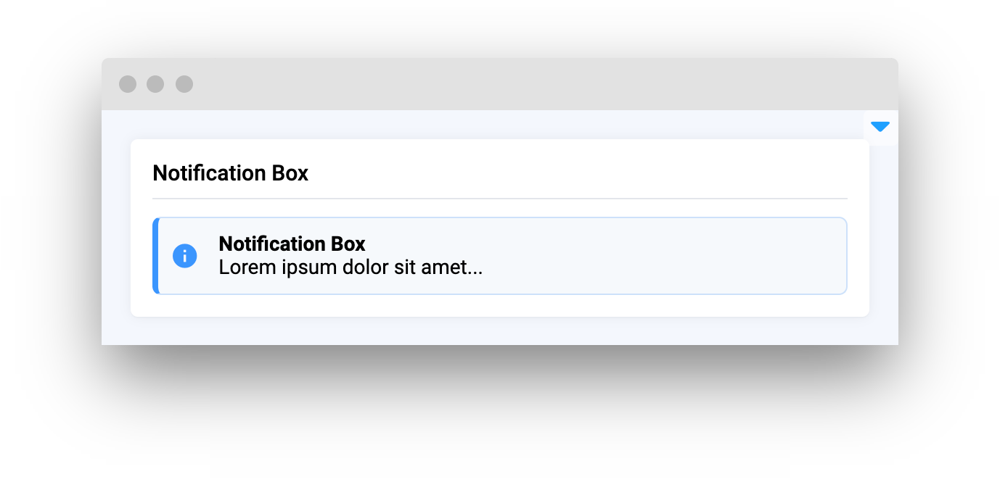
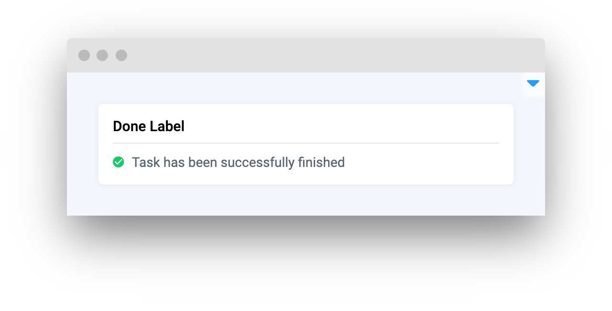
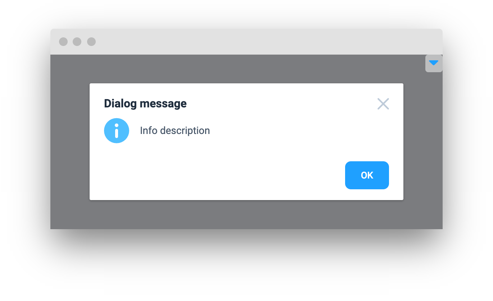
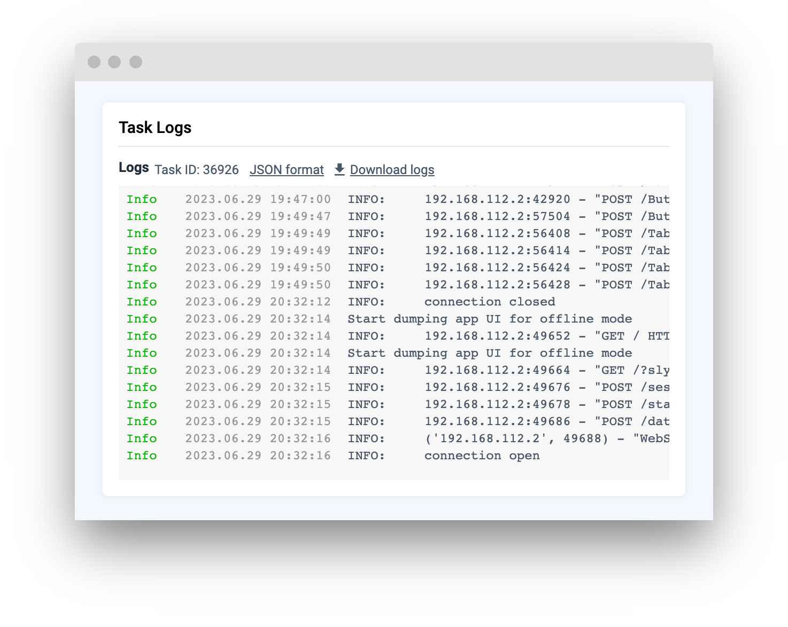

# Status Elements

<table data-view="cards"><thead><tr><th></th><th></th><th></th><th data-hidden data-card-target data-type="content-ref"></th></tr></thead><tbody><tr><td><strong>Progress Bar</strong></td><td></td><td><mark style="color:purple;">Visually show the progress of a task or operation</mark></td><td><a href="progressbar.md">progressbar.md</a></td></tr><tr><td><strong>Notification Box</strong></td><td></td><td><mark style="color:purple;">Display important messages or alerts to users</mark></td><td><a href="notificationbox.md">notificationbox.md</a></td></tr><tr><td><strong>Done Label</strong></td><td></td><td><mark style="color:purple;">Indicate the successful completion of a task or operation</mark></td><td><a href="donelabel.md">donelabel.md</a></td></tr><tr><td><strong>Dialog Message</strong></td><td></td><td><mark style="color:purple;">Display a pop-up message or prompt</mark></td><td><a href="dialogmessage.md">dialogmessage.md</a></td></tr><tr><td><strong>Task Logs</strong></td><td></td><td><mark style="color:purple;">Display logs for a given Task ID</mark></td><td><a href="tasklogs.md">tasklogs.md</a></td></tr></tbody></table>
