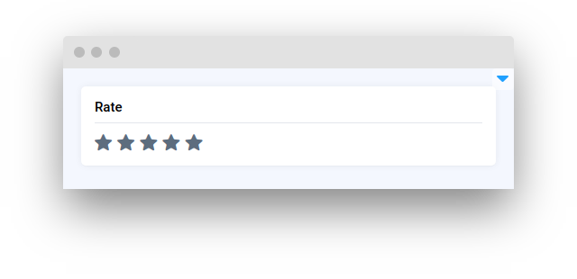
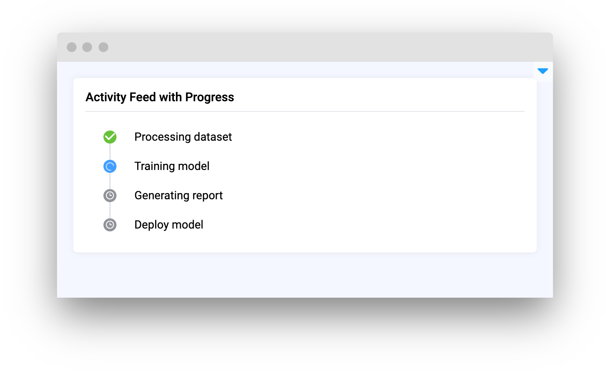

# Status Elements

<table data-card-size="large" data-view="cards"><thead><tr><th></th><th></th><th></th><th data-hidden data-card-target data-type="content-ref"></th></tr></thead><tbody><tr><td><strong>Progress</strong></td><td></td><td><mark style="color:purple;">Visual indicator of the progression of a task or operation</mark></td><td><a href="progressbar.md">progressbar.md</a></td></tr><tr><td><strong>NotificationBox</strong></td><td></td><td><mark style="color:purple;">Display important messages or alerts to users</mark></td><td><a href="notificationbox.md">notificationbox.md</a></td></tr><tr><td><strong>DoneLabel</strong></td><td></td><td><mark style="color:purple;">Shows a notification indicating the successful completion of a task or operation</mark></td><td><a href="donelabel.md">donelabel.md</a></td></tr><tr><td><strong>DialogMessage</strong></td><td></td><td><mark style="color:purple;">Presents a pop-up message or prompt to the user</mark></td><td><a href="dialogmessage.md">dialogmessage.md</a></td></tr><tr><td><strong>TaskLogs</strong></td><td></td><td><mark style="color:purple;">A detailed display of logs associated with a particular task ID for debugging or information purposes</mark></td><td><a href="tasklogs.md">tasklogs.md</a></td></tr><tr><td><strong>Badge</strong></td><td></td><td><mark style="color:purple;">UI element used to display badges, which represent notifications, statuses, or achievements within the application</mark></td><td><a href="badge.md">badge.md</a></td></tr><tr><td><strong>ModelInfo</strong></td><td></td><td><mark style="color:purple;">Displays technical details and configurations for the AI model, supported features, and hardware compatibility</mark></td><td><a href="modelinfo.md">modelinfo.md</a></td></tr><tr><td><strong>Rate</strong></td><td></td><td><mark style="color:purple;">Widget to represent user ratings through a star-based visual system</mark></td><td><a href="rate.md">rate.md</a></td></tr><tr><td><strong>CircleProgress</strong></td><td></td><td><mark style="color:purple;">Wrapper for Progress widget to display it in circular style</mark></td><td><a href="circleprogress.md">circleprogress.md</a></td></tr><tr><td><strong>ActivityFeed</strong></td><td></td><td><mark style="color:purple;">Display a vertical timeline of activity items with status indicators</mark></td><td><a href="activityfeed.md">activityfeed.md</a></td></tr></tbody></table>
