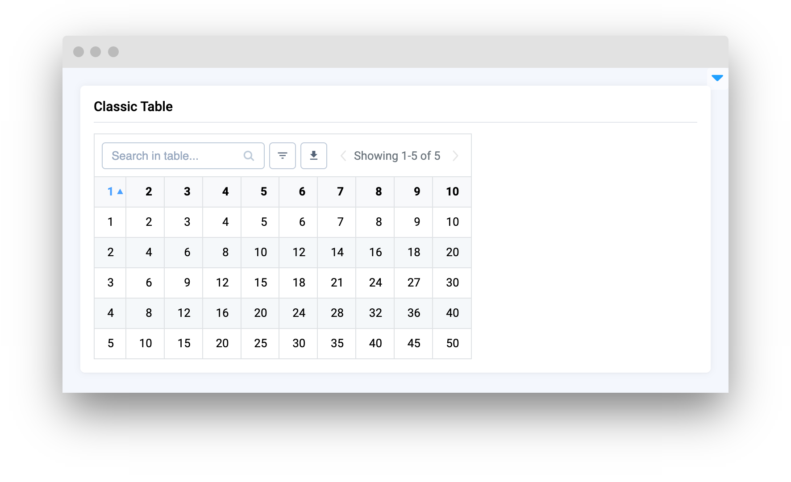
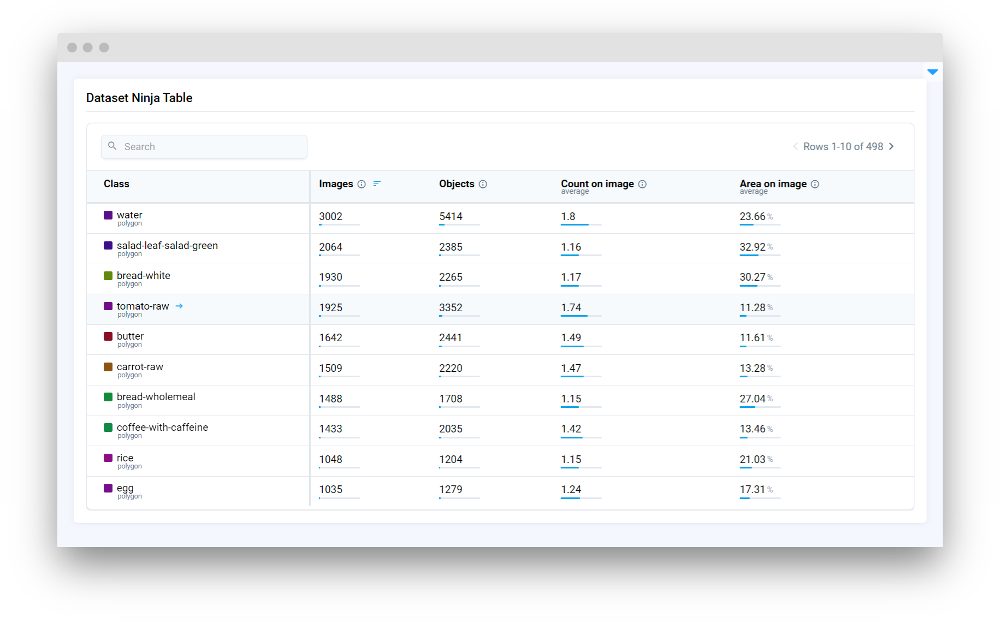

# Tables

<table data-view="cards">
  <thead>
    <tr>
      <th></th>
      <th></th>
      <th></th>
      <th data-hidden data-card-target data-type="content-ref"></th>
    </tr>
  </thead>
  <tbody>
    <tr>
      <td><strong>Table</strong></td>
      <td></td>
      <td>
        <mark style="color: purple"
          >Standard widget for displaying data in a tabular format, allowing for
          an organized view of rows and columns</mark
        >
      </td>
      <td><a href="table.md">table.md</a></td>
    </tr>
    <tr>
      <td><strong>Classic Table</strong></td>
      <td>
        
      </td>
      <td>
        <mark style="color: purple"
          >[Legacy] Outdated version of <strong>Table</strong> widget with fewer
          options</mark
        >
      </td>
      <td><a href="classictable.md">classictable.md</a></td>
    </tr>
    <tr>
      <td><strong>Radio Table</strong></td>
      <td>
        
      </td>
      <td>
        <mark style="color: purple"
          >Selection of a single row within the table to perform specific
          actions or operations, using radio buttons for selection</mark
        >
      </td>
      <td><a href="radiotable.md">radiotable.md</a></td>
    </tr>
    <tr>
      <td><strong>Classes Table</strong></td>
      <td>
        
      </td>
      <td>
        <mark style="color: purple"
          >Specialized for displaying object classes with their associated
          properties, includes a selector</mark
        >
      </td>
      <td><a href="classestable.md">classestable.md</a></td>
    </tr>
    <tr>
      <td><strong>Random Splits Table</strong></td>
      <td>
        
      </td>
      <td>
        <mark style="color: purple"
          >Tool for splitting data into training and validation sets, which is
          common in machine learning and data analysis to evaluate models and
          algorithms</mark
        >
      </td>
      <td><a href="randomsplitstable.md">randomsplitstable.md</a></td>
    </tr>
    <tr>
      <td><strong>Dataset Ninja Table</strong></td>
      <td>
        
      </td>
      <td>
        <mark style="color: purple"
          >Specialized for displaying various dataset statistics just like on Dataset Ninja pages</mark
        >
      </td>
      <td><a href="datasetninjatable.md">datasetninjatable.md</a></td>
    </tr>
  </tbody>
</table>
