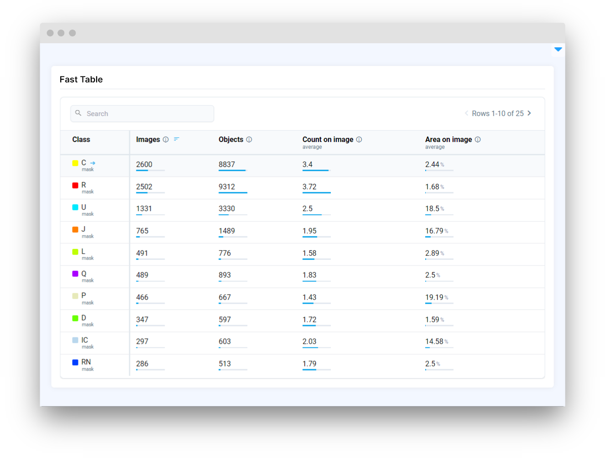

# Fast Table

## Introduction

**`FastTable`** widget in Supervisely allows for displaying and manipulating data of various dataset statistics and processing it on the server side.

The `FastTable` widget allows searching, sorting by column and order, and the ability to customize data. It also allows updating table data in real-time through Python code.

😲 The main feature of `FastTable` in that all information is processed on the server side and transmitted in the size of the active page of the table to the client, thus making its operation more efficient.

## Function signature

Data structure example

```python
fast_table = FastTable(
    data=data,
    columns=columns,
    columns_options=columns_options,
    project_meta=project_meta,
    fixed_columns=1,
    page_size=10,
    sort_column_idx=1,
    sort_order="desc",
    width="auto",
    widget_id=None,
)
```

<figure><figcaption></figcaption></figure>

## Parameters

|    Parameters     |                 Type                  |                Description                 |
| :---------------: | :-----------------------------------: | :----------------------------------------: |
|      `data`       | `Optional[Union[list, pd.DataFrame]]` |                 Table data                 |
|     `columns`     |           `Optional[list]`            |               Table columns                |
| `columns_options` |        `Optional[list[dict]]`         |              Columns options               |
|  `project_meta`   | `Optional[Union[ProjectMeta, dict]]`  |              Project metadata              |
|  `fixed_columns`  |        `Optional[Literal[1]]`         |     Number of the first fixed columns      |
|    `page_size`    |            `Optional[int]`            |     Table page size in number of rows      |
| `sort_column_idx` |                 `int`                 | Index of the column by which sorting works |
|   `sort_order`    |  `Optional[Literal["asc", "desc"]]`   |                 Sort order                 |
|      `width`      |            `Optional[str]`            |               Width of table               |
|    `widget_id`    |            `Optional[str]`            |              ID of the widget              |

### data

Table data in different formats:

**type:** `Optional[Union[list, pd.DataFrame]]`

**default value:** `None`

1. Python `list` with structure:

    ```python
    data_list = [        
        [
            ["apple", "21"],
            ["banana", "15"],
        ],
    ]

    fast_table = FastTable(data=data_list)
    ```

    Where:
      - `data_list` - list with `rows`  

2. Pandas `DataFrame`:   
    
    ```python
    dataframe = pd.DataFrame(data=data, columns=columns)
    fast_table = FastTable(data=dataframe)
    ```
    Where:
      - `columns` - list of column names
      - `data` - list with `rows`
        - `row` - list with values, requires `len(row) == len(columns)`

### columns

Column names. 

💡 If `data` in `DataFrame` type is passed, specifying `columns` will overwrite it in `DataFrame`

**type:** `Optional[list]`

**default value:** `None`

```python
fast_table = FastTable(data=dataframe, columns=columns)
```

### columns_options

List of dictionaries with column options. `len(columns_options)` must equal `len(columns)` to properly add options. If the column has no options, just pass an empty dictionary `{}`

Each dictionary may contain:

- `type` - with value of type `str`, determines special column type, depending on which styles will be applied, now supports only `class` as special type, you don't need to specify a type for the regular ones
- `subtitle` - with value of type `str`, provide additional clarification, specify units of measurement, offer context, and enhance overall understanding of the data
- `maxValue` - with value of type `int`, determines the maximum value for the column and activates special bars that visualize how close the value is to the maximum value
- `postfix` - with value of type `str`, is substituted after each value to denote dimensionality
- `tooltip` - with value of type `str`, tooltip with description for a column

**type:** `Optional[list[dict]]`

**default value:** `None`

```python
fast_table = FastTable(data=data_list, columns=columns_list)
```

### project_meta

Project metadata with classes used to apply special styles for columns with `type`:`class`

**type:** `Optional[Union[ProjectMeta, dict]]`

**default value:** `None`

```python
meta_json = api.project.get_meta(id=project_id)
fast_table = FastTable(data=data_dict, project_meta=meta_json)

# or

meta = sly.ProjectMeta.from_json(data=meta_json)
fast_table = FastTable(data=data_dict, project_meta=meta)
```

<figure><figcaption></figcaption></figure>


### fixed_columns

Number of the first fixed columns if the table has horizontal scrolling.

💡 Currently supports only `1` or `None` as value.

**type:** `Optional[Literal[1]]`

**default value:** `None`

```python
fast_table = FastTable(data=dataframe, fixed_columns=1)
```

### page_size

Table page size in number of rows

**type:** `int`

**default value:** `10`

```python
fast_table = FastTable(data=dataframe, page_size=15)
```

### sort_column_idx

Index of the column by which sorting works.

💡 Cannot be used without `sort_order`, if one of parameters is not set - the sorting will follow the original data structure.

**type:** `int`

**default value:** `None`

```python
fast_table = FastTable(data=dataframe, sort_column_idx=0, sort_order='asc')
```

### sort_order

Sort order.

💡 Cannot be used without `sort_column_idx`, if one of parameters is not set - the sorting will follow the original data structure.

**type:** `Optional[Literal["asc", "desc"]]`

**default value:** `None`

```python
fast_table = FastTable(data=dataframe, sort_column_idx=1, sort_order='desc')
```

### width

Width of table.

**type:** `Optional[str]`

**default value:** `auto`

```python
fast_table = FastTable(data=data_dict, width="50%")
```

<figure><figcaption></figcaption></figure>

### widget_id

ID of the widget.

**type:** `str`

**default value:** `None`


## Methods and attributes

|                     Attributes and Methods                      | Description                                                               |
| :-------------------------------------------------------------: | ------------------------------------------------------------------------- |
|                       `fixed_columns_num`                       | Get or set number of fixed columns (left to right) property.              |
|                         `project_meta`                          | Get or set number project meta property.                                  |
|                           `page_size`                           | Get or set table page size property.                                      |
|           `read_json(data: dict, meta: dict = None)`            | Read and set table data from JSON format.                                 |
|                `read_pandas(data: pd.DataFrame)`                | Read and set table data from `DataFrame`.                                 |
|                 `to_json(active_page = False)`                  | Convert table data to JSON format. Full table or active page only.        |
|                `to_pandas(active_page = False)`                 | Convert table data to pandas `DataFrame`. Full table or active page only. |
|                       `clear_selection()`                       | Deselect a table cell.                                                    |
|                      `get_selected_row()`                       | Get selected table row info.                                              |
|                      `get_selected_cell()`                      | Get selected table cell info.                                             |
|                `insert_row(row: List, index=-1)`                | Insert new row in table by index.                                         |
|                       `pop_row(index=-1)`                       | Remove row from table by index.                                           |
|                     `search(search_value)`                      | Search source data for `search_value` and return results as `DataFrame`.  |
| `sort(column_id: int, order: Optional[Literal["asc", "desc"]])` | Sort table rows by given column ID and/or order direction.                |
|                          `@row_click`                           | Decorator function is handled when table row is clicked.                  |
|                          `@cell_click`                          | Decorator function is handled when table cell is clicked.                 |
|  `update_cell_value(row_index: int, column_index: int, value)`  | Update cell value in table by row and column indexes.                     |

### read_json()

The `data` structure must correspond to the dictionary given in the example below 👇

Structure:
  - `columns` - list of column names
  - `data` - list with `rows`
    - `row` - list with values, requires `len(row) == len(columns)`
  - `columnsOptions` - list of dictionaries in which settings for each column are stored
    - `type` - determines special type of column, depending on which styles will be applied, now supports only `class` as special type, you don't need to specify a type for regular
    - `subtitle` - provide additional clarification, specify units of measurement, offer context, and enhance overall understanding of the data
    - `maxValue` - determines the maximum value for the column and activates special bars that visualize how close the value is to the maximum value
    - `postfix` - is substituted after each value to denote dimensionality
    - `tooltip` - tooltip with description for a column
  - `options` - dict with table options
    - `fixColumns` - number of first fixed table columns. ℹ️ Currently, only the first column is supported
    - `sort` - dict with applied sorting options
      - `columnIndex` - index of the `column`, by the values of which the data should be sorted
      - `order` - sort order
    - `pageSize` - how many `rows` will be displayed on the table page

Here is an example of the described structure: [json_data_example](https://github.com/supervisely-ecosystem/ui-widgets-demos/blob/master/tables/006\_fast\_table/src/json_data_example.json)

This data is under [MIT](https://spdx.org/licenses/MIT.html) license. [Source](https://github.com/esgario/lara2018/)

An example of a table built from this JSON can be seen on the [datasets' page](https://datasetninja.com/coffee-leaf-biotic-stress#objects) on [**Dataset Ninja**](https://datasetninja.com/).

<figure><figcaption></figcaption></figure>

## Mini App Example

You can find this example in our Github repository:

[ui-widgets-demos/tables/006\_fast\_table/src/main.py](https://github.com/supervisely-ecosystem/ui-widgets-demos/blob/master/tables/006\_fast\_table/src/main.py)

### Import libraries

```python
import os
import json
import pandas as pd
import random

import supervisely as sly
from supervisely.app.widgets import (
    Card,
    Container,
    FastTable,
)
```

### Prepare data and meta that will be used to create example table

```python
data = [
    ["apple", "21"],
    ["banana", "15"]
  ]

columns = ["Class", "Items"]

dataframe = pd.DataFrame(data=data, columns=columns)

columns_options = [
    { "type": "class"},
    { "maxValue": 21, "postfix": "pcs", "tooltip": "description text", "subtitle": "boxes" }
  ]

meta_path = "meta.json"  # define file path
with open(meta_path, "r") as json_file:
    meta = json.load(json_file)    
```

### Initialize `FastTable` widget

```python
fast_table = FastTable(
    data=dataframe,
    project_meta=meta,
    columns_options=columns_options,
)
```

### Create app layout

Prepare a layout for app using `Card` widget with the `content` parameter and place widget that we've just created in the `Container` widget.

```python
card = Card(
    title="Fast Table",
    content=fast_table,
)
layout = Container(widgets=[card])
```

### Create app using layout

Create an app object with layout parameter.

```python
app = sly.Application(layout=layout)
```

### Add functions to control widget from python code

```python
@fast_table.row_click
def handle_table_row(clicked_row: sly.app.widgets.FastTable.ClickedRow):
    sly.app.show_dialog(
        f"{clicked_row.row[0]}",
        f"You clicked table row with idx={clicked_row.row_index} in source data",
    )
```

or 

```python
@fast_table.cell_click
def handle_table_cell(cell: sly.app.widgets.FastTable.ClickedCell):
    new_value = str(random.randint(0, 100))
    fast_table.update_cell_value(cell.row_index, cell.column_index, new_value)
```

<figure><figcaption></figcaption></figure>
