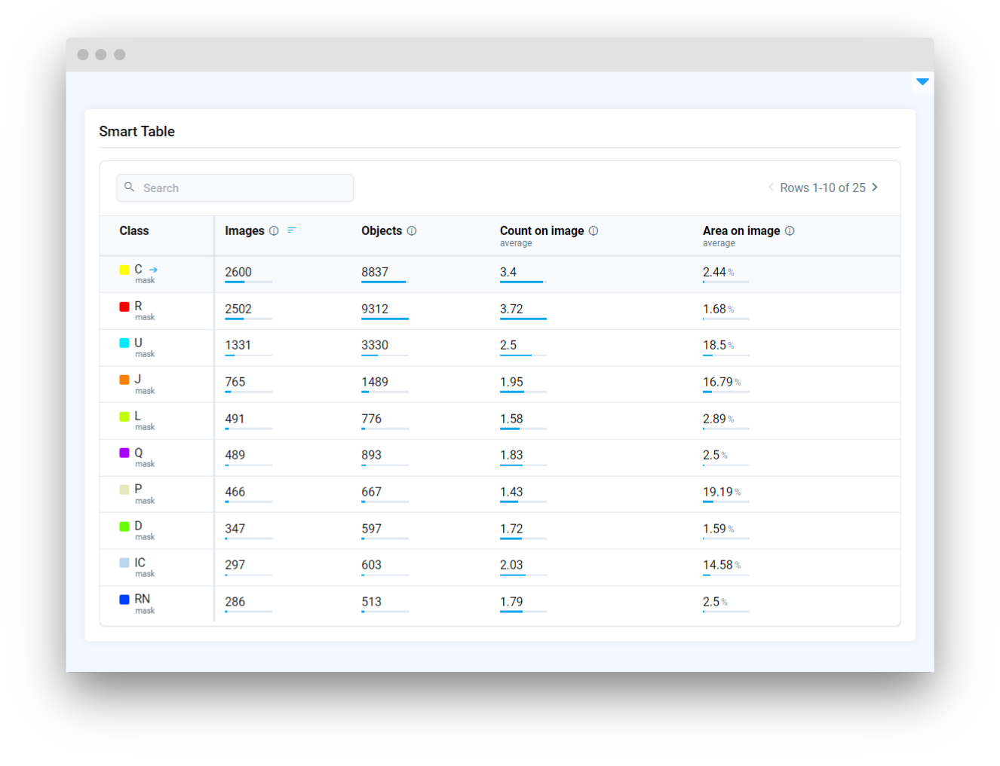

# Smart Table

## Introduction

**`SmartTable`** widget in Supervisely allows for displaying and manipulating data of various dataset statistics and processing it on the server side.

It supports data in the JSON dict format or a Python dictionary with a specific structure.

The `SmartTable` widget allows searching, sorting by column and direction, and the ability to customize data. It also allows updating table data in real-time through Python code.

## Function signature

Data structure example

```python
smart_table = SmartTable(
    data=data_dict,
    project_meta=project_meta,
    clickable_rows=False,
    clickable_cells=False,
    width="auto",
    widget_id=None,
)
```

<figure><figcaption></figcaption></figure>

## Parameters

|    Parameters     |                 Type                 |     Description     |
| :---------------: | :----------------------------------: | :-----------------: |
|      `data`       |     `Optional[Union[dict, str]]`     |    Data of table    |
|  `project_meta`   | `Optional[Union[ProjectMeta, dict]]` |  Project metadata   |
| `clickable_rows`  |           `Optional[bool]`           | Are rows clickable  |
| `clickable_cells` |           `Optional[bool]`           | Are cells clickable |
|      `width`      |           `Optional[str]`            |   Width of table    |
|    `widget_id`    |           `Optional[str]`            |  ID of the widget   |

### data

Data of table in different formats:

1. Python `dict` with structure:

    ```python
    data_dict = {
        "columns": ["Class", "Items"],
        "data": [
            ["apple", "21"],
            ["banana", "15"],
        ],
        "columnsOptions": [
            {"type": "class"},
            {"maxValue": 21, "postfix": "pcs", "tooltip": "description text"},
        ],
        "options": {
            "fixColumns": 1,
            "sort": {"columnIndex": 1, "order": "desc"},
            "pageSize": 10,
        },
    }

    smart_table = SmartTable(data=data_dict)
    ```

    Where:
      - `columns` - list of column names
      - `data` - list with `rows`
        - `row` - list with values, requires `len(row) == len(columns)`
      - `columnsOptions` - list of dictionaries in which settings for each column are stored
        - `type` - determines special type of column, depending on which styles will be applied, now supports only `class` as special type, you don't need to specify a type for regular
        - `subtitle` - provide additional clarification, specify units of measurement, offer context, and enhance overall understanding of the data
        - `maxValue` - determines the maximum value for the column and activates special bars that visualize how close the value is to the maximum value
        - `postfix` - is substituted after each value to denote dimensionality
        - `tooltip` - tooltip with description for a column
      - `options` - dict with table options
        - `fixColumns` - number of first fixed table columns. ℹ️ Currently, only the first column is supported
        - `sort` - dict with applied sorting options
          - `columnIndex` - index of the `column`, by the values of which the data should be sorted
          - `order` - sort order
        - `pageSize` - how many `rows` will be displayed on the table page


2. Path to `JSON` file:

    The file structure must correspond to the dictionary given in the example above ☝️
    
    ```python
    data_path = 'data.json'
    smart_table = SmartTable(data=data_path)
    ```

### project_meta

Project metadata with classes used to apply special styles for columns with `type`:`class`

**type:** `Optional[Union[ProjectMeta, dict]]`

**default value:** `None`

```python
meta_json = api.project.get_meta(id=project_id)
smart_table = SmartTable(data=data_dict, project_meta=meta_json)

# or

meta = sly.ProjectMeta.from_json(data=meta_json)
smart_table = SmartTable(data=data_dict, project_meta=meta)
```

<figure><figcaption></figcaption></figure>

### clickable_rows

Whether the rows are clickable, an event is called when the row is clicked

💡 Cannot be used together with `clickable_cells`

**type:** `Optional[bool]`

**default value:** `False`

```python
smart_table = SmartTable(data=data_dict, clickable_rows=True)
```

<figure><figcaption></figcaption></figure>

### clickable_cells

Whether the cells are clickable, an event is called when the cell is clicked

💡 Cannot be used together with `clickable_rows`

**type:** `Optional[bool]`

**default value:** `False`

```python
smart_table = SmartTable(data=data_dict, clickable_cells=True)
```


#### width

Width of table.

**type:** `Optional[str]`

**default value:** `auto`

```python
smart_table = SmartTable(data=data_dict, width="50%")
```

<figure><figcaption></figcaption></figure>

### widget_id

ID of the widget.

**type:** `str`

**default value:** `None`


## Methods and attributes

|                     Attributes and Methods                      | Description                                                  |
| :-------------------------------------------------------------: | ------------------------------------------------------------ |
|                       `fixed_columns_num`                       | Get or set number of fixed columns (left to right) property. |
|                           `to_json()`                           | Convert table data to JSON format.                           |
|                          `to_pandas()`                          | Convert table data to pandas `DataFrame`.                    |
|           `read_json(data: dict, meta: dict = None)`            | Read and set table data from JSON format.                    |
|                       `clear_selection()`                       | Deselect a table cell.                                       |
|                      `get_selected_row()`                       | Get selected table row info.                                 |
|                      `get_selected_cell()`                      | Get selected table cell info.                                |
|                `insert_row(row: List, index=-1)`                | Insert new row in table by index.                            |
|                       `pop_row(index=-1)`                       | Remove row from table by index.                              |
| `sort(column_id: int, order: Optional[Literal["asc", "desc"]])` | Sort table rows by given column ID and/or order direction.   |
|                          `@row_click`                           | Decorator function is handled when table row is clicked.     |
|                          `@cell_click`                          | Decorator function is handled when table cell is clicked.    |


## Mini App Example

You can find this example in our Github repository:

[ui-widgets-demos/tables/006\_smart\_table/src/main.py](https://github.com/supervisely-ecosystem/ui-widgets-demos/blob/master/tables/006\_smart\_table/src/main.py)

### Import libraries

```python
import os
import json

import supervisely as sly
from dotenv import load_dotenv
from supervisely.app.widgets import (
    Card,
    Container,
    SmartTable,
)
```

### Init API client

First, we load environment variables with credentials and init API for communicating with Supervisely Instance:

```python
load_dotenv("local.env")
load_dotenv(os.path.expanduser("~/supervisely.env"))

api = sly.Api()
```

### Prepare data and meta that will be used to create example table

```python
data_path = "data.json"

meta_path = "meta.json"
with open(meta_path, "r") as json_file:
    meta = json.load(json_file)    
```

### Initialize `SmartTable` widget

```python
smart_table = SmartTable(
    data=data_path,
    project_meta=meta,
    clickable_rows=True,
)
```

### Create app layout

Prepare a layout for app using `Card` widget with the `content` parameter and place widget that we've just created in the `Container` widget.

```python
card = Card(
    title="Smart Table",
    content=smart_table,
)
layout = Container(widgets=[card])
```

### Create app using layout

Create an app object with layout parameter.

```python
app = sly.Application(layout=layout)
```

### Add functions to control widget from python code

```python
@smart_table.row_click
def handle_table_row(datapoint: sly.app.widgets.SmartTable.ClickedDataRow):
    sly.app.show_dialog(
        f"{datapoint.row[0]}",
        f"You clicked table row with idx={datapoint.row_index} in source data",
    )
```

<figure><figcaption></figcaption></figure>
