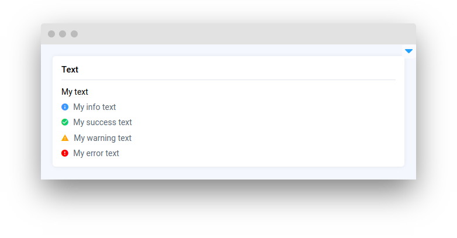

# Text Elements

<table data-view="cards"><thead><tr><th></th><th></th><th></th><th data-hidden data-card-target data-type="content-ref"></th></tr></thead><tbody><tr><td><strong>Text</strong></td><td></td><td><mark style="color:purple;">Share instructional or informative data in your apps</mark></td><td><a href="text.md">text.md</a></td></tr><tr><td><strong>Text Area</strong></td><td></td><td><mark style="color:purple;">Resizable text input for entering multiple lines of text information</mark></td><td><a href="textarea.md">textarea.md</a></td></tr><tr><td><strong>Editor</strong></td><td></td><td><mark style="color:purple;">Edit and manage different input settings in various formats: Python, YAML, JSON, and more</mark></td><td><a href="editor.md">editor.md</a></td></tr></tbody></table>
