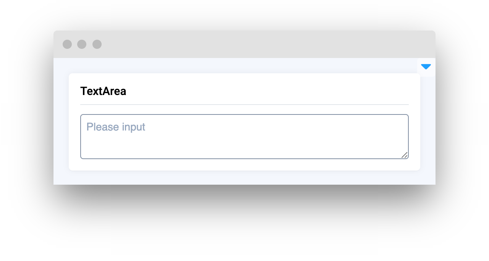

# Text Elements

<table data-view="cards"><thead><tr><th></th><th></th><th></th><th data-hidden data-card-target data-type="content-ref"></th></tr></thead><tbody><tr><td><strong>Text</strong></td><td></td><td><mark style="color:purple;">Provides a static text field to present data, instructions, or information within your application</mark></td><td><a href="text.md">text.md</a></td></tr><tr><td><strong>Text Area</strong></td><td></td><td><mark style="color:purple;">Expandable area for text input, allowing for extensive data entry across multiple lines</mark></td><td><a href="textarea.md">textarea.md</a></td></tr><tr><td><strong>Editor</strong></td><td></td><td><mark style="color:purple;">Versatile editing field that supports syntax highlighting and formatting for code and text in various languages and formats</mark></td><td><a href="editor.md">editor.md</a></td></tr><tr><td><strong>Copy to Clipboard</strong></td><td></td><td><mark style="color:purple;">Integrates a copy function to quickly duplicate text from a widget to the system clipboard</mark></td><td><a href="copytoclipboard.md">copytoclipboard.md</a></td></tr><tr><td><strong>Markdown</strong></td><td></td><td><mark style="color:purple;">Renders markdown syntax as styled text, facilitating the display of structured content and documentation</mark></td><td><a href="markdown.md">markdown.md</a></td></tr><tr><td><strong>Tooltip</strong></td><td></td><td><mark style="color:purple;">Provides contextual information and guidance when a user hovers over a UI element with the cursor</mark></td><td><a href="tooltip.md">tooltip.md</a></td></tr><tr><td><strong>ElementTag</strong></td><td></td><td><mark style="color:purple;">Represents a specific attribute or classification</mark></td><td><a href="elementtag.md">elementtag.md</a></td></tr><tr><td><strong>ElementTagsList</strong></td><td></td><td><mark style="color:purple;">These tags serve as identifiers or categories that provide quick information about the entity.</mark></td><td><a href="elementtagslist.md">elementtagslist.md</a></td></tr></tbody></table>
