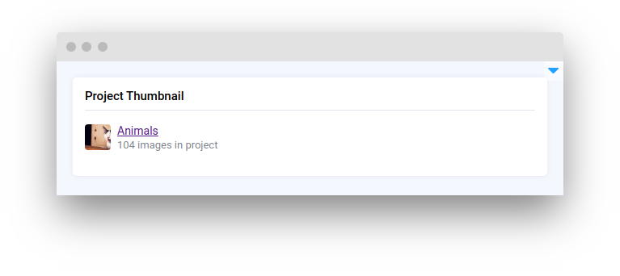
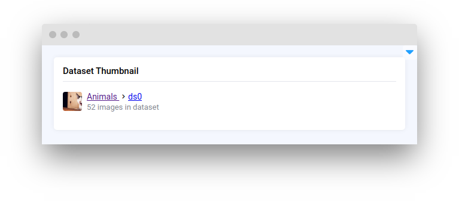
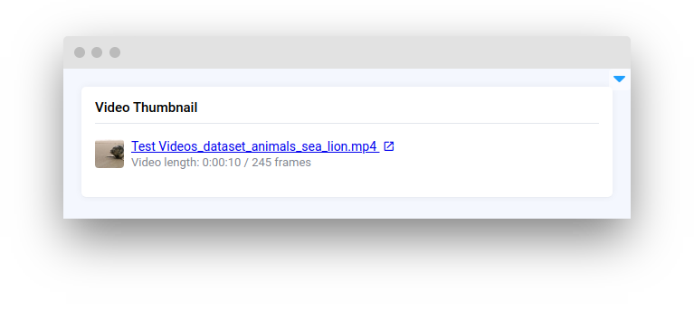
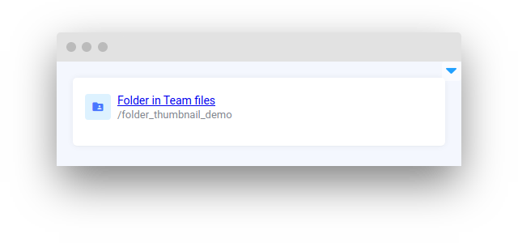
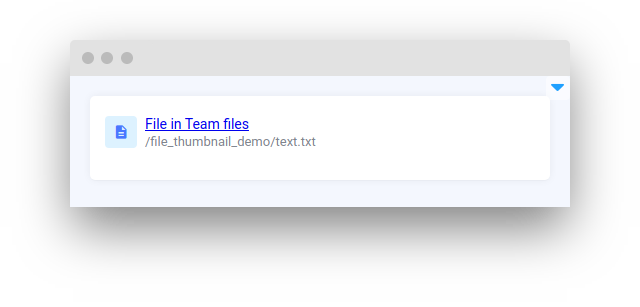

# Thumbnails

<table data-view="cards"><thead><tr><th></th><th></th><th></th><th data-hidden data-card-target data-type="content-ref"></th></tr></thead><tbody><tr><td><strong>ProjectThumbnail</strong></td><td></td><td><mark style="color:purple;">Visual preview of a project with a quick access to it</mark></td><td><a href="projectthumbnail.md">projectthumbnail.md</a></td></tr><tr><td><strong>DatasetThumbnail</strong></td><td></td><td><mark style="color:purple;">Visual preview of a dataset with a quick access to it</mark></td><td><a href="datasetthumbnail.md">datasetthumbnail.md</a></td></tr><tr><td><strong>VideoThumbnail</strong></td><td></td><td><mark style="color:purple;">Visual preview of a video with a quick access to it</mark></td><td><a href="videothumbnail.md">videothumbnail.md</a></td></tr><tr><td><strong>FolderThumbnail</strong></td><td></td><td><mark style="color:purple;">Visual preview of a Folder with a quick access to it</mark></td><td><a href="folderthumbnail.md">folderthumbnail.md</a></td></tr><tr><td><strong>FileThumbnail</strong></td><td></td><td><mark style="color:purple;">Visual preview of a File with a quick access to it</mark></td><td><a href="filethumbnail.md">filethumbnail.md</a></td></tr></tbody></table>

