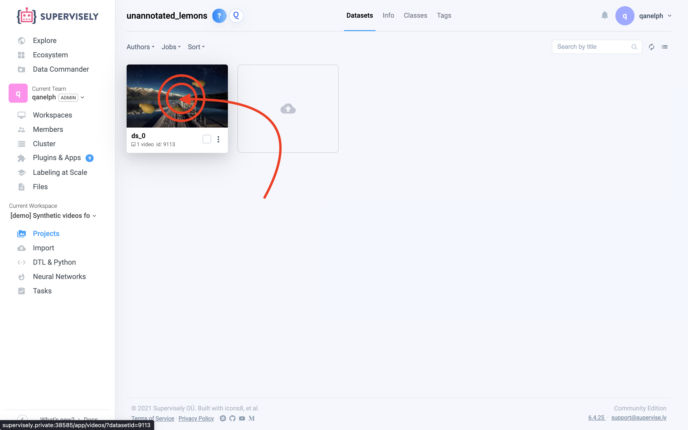
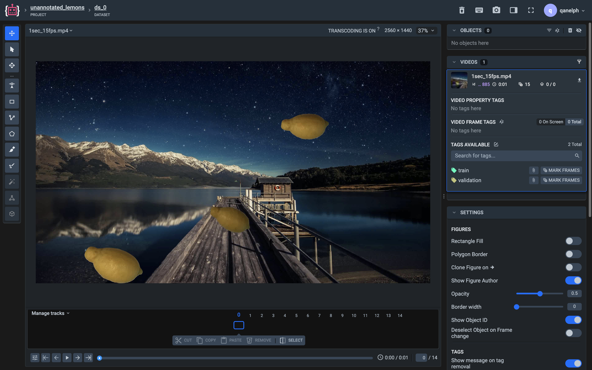
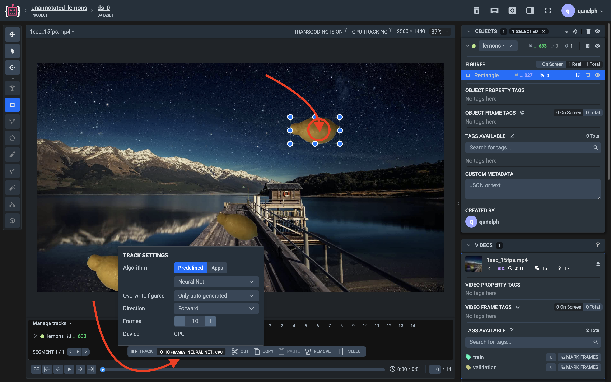

# Part 5 — Integrate custom tracker into Videos Annotator tool \[OpenCV Tracker]

### Table of contents

1. [Videos Annotator?](part-5-integrate-custom-tracker-into-videos-annotator-tool-opencv-tracker.md#step-1-videos-annotator)
2. [Trackers](part-5-integrate-custom-tracker-into-videos-annotator-tool-opencv-tracker.md#step-2-trackers)
3. [Creating the APP](part-5-integrate-custom-tracker-into-videos-annotator-tool-opencv-tracker.md#step-3-creating-the-app)
4. [Results](part-5-integrate-custom-tracker-into-videos-annotator-tool-opencv-tracker.md#step-4-results)

### Step 1 — Videos Annotator?

Ok. This is the video annotation tool available in Supervisely.\
To launch the Videos Annotator, click on the videos dataset. Done!





### Step 2 — Trackers

Supervisely has **two types** of tracking algorithms:

1. **Predefined** — our base tracking solutions
2. **Apps** — custom tracking solutions

They become available when you select the annotated object.\
In this part, we will integrate our own tracker (**Apps**).



### Step 3 — Creating the APP

**1. Add session tag to config**

In order for the Videos Annotator to see our application, we link it through the **sessions tags** space.\
 Only through the `sly_video_tracking` tag will Videos Annotator see our application. So:

**config.json (partially)**

```
"session_tags": [
  "sly_video_tracking"
]
```

**2. Handle track command**

How to handle commands — [see here](https://github.com/supervisely-ecosystem/how-to-create-app/tree/master/chapter-03-ui/part-03-app-handlers#step-1--handle-html-events).\
The most important thing is to write a handler for the **track command**.

**src/main.py (partially)**

```
@g.my_app.callback("track")
@sly.timeit
@send_error_data
def track(api: sly.Api, task_id, context, state, app_logger):
    tracker = TrackerContainer(context)
    tracker.track()
```

The OpenCV tracker logic is described [here](https://github.com/supervisely-ecosystem/how-to-create-app/blob/master/chapter-01-headless/part-05-integrate-to-videos-annotator/src/tracker.py#L42-L100).\
**You can replace it with your own code (your own tracker)**.

***

### Step 4 — Results


Integrate custom tracker into Videos Annotation tool


